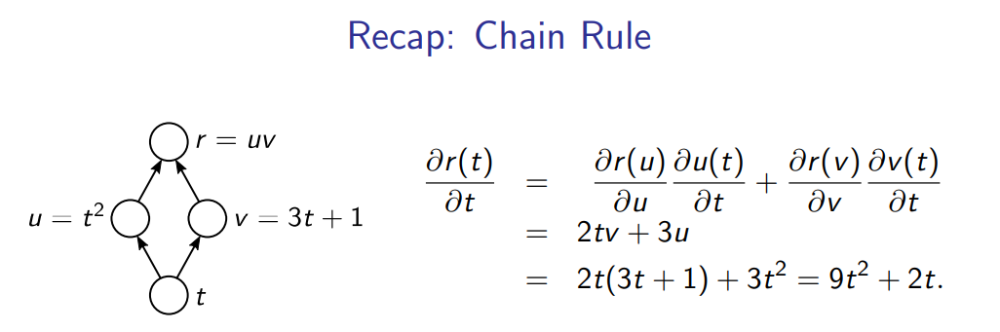
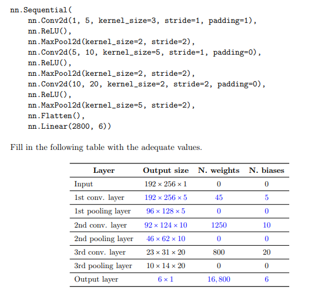

# Deep Learning

## Linear Models

> **Linear models** are a class of **regression** and **classification** models in which the prediction is a linear function of the input variables.

### Linear Regression: $y = w^T x + b$

* $w$ is a $d$-dimensional vector of **weights**;
* $b$ is a **bias** - usually included in $w$ as a constant feature $x_0 = 1$;
* Given **training data** $D = \{(x_n, y_n)\}_{n=1}^N$, we want to find the **best** $w$ and $b$, so we use want to fit the model, i.e. find the best $w$ and $b$, **minimizing the loss function** - usually, the **squared loss**: $\hat{w} = argmin_{w} \frac{1}{2} \sum_{n=1}^N (y_n - (w^T x_n + b))^2$;
* **Closed-form solution**: $w = (X^T X)^{-1} X^T y$, where $X = \left[ \begin{matrix} x_1^T \\ x_2^T \\ \vdots \\ x_N^T \end{matrix} \right]$ and $y = \left[ \begin{matrix} y_1 \\ y_2 \\ \vdots \\ y_N \end{matrix} \right]$;
* **Regularization** is a technique used to **reduce overfitting** by **constraining** the **weights** of the model;
  * If $X^T X$ is not invertible, we can add a regularization term to the loss function - **ridge regression**;
    * $L(w, b) = \sum_{n=1}^N (y_n - (w^T x_n + b))^2 + \lambda ||w||^2_2$;
    * **Closed-form solution**: $\hat{w_{ridge}} = (X^T X + \lambda I)^{-1} X^T y$;
    * $l_2$ regularization is also known as **weight decay**, or penalized least squares.

### Maximum A Posteriori Estimation

* A **Bayesian** approach to **linear regression**;
* Assume that the **weights** are **random variables** with a **prior distribution**: $w \sim \mathcal{N}(0, \tau^2 I)$;
* $\hat{w_{MAP}} = argmax_w p(w | y) = argmin_{w} \lambda ||w||^2_2 + \sum_{n=1}^N (y_n - w^T \phi(x_n))^2$;
  * $||w||^2_2$ is the **regularization term**;
  * $\sum_{n=1}^N (y_n - w^T \phi(x_n))^2$ is the **squared loss**.

### Perceptron: $y = sign(w^T x + b)$

* **Binary classification** model - outputs $+1$ or $-1$ (**discrete**);
* **Discriminative** model - **directly** models $p(y | x)$;
* Bias $b$ is included in $w$ as a constant feature $x_0 = 1$;
* $x$ can be represented as $\phi(x)$, where $\phi$ is a **feature map**;
* Algorithm:
  1. Initialize $w$ to zero: $w_0 = 0$;
  2. While not converged, for each $(x_n, y_n)$ in $D$:
     1. Predict: $\hat{y} = sign(w^T x_n)$;
     2. If $\hat{y} \neq y_n$:
        1. Update: $w_{t+1} = w_t + y_n x_n$;
        2. Go to step 2;
* **Perceptron convergence theorem**: if the **training data** is **linearly separable**, the **perceptron algorithm** will **converge** in a **finite number of steps**:
* It **cannot** be used for **non-linearly separable data** - XOR problem.

### Logistic Regression: $y = \sigma(w^T x + b)$

* **Logistic regression** is a **linear model** for **binary classification** - differs from perceptron, because it uses a **sigmoid function (continuous)** instead of a **sign function (discrete)**;
* **Binary classification** model - outputs $[0, 1]$ (**continuous**);
* **Discriminative** model - **directly** models $p(y | x)$;
* No closed-form solution, so we use **gradient descent** to find the **best** $w$ and $b$ - **stochastic gradient descent** is usually used, because it is **faster**: $w_{t+1} = w_t - \eta \nabla_w L(w_t)$. The **learning rate** $\eta$ is usually **small**;
  * Different than **gradient descent**: $w_{t+1} = w_t - \eta \nabla_w \sum_{n=1}^N L(w_t, x_n, y_n)$, which uses **all** the **training data** to compute the **gradient**.

### Multi-class Classification

* **Multi-class classification** is a **classification** task with **more than two classes**, but there are several strategies to **reduce to binary classification**;
* Parametrized by a **weight matrix** $W \in \mathbb{R}^{d \times |Y|}$ and a **bias vector** $b \in \mathbb{R}^{|Y|}$;
* $\hat{y} = argmax_{y \in Y} (W \phi(x) + b)$;
* Multi-class perceptron algorithm:
  1. Initialize $W$ to zero: $W_0 = 0$;
  2. While not converged, for each $(x_n, y_n)$ in $D$:
     1. Predict: $\hat{y} = argmax_{y \in Y} (W \phi(x_n))$;
     2. If $\hat{y_n} \neq y_n$:
        1. Update: $W_{y_n}^{k+1} = W_{y_n}^k + \phi(x_n)$
        2. Update: $W_{\hat{y_n}}^{k+1} = W_{\hat{y_n}}^k - \phi(x_n)$;
        3. Go to step 2;

---

## Neural Networks

* **Neural networks** are a class of **non-linear models** that are **inspired by the brain**;
* Consist of **neurons** that are **connected** to each other;
* **Pre-activation**: $z(x) = w^T x + b = \sum_{i=1}^d w_i x_i + b$;
* **Activation**: $h(x) = g(z(x))$; $g$ can be:
  * **Linear**: $g(z) = z$ - linear regression;
  * **Sigmoid**: $g(z) = \frac{1}{1 + e^{-z}}$ - logistic regression;
  * **Rectified Linear Unit (ReLU)**: $g(z) = max(0, z)$ - most used because it is **fast** to compute;
  * **Hyperbolic Tangent (tanh)**: $g(z) = \frac{e^z - e^{-z}}{e^z + e^{-z}}$;
  * **Softmax**: $g(z) = \frac{e^{z_i}}{\sum_{j=1}^k e^{z_j}}$ - used for **multi-class classification**;

### Feed-forward Neural Networks

* A **feed-forward neural network** is a **neural network** where the **neurons** are **organized in layers** - there are **hidden layers** between the **input layer** and the **output layer**;
  * **Input layer**: $x$ - vector of features;
  * **Hidden layers**: $h^{(1)}, h^{(2)}, \dots, h^{(L)}$;
  * **Output layer**: $y$ - vector of predictions;
  * **Weights**: $W^{(1)}, W^{(2)}, \dots, W^{(L)}$ - each weight matrix is between two layers;
  * **Biases**: $b^{(1)}, b^{(2)}, \dots, b^{(L)}$ - each bias vector is between two layers;
  * **Hidden layer pre-activation**: $z^{(l)}(x) = W^{(l)} h^{(l-1)}(x) + b^{(l)}$;
  * **Hidden layer activation**: $h^{(l)}(x) = g(z^{(l)}(x))$;
  * **Output layer activation**: $f(x) = h^{(L)}(x)$;
* **Universal approximation theorem**: a **feed-forward neural network** with a **single hidden layer** can **approximate any function** - given enough **neurons**;

### Training Neural Networks

* Training consists of **finding the best parameters $\theta$** - weights and biases, that **minimize the loss function**: $L(\theta) := \lambda \omega(\theta) + \frac{1}{N} \sum_{n=1}^N L(f(x_n; \theta), y_n)$;
* $\lambda$ is the **regularization constant**;
* $\omega(\theta)$ is the **regularization term**;
* $L(f(x_n; \theta), y_n)$ is the **loss function**;
  * **Mean squared error**: $L(f(x_n; \theta), y_n) = \frac{1}{2} (f(x_n; \theta) - y_n)^2$ - used for **regression**;
  * **Cross-entropy loss** (negative log-likelihood): $L(f(x_n; \theta), y_n) = - \sum_{i=1}^k y_{n,i} log(f(x_n; \theta)_i) = - log((softmax(z(x))_y))$ - used for **classification**;
* **Backpropagation** is a technique used to **compute the gradients** of the **loss function** with respect to the **parameters** - **chain rule**.

    

### Automatic Differentiation

* **Automatic differentiation** is a **technique** for **computing derivatives** of **functions**;
  * Forward propagation can be represented as a **computation graph** - a **directed acyclic graph** (DAG) that represents the **computation** of the **function**;
    * Each box can be an object with a `fprop` method that computes the **forward pass**;
    * Calling the `fprop` method of each box in the **topological order** of the graph computes the **forward pass**;
  * **Backpropagation** is also implemented as a **computation graph** - a **directed acyclic graph** (DAG) that represents the **computation** of the **gradients**;
    * Each box can be an object with a `bprop` method that computes the **loss gradient** w.r.t. its parents, given the **loss gradient** w.r.t. to the output of the box;
    * Calling the `bprop` method of each box in the **reverse topological order** of the graph computes the **backward pass**.
  * There are several **Autodiff** strategies:
    * **Symbol-to-Number Differentiation**
      * Take a computational graph and numerical inputs;
      * Returns a set of numerical outputs describing the gradient at those inputs;
      * **Advantage**: simpler to implement and debug;
      * **Disadvantage**: only works for first-order derivatives;
      * **Example**: Caffe, Torch, PyTorch, ...
    * **Symbol-to-Symbol Differentiation**
      * Take a computational graph and add additional nodes to the graph that provide a symbolic description of the gradient;
      * **Advantage**: works for higher-order derivatives;
      * **Disadvantage**: more complex to implement and debug;
      * **Example**: Theano, TensorFlow, ...

### Regularization

* **Regularization** is a technique used to **reduce overfitting** by **constraining** the **weights** of the model - $\Omega(\theta)$ is the **regularization term**;
  * **L2 regularization**: $\Omega(\theta) = \frac{1}{2} \sum_{li=1}^{L+1} ||W^{(l)}||^2$ - **weight decay** - penalizes **large weights**;
    * Equivalent to **Gaussian prior** on the weights;
  * **L1 regularization**: $\Omega(\theta) = \sum_{li=1}^{L+1} ||W^{(l)}||$ - **sparse weights** - promotes **sparsity** of the weights;
    * Equivalent to **Laplace prior** on the weights;
  * **Dropout**: randomly **drop** some **neurons** during **training** - **ensemble** of **smaller networks** - **regularizes** the **network**;
    * There is a dropout probability $p$ for each neuron;
    * Usually implemented with random binary masks;
    * The hidden layer activations becomes: $h^{(\mathcal{l})}(x) = g(z^{(\mathcal{l})}(x)) \odot m^{(\mathcal{l})}$, where $m^{(\mathcal{l})} \in \{0, 1\}^{K^{(\mathcal{l})}}$ is a **random binary mask** with $p$ probability of being $1$;

---

## Representing Learning - Auto-encoders

* **Auto-encoders** are feed-forward NNs trained to reproduce its input at its output layer;
* **Encoder** - maps input to a hidden representation : $h = g(Wx + b)$;
* **Decoder** - maps hidden representation to a reconstruction : $\hat{x} = W^Th(x) + c$;
* **Loss function** - $\mathcal{L}(\hat{x}, x) = \frac{1}{2}||\hat{x} - x||^2$;
* **Objective** - $\hat{W} = argmin_W \sum_{i} || W^Tg(Wx_i) - x_i||^2$ - drop the bias term $b$.

### Single Value Decomposition (SVD)

* **SVD** is a matrix factorization method that decomposes a matrix $A \in \mathbb{R}^{m \times n}$ with $m \geq n$ into the product of three matrices $U$, $\Sigma$ and $V$ such that $A = U\Sigma V^T$;
  * $U \in \mathbb{R}^{m \times m}$ - columns are an orthonormal basis of $R(A)$ (left singular vectors);
  * $\Sigma \in \mathbb{R}^{m \times n}$ - diagonal matrix with singular values of $A$; 
  * $V \in \mathbb{R}^{n \times n}$ - columns are an orthonormal basis of $R(A^T)$ (right singular vectors);
  * $sigma_1 \geq ... \geq \sigma_r$ - square roots of the eigenvalues of $A^TA$ or $AA^T$ - **singular values** of $A$;
  * $U^TU = I$ and $V^TV = I$.

### Linear Auto-Encoder

* Let $X \in \mathbb{R}^{N \times D}$ be a data matrix with $N$ samples and $D$ features ($N > D$);
* Assume $W \in \mathbb{R}^{K \times D}$ ($K < D$);
* We want to minimize $\sum_{i=1}^N ||x_i - \hat{x}_i||_2^2 = ||X -XW^TW||_F^2$;
  * $|| \cdot ||_F^2$ - **Frobenius norm**;
  * $W^TW$ has rank $K$;
* From the **Eckart-Young theorem**, the minimizer is **truncated SVD** of $X^T$;
  * $\hat{X}^T = U_K\Sigma_KV_K^T$;
  * $W = U_K^T$;
* This is called **Principal Component Analysis (PCA)** - fits a **linear manifold** to the data - auto-encoder with **linear activations**.
* By using **non-linear activations**, we obtain more sophisticated codes (representations).

There are some variants of auto-encoders:

* **Sparse auto-encoders** - add a **sparsity penalty** $\Omega(h)$ to the loss function;
  * Typically the number of hidden units is larger than the number of inputs;
  * The sparsity penalty is a **regularization** term that encourages the hidden units to be **sparse**;
* **Stochastic auto-encoders** - encoder and decoder are **not deterministic**, but involve some **noise/randomness**;
  * Uses distribution $p_encoder(h|x)$ for the encoder and $p_decoder(x|h)$ for the decoder;
  * The auto-encoder can be trained to minimize $-log(p_decoder(x|h))$;
* **Denoising auto-encoders** - use a **perturbed version of the input** $\tilde{x} = x + n$, where $n$ is a **random noise**;
  * Instead of minimizing $\frac{1}{2}||\hat{x} - x||^2$, we minimize $\frac{1}{2}||\hat{x} - \tilde{x}||^2$;
  * This is a form of implicit regularization that ensures **smoothness**: it forces the system to represent well not only the data points, but also their perturbations;
* **Stacked auto-encoders** - several layers of auto-encoders stacked together;
* Variational auto-encoders - learn a **latent variable model** of the data.

#### Regularized Auto-Encoders

* We need some sort of **regularization** to avoid **overfitting**;
* To regularize auto-encoders, **regularization** is added to the loss function;
* The goal is then to minimize $\mathcal{L}(\hat{x}, x) + \Omega(h, x)$;
* For example:
  * Regularizing the code: $\Omega(h, x) = \lambda ||h||^2$;
  * Regularizing the derivatives: $\Omega(h, x) = \lambda \sum_{i} ||\nabla_x h_i||^2$.

> One use of auto-encoders is **unsupervised pre-training** of **deep neural networks**.

---

## Convolutional Neural Networks

* **Convolutional neural networks (CNNs)** are a class of **deep neural networks** that are **specialized** for **processing data** that has a **grid-like topology**, such as **images**;
* Equivalent to **translations** of the **input**;
* Convolutional and pooling layers exploit the fact that the same feature may appear in different **parts of the image**;
* Lower layers of a CNN learn **local features** (e.g. edges), while higher layers learn **global features** (e.g. objects);
* **Convolution layers** are alternated with **pooling layers** - **convolution** is a **linear operation** that **preserves the grid-like topology** of the input;
* **Activation maps** are the **output** of a **convolutional layer**;
* Image of size $N \times N \times D$ is represented as a **3D tensor**;
* **Filter/kernel** is a **small matrix** that is **convolved** with the **input** to produce an **activation map** - $F \times F \times D$;
* **Stride** is the **step size** of the **convolution** - $S$;
* **Padding** is the **number of zeros** added to the **input** - $P$;
  * A common padding size is $P = \frac{F - 1}{2}$, which preserves the spatial size of the input $M = N$;
* **Number of channels** is the **number of filters** used in each layer - $K$;
* The **output** of a **convolutional layer** is of size $M \times M \times K$, where:
  * $M = \frac{N - F + 2P}{S} + 1$;
* **Number of trainable parameters** in a **convolutional layer**: $M \times ((N^2 \times K) + bias)$;
* Properties of CNNs:
  * **Invariance** - the output is **invariant** to **small translations** of the input;
  * **Locality** - the output is **only affected** by a **small region** of the input;
  * **Sparse interactions** - each output value is the result of a **small number of interactions** with the input;
  * **Parameter sharing** - the **same parameters** are used for **different parts** of the input.

    

### Residual Networks (ResNets)

* **Residual networks** are a class of **neural networks** that **skip connections** - tend to lead to more stable learning;
* Key motivation: **mitigate the vanishing gradient problem**;
* With $H(x) = \mathcal{F}(x) + \lambda x$, the gradient backpropagation becomes:

$$
\frac{\partial L}{\partial x} = \frac{\partial L}{\partial H} \frac{\partial H}{\partial x} = \frac{\partial L}{\partial H} \left( \frac{\partial \mathcal{F}}{\partial x} + \lambda \right)
$$

---

## Recurrent Neural Networks

* RNNs allow to take advantage of **sequential data** - words in text, DNA sequences, sound waves, etc;
  * $h_t = g(V x_t + U h_{t-1} + c)$ - $h_t$ is the **hidden state** at time $t$;
  * $\hat{y}_t = W h_t + b$ - $\hat{y}_t$ is the **output** at time $t$;
* Used to generate, tag and classify sequences, and are trained using **backpropagation through time**;
  * Parameters $V$, $U$, $W$, $c$ and $b$ are **shared** across **time steps** - **parameter sharing**;
  * **Exploding gradients** are a problem - **gradient clipping** is used to avoid this problem;
  * **Vanishing gradients** are a problem - **LSTMs** and **GRUs** are used to avoid this problem.

Applications:
  * **Sequence generation** - generate a sequence of words - **auto-regressive models**;
  * **Sequence tagging** - assign a label to each element in a sequence;
  * **Pooled classification** - classify a sequence as a whole;

Standard RNNs suffer from vanishing and exploding gradients - alternative parameterizations like **LSTMs** and **GRUs** are used to avoid this problem;
* **Gated Recurrent Units (GRUs)** are a type of **recurrent neural network** that are **simpler** than **LSTMs** and **perform better** than **standard RNNs** - idea is to create some **shortcuts** in the **standard RNN**;
  * $u_t = \sigma(V_u x_t + U_u h_{t-1} + b_u)$ - **update gate**;
  * $r_t = \sigma(V_r x_t + U_r h_{t-1} + b_r)$ - **reset gate**;
  * $\tilde{h}_t = tanh(v x_t + U (r_t \odot h_{t-1}) + b)$ - **candidate hidden state**;
  * $h_t = (1 - z_t) \odot h_{t-1} + z_t \odot \tilde{h}_t$ - **hidden state**;
* **Long Short-Term Memory (LSTM)** is a type of **recurrent neural network** that are **more complex** than **GRUs** and **perform better** than **standard RNNs** - idea is to use **memory cells $c_t$** to **store information**;
  * $i_t = \sigma(V_i x_t + U_i h_{t-1} + b_i)$ - **input gate**;
  * $f_t = \sigma(W_f x_t + U_f h_{t-1} + b_f)$ - **forget gate**;
  * $o_t = \sigma(W_o x_t + U_o h_{t-1} + b_o)$ - **output gate**;
  * $\tilde{c}_t = tanh(W_c x_t + U_c h_{t-1} + b)$ - **candidate cell state**;
  * $c_t = f_t \odot c_{t-1} + i_t \odot \tilde{c}_t$ - **cell state**;
  * $h_t = o_t \odot tanh(c_t)$ - **hidden state**.

---

## Sequence to Sequence Models

* **Sequence-to-sequence models** are a class of **neural networks** that are used to **map sequences** to **sequences** - **encoder-decoder** architecture;
  * Used for **machine translation**, **speech recognition**, **image captioning**, etc;
* A **Neural Machine Translation (NMT)** system is a **sequence-to-sequence model** that is used to **translate** a **sequence** in one **language** to a **sequence** in another **language** - **encoder-decoder** architecture;
  * **Encoder** RNN encodes source sentence into a **vector state** - $h_t = f(x_t, h_{t-1})$;
  * **Decoder** RNN decodes the **vector state** into a **target sentence** - $y_t = g(y_{t-1}, s_t)$;
* Representing the **input sequence** as a **single vector** is a **bottleneck** - **attention mechanisms** are used to **improve performance** - focus on different parts of the input.

---

## Attention Mechanisms and Transformers

* Encoders/decoders can be RNNs, CNNs or **self-attention layers**;
* **Self-attention** is a **linear operation** that **maps** a **sequence** of **vectors** to a **sequence** of **vectors** - **encoder-decoder** architecture;
  * **Query** vector $q_t$;
  * **Key** vectors $k_1, k_2, \dots, k_n$;
  * **Value** vectors $v_1, v_2, \dots, v_n$;
  * **Attention weights** $\alpha_{t, i} = \frac{exp(q_t^T k_i)}{\sum_{j=1}^n exp(q_t^T k_j)}$;
  * **Output** vector $o_t = \sum_{i=1}^n \alpha_{t, i} v_i$;
* **Transformers**: **encoder-decoder** architecture with **self-attention** layers instead of **RNNs**;
  * **Encoder**: **self-attention** layers;
  * **Decoder**: **self-attention** layers + **encoder-decoder attention** layers;
* **Multi-head attention** is a **self-attention** layer with **multiple heads** - **parallel** self-attention layers;
  * **Query** vectors $q_t$;
  * **Key** vectors $k_1, k_2, \dots, k_n$;
  * **Value** vectors $v_1, v_2, \dots, v_n$;
  * **Attention weights** $\alpha_{t, i} = \frac{exp(q_t^T k_i)}{\sum_{j=1}^n exp(q_t^T k_j)}$;
  * **Output** vector $o_t = \sum_{i=1}^n \alpha_{t, i} v_i$.

---

## Large Pretrained Models

* Pretraining large models and fine-tuning them to a specific task is a common practice in deep learning:
  * **Pretraining** is a technique used to **initialize** the **parameters** of a **neural network** - **self-supervised learning**;
  * **Fine-tuning** is a technique used to **adapt** the **parameters** of a **neural network** to a **specific task**;
* Models: ELMo, BERT, GPT, etc;
* **Adapters** and **prompting** are other strategies more parameter-efficient than fine-tuning;
* Current models exhibit **few-shot learning** capabilities - can be trained with **few examples**.

---
---

## Derivatives and Gradients

* **Derivatives** are a **measure of how a function changes** when its **inputs change**;
* **Gradients** are a **generalization of derivatives** to **multiple dimensions** - **vector of partial derivatives**;
* **Partial derivatives** are the **derivatives** of a **function** with **respect to one variable**, while **holding the other variables constant**.

### Derivative Rules

* $\frac{d}{dx} c = 0$;
* $\frac{d}{dx} x^n = n x^{n-1}$;
* $\frac{d}{dx} e^x = e^x$;
* $\frac{d}{dx} log(x) = \frac{1}{x}$;
* $\frac{d}{dx} sin(x) = cos(x)$;
* $\frac{d}{dx} cos(x) = -sin(x)$;
* $\frac{d}{dx} f(g(x)) = f'(g(x)) g'(x)$;
* $\frac{d}{dx} f(x) g(x) = f'(x) g(x) + f(x) g'(x)$;
* $\frac{d}{dx} \frac{f(x)}{g(x)} = \frac{f'(x) g(x) - f(x) g'(x)}{g(x)^2}$;
* $\frac{d}{dx} \sum_{i=1}^n f_i(x) = \sum_{i=1}^n \frac{d}{dx} f_i(x)$;
* $\frac{d}{dx} \prod_{i=1}^n f_i(x) = \sum_{i=1}^n \frac{d}{dx} f_i(x) \prod_{j \neq i} f_j(x)$.

### Chain Rule

* The **chain rule** is a **formula** for computing the **derivative** of the **composition** of **two or more functions**;
* If $y = f(u)$ and $u = g(x)$, then $\frac{dy}{dx} = \frac{dy}{du} \frac{du}{dx}$.

### Gradient

* The **gradient** of a **scalar function** $f: \mathbb{R}^n \rightarrow \mathbb{R}$ is the **vector of partial derivatives** of $f$ with respect to each of its **input variables**;
* $\nabla f(x) = \left[ \begin{matrix} \frac{\partial f(x)}{\partial x_1} \\ \frac{\partial f(x)}{\partial x_2} \\ \vdots \\ \frac{\partial f(x)}{\partial x_n} \end{matrix} \right]$;
* Rules:
* $\nabla_x c = 0$;
* $\nabla_x x^T A x = (A + A^T) x$;
* If $A$ is **symmetric**, then $\nabla x^T A x = 2 A x$;
* Particular case: $f(x) = x^T x = ||x||^2$, then $\nabla f(x) = 2 x$.
* If $f(x) = x^T b = b^T x$, then $\nabla f(x) = b$.
* If $g(x) = f(Ax), then \nabla g(x) = A^T \nabla f(Ax)$.
* If $g(x) = f(a \cdot x)$, then $\nabla g(x) = a \cdot \nabla f(a \cdot x)$.
