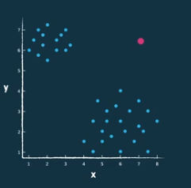
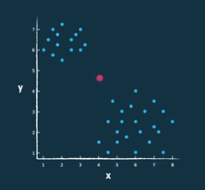
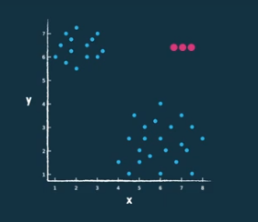

# Anomaly Detection

> **Anomaly Detection** is the identification of records that do not conform to expected (normal) behaviour.

- **Outliers** are values that deviate from the expected behavior - **variable perspective**;
- **Anomalies** are records that deviate from the expected behavior - **record perspective**;
- **Point anomalies** are individual records that are anomalous;
- **Contextual anomalies** are records that are anomalous in a specific context - record at the same distance of both clusters, but does not belong to any of them;
- **Collective anomalies** are records that are anomalous when considered together - a record that is not anomalous by itself, but is anomalous when considered with other records.

    
    
    

    <strong>Figure:</strong> Point, Contextual and Collective Anomalies.

---

## Anomaly Detection Techniques

- **Classification-based** - **train a classifier** to distinguish between normal and anomalous records - **supervised**;
- **Clustering-based** - **cluster** the records and consider the records in small clusters as anomalies - **unsupervised**;
  - **K-means with Euclidean distance** - clusters are spherical and have the same size;
  - **EM** - **Expectation-Maximization** algorithm (creates clusters with different sizes, usually one big and one small);
- **Statistical-based** - **model** the normal records and consider the records that do not fit the model as anomalies - **unsupervised**;
  - See the probability distribution of the data and consider the records that are far away from the distribution as anomalies;
- **Proximity-based** - **measure the distance** between records and consider the records that are far away from the others as anomalies - **unsupervised**;
  - **LOF** - **Local Outlier Factor** - is an unsupervised algorithm that computes the **local density** of a point compared to its neighbors;
    - It cannot detect **collective anomalies**;

---

## Assessment

- **Recal**, also known as **True Positive Rate** or **Sensitivity**, is the proportion of actual positives that are correctly identified as such: $recall = \frac{TP}{TP + FN}$;
- ROC charts are the best way to compare classifiers.
