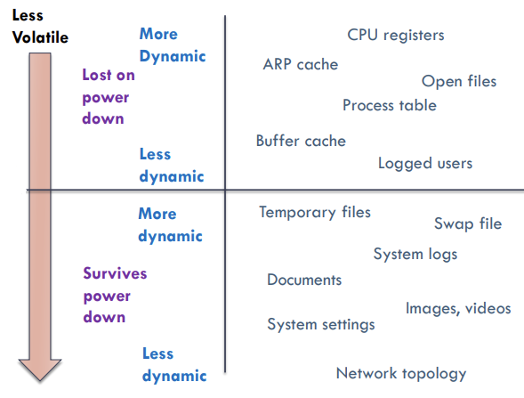
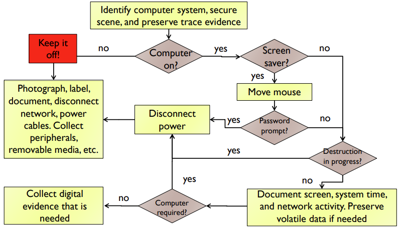
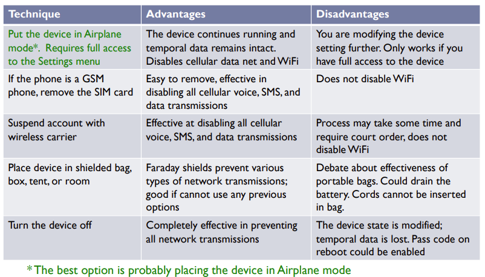

# Evidence Acquisition

## Forensic tools for evidence acquisition

- **Commercial tools**:
  - ✅ Rich in features and user friendly;
  - ❌ Expensive;
- **Open source tools**:
  - ✅ Free and still rich in features;
  - ❌ Not so user friendly;
  - Examples:
    - **FTK imager/dd**: disk imager;
    - **Autopsy/The Sleuth Kit**: disk analysis;
    - **Volatility**: memory forensics;
    - **Registry recon**: Windows registry analysis;
    - **Wireshark**: network analysis;
    - **Cellebrite UFED**: mobile forensics;
    - **Kali**/CAINE: Linux distributions;

> It's very important to use only **trustworthy** forensic tools, with the following properties: **usability**, **comprehensiveness**, **accuracy**, **determinism**, **verifiability** and **performance**.

Equipment recommended by the Interpol to carry in backpack:

- **Forensic equipment**: laptop with the necessary standard forensic tools installed, forensically clean storage for evidence collection, hardware write blocker;
- **Tools to disassemble**;
- **Exhibit documentation**: photo/video camera, permanent markers, labels, tags;
- **Resources for packaging and transport**: evidence bags and seal;
- ...

## Evidence acquisition procedures

### Handle storage devices

- If you can take the device: tag, bag, create chain of custody and **bring to the lab** for extraction;
  - Else, perform **extraction on spot**;
- **Extraction**: copy data without alterations, calculate the hash, and create at least one copy;
- Use **write blockers** - filters that allow the acquisition of data from a storage device without changing the contents of the source; **writes are blocked, only reads are allowed**;
- **Hardware write blockers** (✅ more comprehensive and secure, ❌ however is more expensive and less available)
- **Software write blockers**;
- **Bit-by-bit** copy: collect meta-data, active and stale data;
- **Device to device (clone)**;
- **Device to file (image)** - ✅ recommended:
  - Allows the copy to be spread in multiple files, facilitating storage;
  - Provides file compression without data loss;
  - Allows encryption if needed;
  - May include case info;
  - Prevents contamination of the copy;
- In some cases, it will not be possible to obtain an exact physical copy, bit by bit, of the entire source device: try to perform **logical acquisition**:
- **Logical copy of files** - select relevant files;
- **Logical copy of volumes** - copy the contents of an encrypted volume that is being
  used (hence, unencrypted) on a powered computer;

### Handle computer

- If the computer is off, **leave it off**;
  - Evidence can be **tampered or even destroyed**;
  - Check if the computer is really off, and prevent it to being turned on (bag the cable, tape over the power receptacle, and remove the battery if it's a laptop)
  - If you cannot bring the entire computer, juts bring the hard disks, or a copy of them;
- If the computer is **turned of**:
  - **Plug it off**: may help preserve evidence ✅ (any script that would executed during shutdown will not execute), however volatile information may be lost ❌
  - **Unplugging the network cable** can be:
    - ✅ **Good**: preserve evidence by preventing anyone from accessing systems;
    - ❌ **Bad**: can destroy evidence, like the list of active connections;
    - ❌ **Ugly**: it can impact a business (e.g. disconnect a whole server).

> **Decide according to what will preserve most relevant evidence: if it's on, do not turn it off and isolate the networks**

- Is the system **password-protected**?
  - If it is and you don't know the password -> pull the power plug (not much can be done);
  - If there are logged in accounts, perform **live forensics**: analysis is done on a live system -> we are modifying the system, so better we know what we are doing!
    - Useful **volatile** data to collect:
      - RAM content;
      - Routing table;
      - DNS cache;
      - Running processes;
      - Active network connections;
      - Open files and ports;
    - Collect **from the most volatile to the least**;

    

    <strong>Figure:</strong> Volatility Levels.

    

    <strong>Figure:</strong> Simplified decision process in live forensics.

### Handle mobile devices

- Limitations when handling mobile devices:
  - **Cannot remove persistent memory** off the device;
  - The **OS restricts** data access;
  - Linked with outside world via **wireless**;
  - Depend on **battery** for power supply;
- Use the chance to **infer the lock pattern** from the oil smudge left;
- If the device is on, **isolate it**;
  - Airplane mode;
  - Remove SIM card;
  - Suspend account with carrier;
  - Turn off the device;
  - Place the device in a **Faraday bag**;

    

    <strong>Figure:</strong> Mobile isolation techniques.

