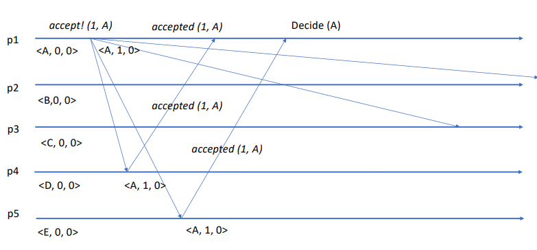
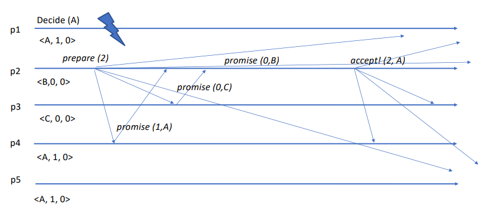
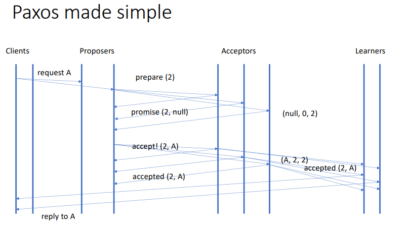

# [Consensus 🤝](https://w3.cs.jmu.edu/kirkpams/OpenCSF/Books/csf/html/DistConsensus.html#:~:text=Consensus%20in%20a%20distributed%20system,to%20determine%20a%20variable's%20value.)

> _**Consensus** is the process of **agreeing on one result among a group of participants**. This problem becomes difficult when the participants or their communication medium may experience **failures**._

<p align="center">
    
</p>

- Set of **N** processes;
- Each process **proposes** a value;
- All correct processes **decide** on the same value;
- The output value must be a **proposed value**;
- The output value may be any of the proposed values - **all inputs are equally good**.

## Properties of Consensus

- **Termination**: all correct processes eventually **terminate/decide**;
- **Uniform Agreement**: all correct processes **decide on the same value**;
- **Integrity**: the value decided has been **proposed by some process**.

---

## Problems/Challenges

### Bogus Consensus

- Assume you have a URB (Uniform Reliable Broadcast) primitive with the following interface:
  - `broadcast(m)`: broadcasts message `m` to all processes;
  - `deliver(m)`: delivers message `m` to the application;
- and the following properties:
  - **Validity**: if a correct process broadcasts a message `m`, then it eventually delivers `m`;
  - **No duplication**: no message is delivered more than once;
  - **No creation**: if a process delivers a message `m`, then `m` was previously broadcast by some process;
  - **Agreement**: if a correct process delivers a message `m`, then all correct processes eventually deliver `m`.

Now assume the following algorithm - **Bogus Consensus**:

```
When propose(value):
  URB.broadcast(value)

When deliver(value_i):
  setOfValues.add(value_i)

When |setOfValues| == N:
  decide(MIN(setOfValues)) // MIN or other deterministic function
```

**Problem**: if a process fails (and never broadcasts), then the other processes will never decide - will **block forever**.

### Bogus with Perfect Failure Detector

> A Perfect Failure Detector is a failure detector that **eventually** **detects** every process crash.

```
alive = {p1, p2, ...} // initially |alive| = N

When fail(p_i):
  alive.remove(p_i)

When propose(value):
  URB.broadcast(value)

When deliver(value_i):
  setOfValues.add(value_i)

When |setOfValues| == |alive|:  // |alive| is the number of processes alive
  decide(MIN(setOfValues))      // MIN or other deterministic function
```

**Problem**: if a process proposes(broadcasts) a value and then crashes, while the URB is still executing:

- a process may receive the value, before the failure is detected;
- another process may detect the failure before receiving the value.

These processes will **decide on different values**.

---

### Terminating Reliable Broadcast, URB and Perfect Failure Detector

> A Terminating Reliable Broadcast is a communication primitive used to disseminate a message among a set of processes in a reliable way.

- There is a special process that is the **sender** `s`;
  - `s` broadcasts a message `m`;
  - initiates the algorithm issuing `send(m)`;
  - other nodes initiate the algorithm issuing `wait()`;
- All correct process **eventually** execute `output(value)`;
  - where `value` is the message `m` sent by `s`;
  - or `null` if `s` crashes before sending `m`.

```
proposed = false

When TRB.wait():
  do nothing

When TRB.send(m):
    URB.broadcast(m)

When URB.deliver(m) and not proposed:
  proposed = true
  consensus.propose(m)

When fail(s) and not proposed:
  proposed = true
  consensus.propose(null)

When consensus.decide(value):
  TRB.output(value)
```

---

### Leader based Consensus with Perfect Failure Detector (P)

> A leader based consensus algorithm is an algorithm that **elects a leader** and then **uses the leader to decide**.

Works in **epochs/rounds** - in each epoch there is a different leader;

- Epoch `i` is led by process `pi`;
- Epoch `i` starts only if epoch `i-1` has terminated - all leaders from previous epochs have failed.

#### Execution

1. The **leader** `pi` of epoch `i` **sends** its value `vi` to all processes;
2. When a process receives a value `vi` from the leader `pi`, it **adopts** `vi` as its value (forgetting any previous value) and sends back an **acknowledgement** to `pi`;
3. The leader waits until it receives an **acknowledgement** from **all correct processes** - all correct processes have adopted the leader's value;
4. The leader then sends a second message that **commits** its proposed value;
5. When a process receives a **commit** message from the leader, it **decides/outputs** on the leader's value.

---

### Perfect Failure Detector (P)

- Very hard to implement in a **real system**;
  - requires use of real-time OS and real-time network, plus bound and predictable loads;
- If processes may suffer arbitrary delays, it may be **impossible to distinguish between a process that is slow and a process that has crashed** - **Unreliable Failure Detector**.

---

## Impossibility of Consensus (Fischer, Lynch and Paterson)

> There is no **deterministic** protocol that solves consensus in an asynchronous system where even a single process may suffer a crash fault

- **Proof by contradiction**:
  - Assume there is a protocol that solves consensus;
  - Show that the protocol **violates one of the three properties** of consensus.

#### Example 1

- Two processes `p1` and `p2` propose initially 0;
- `p2` crashes as soon as the execution starts;
- By the validity property, the correct process `p1` must decide on 0, at some instant `t1`.

#### Example 2

- Two processes `p1` and `p2` propose initially 0;
- `p1` crashes as soon as the execution starts;
- By the validity property, the correct process `p2` must decide on 0, at some instant `t2`.

#### Example 3

- Process `p1` proposes initially 0, and `p2` proposes initially 1;
- Messages between `p1` and `p2` are delayed, so that `p1` receives `p2`'s proposal only after it has decided on 0, and `p2` receives `p1`'s proposal only after it has decided on 1.

The solution for this is that the leader should be able to make a decision without receiving acknowledgements from all processes, just a **majority**.

When a new leader is elected, it should **enquire** the other processes to check what the previous leaders have done.

The solution to this is the **Paxos** algorithm.

---

---

## [Paxos](https://lamport.azurewebsites.net/pubs/paxos-simple.pdf)

> _[**Paxos**](https://www.cs.yale.edu/homes/aspnes/pinewiki/Paxos.html) is an algorithm for solving consensus assuming a very weak assumption on synchrony of the system (**without a perfect failure detector**)._

1. Messages can take **arbitrarily long** to be delivered, can be **lost**, and can be **duplicated**, but they **cannot be corrupted**;
2. Agents operate at **arbitrary speeds**;
3. For a sufficiently long period of time, the system is **synchronous enough** to allow electing a single leader - **distinguished proposer**.

Paxos has **3 types of agents/roles**:

- **Proposers** - propose values;
- **Acceptors** - accept values;
- **Learners** - learn values.

> Assumption: **asynchronous**, **non-Byzantine** system with a distinguished proposer.

### Leaders in Paxos

- Proposers pre-agree on an order to become leaders: `{p1, p2, ..., pn}`;
- `p1` is the first leader;
- If a process `pi` suspects that all the previous leaders have crashed, it becomes the new leader;
- If `pn` is suspected to have crashed, `p1` becomes leader again, and the **cycle repeats**;
- The leader numbers work as a logical clock, that marks the **passage of time**.

---

### Algorithm of the Leader

Each leader performs **two steps** (the first step is skipped by the first leader):

1. **Prepare**: checks for evidence of the **activity of past leaders** and selects a value that is consistent with any decision that previous leaders may have taken;
   - For this, each process keeps a tuple with the last adopted value: `<value, wr_timestamp, rd_timestamp>` - `value` is the adopted value, `wr_timestamp` is the timestamp of the last write, and `rd_timestamp` is the timestamp of the last read.
   - Initially, this tuple is `<my_value, 0, 0>` - `my_value` is the value proposed by the process.
2. **Propose**: attempts to have a **majority** of nodes to adopted the value it has selected. If a majority is reached, the leader sends a commit message to all nodes, and the **value is decided**.

### Example of Execution

- 1st leader is `p1`;
  1. Skips the prepare step;
  2. Step 2:
     1. `p1` sends a `accept!(1, A)` message to all nodes;
     2. Waits for a majority of nodes to send an `accepted(1, A)` message;
     3. If a majority is reached, `p1` decides: `decide(A)`.

<p align="center">
    
</p>

- 2nd leader is `p2`;
  1. Step 1:
     1. `p2` sends a `prepare(2)` message to all nodes;
     2. Waits for a majority of nodes to send an `promise(wr_timestamp, value)` message;
     3. Adopts the **most recent value** - highest `wr_timestamp`;
     4. If the majority of values are still the initial values (with timestamp 0), then `p2` adopts its own value;
  2. Step 2 (same as before)
     1. `p2` sends a `accept!(2, A)` message to all nodes;
     2. Waits for a majority of nodes to send an `accepted(2, A)` message;
     3. If a majority is reached, `p2` decides: `decide(A)`.

<p align="center">
    
</p>

---

### Concurrent Leaders

- If two leaders are active at the same time, they may **propose different values**;
- The `rd_timestamp` stores the round identifier of the last `prepare` message to which the current process replied with a `promise` message - this is used to prevent two concurrent leaders from proposing different values;
- Nodes only send `promise` messages to leaders that use a **timestamp larger** than any timestamp seen in the past - this is similar to a fault-tolerant, distributed, **compare-and-swap** operation.

> **Live-lock** is a special case of **deadlock** in which a process **repeatedly** changes its state in response to changes in the other processes without doing any real work.

---

---

## Multi-Paxos

> _**Multi-Paxos** is an extension of Paxos that allows for multiple rounds of agreement from a stable leader._

### Roles

- **Clients** - propose input values to consensus;
- **Proposers** - leaders; execute the read/write phases of a Paxos round to commit a value;
- **Acceptors** - accept values; keep a record of the last value written/read by the most recent proposer (`<value, wr_timestamp, rd_timestamp>`);
- **Learners** - obtain the output of the consensus algorithm.

<p align="center">
    
</p>

---

### From Paxos to SMR (State Machine Replication)

> _**State Machine Replication** is a technique for implementing a fault-tolerant service by replicating servers and coordinating client interactions with a replicated state machine._

- In SMR we need to order the **commands** sent by the clients; thus we need to run **multiple instances** of consensus one after the other;
- Use a different set of proposers and acceptors for each consensus instance would be **inefficient** - so we want to **keep the same set of proposers and acceptors for multiple instances**;
- **Proposers should be learners**, to avoid proposers from proposing values that have already been accepted in other instances.

### Optimizations

- A proposer can start **a new instance of consensus while the other is still executing**, but this may create some weird situations, if the channel is not FIFO;
- To prevent the slowdown from having to run step 1 (prepare) for multiple instances of consensus, the leader can execute this step for multiple instances in **parallel**.
