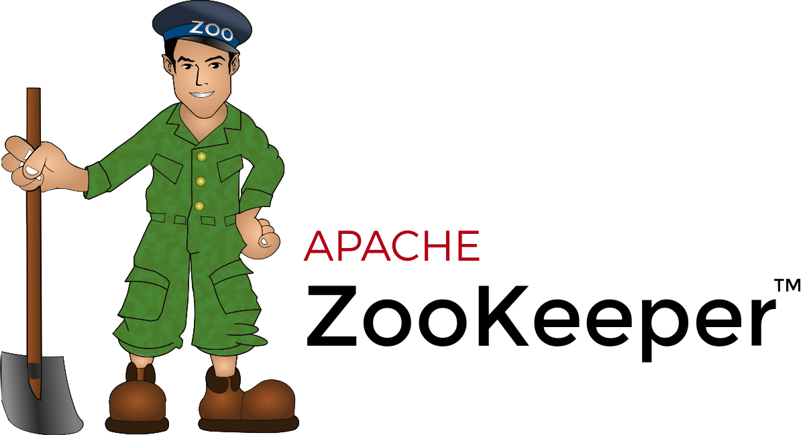

# Coordination Services

> _**Coordination services** are a class of distributed systems designed to help applications that want to **avoid implementing Paxos** or other consensus protocols directly. They provide a simple API that allows applications to implement higher-level abstractions such as locks, barriers, and leader election. It must be **highly available** and **fault-tolerant**._

## [Chubby](https://static.googleusercontent.com/media/research.google.com/en//archive/chubby-osdi06.pdf) (Google)

- Small **file system** and **lock service** built on top of Paxos;
- State is kept by a set of replicas to ensure **fault-tolerance**;
- State-updates are performed using **Paxos**, to ensure **consistency**;
- Distributed applications can use Chubby to **coordinate** their activities.

### Main goals

- Act as a lock service;
- Can be used to **elect a master**;
- Replicas and clients can be notified when the master changes;
- Based on the notion of **lease** - a period of time after which a primary must "give up" unless it is able to renew the lease.

### Paxos Implementation

Chubby implements Paxos with some twists:

#### Leaders

- When a process becomes a leader, it **remains a leader** for some **pre-defined period of time (lease)**;
- Other nodes do not attempt to become leader while the lease is valid;
- This avoids **contention** (scenario where multiple nodes try to become leader at the same time and prevent each other from making progress);
- If the **leader fails, the lease will expire** and another node will be able to become leader;
- The new leader must get a **majority of votes** to be elected.

> This is similar to a **primary-backup** system, where the **primary** is the **leader** and the **backups** are the **followers**.

#### Clients

- Clients send requests to the leader;
  - **Write requests are propagated** via the consensus protocol to all replicas;
  - Write requests are **acknowledged when the write has reached a majority** of replicas in the cell;
- **Read requests** are satisfied by the **master alone**.

### Architecture

- Chubby internally maintains a **hierarchical file system**, such that it can keep the state of different files/locks (these are named **nodes**);
  - Each node has a **version number** (incremented when the content is updated) and a **lock number** (incremented when the lock is acquired);
  - Nodes can be **ephemeral** (deleted when the client disconnects), used as an indication of **liveness**;
- Differences `wrt` UNIX to ease distribution:
  - Files can be read/write only in their **entirety** - no random access;
  - **No move** between directories;
  - No last-modified/last-accessed timestamps - **ease caching**;
- When a file is opened by the client, it is **downloaded and a lease for that file is established**;
  - Chubby keeps track of which clients have cached copies of a file;
  - All writes from a client must be sent to the chubby master - **write-through cache**;
  - Chubby then sends **invalidation messages** to all clients that have cached the file.

#### Locks

- **Any node (file/dir)** can be used as a **lock**;
- Locks are only **advisory** - clients can ignore them;
- Chubby supports **shared and exclusive locks**;
- Clients that obtain an exclusive lock are guaranteed to hold the lock for a lease time known as the **lock-delay**;
- If the client holding the lock fails, the lock can be **re-acquired** by another client after the lease expires;
- If the client holding the lock releases it before the lease expires, the lock can be **re-acquired** immediately.

### Dealing with Faulty Clients

- If a client `C` holding a lock `L`, issues a request `R` on a service `S` (protected by `L`) and then fails;
- A new client `C'` can acquire the lock `L` and issue the request `R'`, before `R` is received by `S`;
- The problem with this is that `S` will receive `R'` before `R`, which can lead to **inconsistencies** - reverse order.

There are two solutions for this problem:

1. Send **lock sequence number** along with the request; this way, `S` can **ignore requests** that are **out of order**;
2. If a client crashes while holding the lock, the lock is unav**a**ilable for a given **lock-delay period** - this is simple but undesirable because it **increases the latency** of the system.

### Client Caching

- Clients cache the **content of a node** and information regarding **current lock owners** - this cache is valid for some **lease period**;
- If the content of a node is **updated**, Chubby **invalidates all caches**;
- If a client is slow, invalidation will stall until the cache expires;
- Clients must notify the Chubby servers that they are still alive, using a **keep-alive** mechanism;
  - This is used to **update the lease and to receive updates** from the Chubby servers;
  - Server adapts lease duration to load: **higher load -> longer lease**.
- Client use a conservative approximation of lease time - time keep-alive messages spend in the network and server clock drift rate.

_TODO: notes about chubby to be improved_

---

## [Zookeeper](https://www.usenix.org/legacy/event/usenix10/tech/full_papers/Hunt.pdf) (Yahoo!)

> Zookeeper can be seen as an **open-source implementation of Chubby**, but with a difference: it does not offer **consistent caching**, while Chubby does.

    

- Like Chubby, Zookeeper keeps (small) files replicated using Paxos-like consensus protocol;
- Clients may request to be notified when the file changes - **watch**; however, this notification is performed **asynchronously**;
  - Thus, at a given moment, two clients may have different views of the system;
  - Due to this problem, there are open-source libraries that augment Zookeeper with **consistent caching**.

### Updates

- Only updates are **linearizable**;
- Updates include:
  - **normal writes**;
  - **sequential creates** (where an order-number is automatically added by the system to the object attributes)
  - a form of **compare-and-swap**;
- Reads are performed **locally** at each replica - **no consensus**;
  - Clients may attempt to read from a replica that is **not up-to-date**, so they can circumvent this by doing an **empty write** to the replica they want to read from, forcing it to update its state - **sync** request.

### Locks

- Although Zookeeper does not provide a **lock service**, it can be used to implement **locks**;
- A node can create an **ephemeral** node associated with a lock; the first client to do so becomes the **lock owner**;
  - The other nodes will put a **watch** on the lock node;
  - If the client fails or unlocks, the node is deleted, and other clients may attempt to create the node to become the new lock owner.
