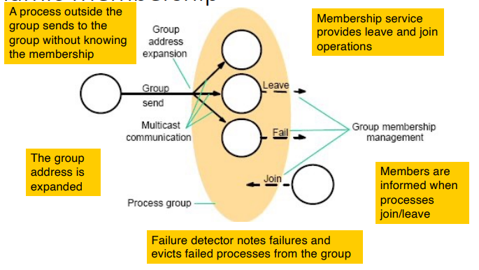

# Group Communication and View Synchrony

> _**Group communication** is a mechanism that allows a set of processes to coordinate their actions by sending messages to a group of processes called a **group**._

> _**View synchrony** is a property of a distributed system in which all correct processes agree on a common view of the system membership. An abstraction to program in a system where the **set of servers may change over time**._

## Group Communication

* **Multicast** of messages to **groups of processes**.

Key areas of application:

* **Reliable dissemination** of information to large number of clients;
* Support for **collaborative** applications;
* Support for **fault-tolerant** applications;
* Support for **system monitoring and management**.

---

## Group Membership Service

* Interface for group membership changes:
  * `create` and `destroy` groups;
  * `add` and `remove` processes from groups;
* Implements a **failure detector**:
  * which **monitors members for failures** (crashes/communication);
  * and **excludes them when unreachable** (or suspected to be unreachable).
* **Notifies of membership changes** to group members;
* **Group address expansion**:
  * multicasts addressed to group identifiers;
  * coordinates delivery when membership is changing.

### Group Views

A full membership services maintains **group views**:

* List of **ordered group members**;
* A **new group view is generated each time a membership change occurs** (e.g. a process joins or leaves the group);
* **View delivery** is the idea that processes can **deliver views** (like delivering multicast messages);
* If a process is suspected, it is **excluded from the group**;
  * If the process not failed, or recovered, it can **rejoin the group**.
  * **False suspicions reduce effectiveness** of the system.

### View-synchronous group communication with reliability

* All processes **agree** on the **ordering of messages and membership changes**;
* A joining process can safely **get state from another member**;
* If one process **crashes**, another will know which operations it had already performed.

### Network partitioning

* **Network partitioning** is when a network is split into two or more parts;
* Occur **when routers or links fail** such that two subnets emerge that cannot communicate with each other;
* Group management in the presence of partitions:
  * **Primary partition**: at most one sub-group survives, remaining processes are told to suspend;
  * **Partitionable**: subgroups survive as independent multicast groups - **relaxed consistency**.

### Multicast Communication to Groups with Dynamic Membership

    

### Distinctions on Groups

* **Open** vs **closed** groups: whether non-members can send messages to the group;
* **Overlapping** and **non-overlapping** groups: whether a process may belong to multiple groups.

---
---

## View Delivery

> _**View delivery** is the idea that processes can **deliver views** (like delivering multicast messages)._

* Treat each member of a group in a consistent way during group membership changes;
* Group management service **delivers sequence of views** to members (e.g. `v0(g) = {p}`, `v1(g) = {p, q}`, `v2(g) = {p, q, r}`, ...);
* System imposes an **ordering** on the possibly concurrent view changes;
* Queue in hold-back queue as for multicast, until **all members agree to deliver the view**.

#### Example

The system evolves in a totally ordered series of views:

* `V1 = {p1, p2, p3, p4, p5, p6}`
* `V2 = {p1, p2, p3, p4, p6}`
* `V3 = {p1, p3, p4, p6}`
* `V4 = {p1, p3, p4, p6, p7}`

**All processes that remain in the views, receive the same sequence of views**: if `p1` receives `V1, V2, V3, V4`, then `p3` also receives the same sequence of views.

---

### View Delivery - Definition

* **Order**: if some process delivers two views in some order, then all processes in the group will do so;
* **Integrity**: if some process `p` delivers view of group `p`, then `p E g`;
* **Non-Triviality**: if a process `q` joins a group and becomes **indefinitely reachable**, then `q` will eventually be included in **all views**.
* **Partitionable**: if the group partitions, then eventually views delivered in one partition will exclude views delivered in other partitions.

---

### View Synchronous Group Communication

> **Extends reliable multicast semantics to view delivery**: Guarantees not only the
> **above properties for view delivery**, but also includes guarantees on the **delivery of multicast messages**.

#### Guarantees

* **Agreement**: correct processes deliver same sequence of views;
  * if a **correct** process delivers message `m` in view `v(g)`, then all other correct processes that deliver `m` also do so in the view `v(g)`.
  * **Uniform Agreement**: if **any** process delivers message `m` in view `v(g)`, then all other correct processes that deliver `m` also do so in the view `v(g)`.
* **Integrity**: if `p` delivers `m`, then it will not deliver `m` again;
* **Validity**: correct processes always deliver messages they send.