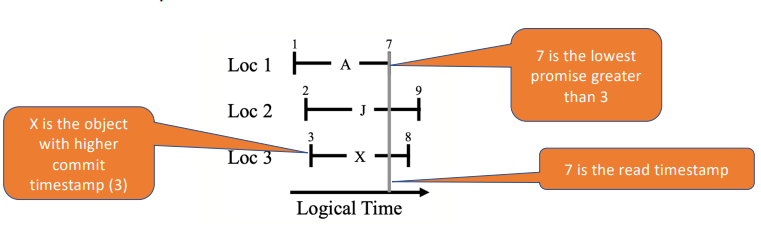
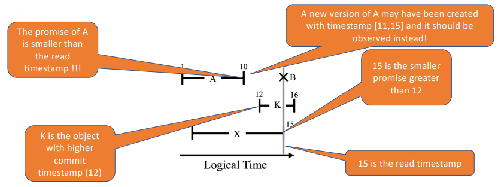

# Transactional Causal Consistency (TCC)

> **Transactional Causal Consistency** is a consistency model that provides causal consistency guarantees for transactions.

> **Causal Consistency** is a consistency model that guarantees that if a process reads the latest version of a data item, it will read the latest version of all data items that are **causally related** - i.e., if one data item is updated based on another, the process will read the latest version of both;

- Strong consistency model that ensures **high availability**;
- **Does not require ordering concurrent operations** originated at different nodes - operations can be **executed locally and propagated asynchronously**.

## Implementation

- Uses **multi-versioned** databases;
  - Each update creates a new version of the data item;
  - Transactions read from a given **snapshot** of the database;
- Unlike Spanner, TCC does not require all update transactions to be **totally ordered** - concurrent TCC transactions can be executed in **parallel by any replica** (in Spanner, transactions are executed by the **leader**);
- Different replicas can observe commits in different orders, but they will **eventually converge** to the same state;
- Updates from a given transaction may become visible in one partition before another, but **all updates from a given transaction will eventually become visible**;

---

## [TCC - Eiger](https://www.usenix.org/system/files/conference/nsdi13/nsdi13-final149.pdf)

- Does not support **general TCC transactions**, only supports:
  - **static read-only transactions**;
  - **static write-only transactions**;
- In **static transactions** the set of data items accessed by the transaction is known **before the transaction starts** - **a priori**;
- All reads (or writes) are executed in **parallel**.

> **Key Challenge**: how to ensure consistent up to date view of data stored in different partitions, despite concurrent updates?

### Read-only Transactions

- **Logical time** gives a global view of the data store;
- Data store is consistent at all logical times;
- A trivial solution to find the read snapshot that include all committed values would be to do a round of communication before starting the transaction -this would require **two round trips** to the data store;
- **In Eiger, the read timestamp is not defined when a transaction starts, but it is discovered during the read operation**.

When an object is read, **the partition returns**:

- The **value** of the object;
- The **commit timestamp** of the object;
- The **local clock when the value is read** - this is called the promise (any future version will have a timestamp greater than the promise);

This information defines an interval where the **version is valid**: `[commit timestamp, promise]`.

#### Selecting the Read Timestamp

The reader **selects the read timestamp** as follows:

1. It checks which object has the **newest commit timestamp**;
2. Then, among all other reads that have a promise higher than the commit timestamp, it selects the **lowest promise** - this is the **read timestamp**.

    

#### Problem

- It may happen that some objects have a **promise lower than the read timestamp** - there is a risk that the reader will **miss some updates**;
- In this case, the then transaction needs to **read the object again**, now specifying the **read timestamp**:
  - If no freshed version exists, the previous read was **valid**;
  - If a newer version exists with a commit timestamp smaller than the read timestamp, this is returned.

    

Eiger can require a **third round trip, if the second round value is still prepared** - the commit time can be smaller or greater than the read timestamp:

- In this case, the partition **redirects the read request to the coordinator**, to know if the value has been committed or not;
- If the value will (or has been) **committed with a clock higher than the read timestamp**, the partition returns the **older version**.

### Write-only Transactions

- Update transactions are executed using **two-phase commit**, similar to Spanner, where versions are first prepared and then committed;
- The **final commit timestamp** is defined using logical clocks, selecting **a value greater than all prepare timestamps**;
  - All items updated are assigned the same **logical clock**;
  - The commit timestamp is in the logical future at all partitions.

### Ensuring Causality

- Each version of an object stores the **id of the update transaction** that created it;
- When a transaction reads an object, it **adds the logical clock of the write transaction in its causal past**;
- When a transaction writes, it also sends all of its **causal past** to the partition;
  - The update transaction is only applied after **all transactions in its causal past have been applied**.

### Replication of Write Transactions

- After an update is executed at a given partition, it is **propagated asynchronously** to other partitions, that also execute the two-phase commit protocol;
- The coordinator **waits until any transaction in the causal past has been applied**, **before sending the prepare message** to other partitions.

### Concurrent Write Transactions

- If two transactions write to the same object, at different partitions, concurrently, TCC allows both transactions to commit and **merge the two versions**;
  - The transaction with the **largest timestamp** is selected as the **winner** - **last writer wins**.

### Dealing with Failures

- Each partition is stored over a logical server, replicated over multiple physical servers, using **Paxos**;
- These servers appear as **highly available**, despite failures of individual servers.

---

## [TCC Cure](https://pages.lip6.fr/Marc.Shapiro/papers/Cure-final-ICDCS16.pdf)

- Supports **general TCC transactions** - read-write transactions;
- Uses **synchronized physical clocks** to select timestamps;
- Clients maintain **vector clocks** to track the **causal past** of transactions;
- When a **transaction starts**, it is assigned **a vector timestamp that defines the snapshot the transaction will use for reading**;
- Writes are buffered;
- The timestamp of updates is defined at commit time (similar to Spanner).

#### Propagation of Updates

- Updates are committed in one data-center, and then propagated to other data-centers;
- Local commits use **two-phase commit**, similar to Spanner, to find a commit time in the future of all partitions;
- The **write timestamp is selected by picking the most recent** clock value from all partitions (similar to Spanner).

### Updates on a Single Data-center

- The **coordinator** of the transaction **selects a timestamp** for the transaction, using the **vector clock** of the transaction; It uses the **largest timestamp** of all objects written by the transaction;
- Then it commits the transaction and **propagates the updates** to other data-centers, sending the **vector clock** of the transaction (contains the timestamp of the transaction and the stable timestamp for other objects).

### Concurrent Updates on Different Data-centers

- Cure allows different transactions that affect a given object X to run **concurrently** in two or more datacenters;
- TCC does not avoid write conflicts: **both transaction will commit**;
- To make this easier, they use **Conflict-free Replicated Data Types (CRDTs)**;
  - Data structures designed to make **merging concurrent updates** easier;
  - Exploit the **commutativity** of operations to ensure that concurrent updates **do not conflict**.

### Read Snapshot captured as a Vector Clock

- When a transaction starts at `DCi`, the system attempts to offer the most recent snapshot that:
  - Does not violate **causality**;
  - Is unlikely to **block the client**;
- This contains:
  - All transactions previously committed at `DCi`;
  - All transactions from **remote data-centers that are stable** at `DCi`.

### Applying Updates in Causal Order

- As said before, updates are tagged with the **vector clock** of the transaction, that captures the **causal past** of the transaction;
- When a partition receives an update, it **buffers the update** until all transactions in the causal past have been applied.
