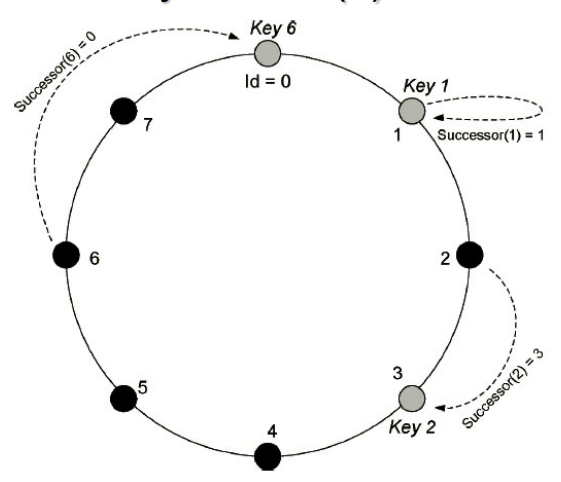

# Peer to Peer Systems

> _Peer-to-peer (P2P) computing or networking is a distributed application architecture that partitions tasks or workloads between peers. Peers are equally privileged, equipotent participants in the application. They are said to form a peer-to-peer network of nodes._

* **Distributed systems paradigm**;
* Data and computational resources are **distributed** across the network;
* **Key problems**: data placement, balancing load and ensuring data availability;
* **P2P middleware systems** enable **resource sharing**;
* **P2P applications** - file sharing, web caching, information dissemination;
  * **mainly immutable data**.

### P2P Systems

* Distributed systems consisting of **interconnected nodes**;
* **Fully decentralized** - no central server;
* Able to **self-organize** into network topologies;
* Purpose of **sharing resources**;
* Capable of **adapting to failures** and accommodating **transient populations of nodes**, as they join/leave in very dynamic memberships - **churn**;
* **Load balancing**.

Key properties:

* Each user contributes to the system by sharing resources;
* All nodes have the same functional capabilities and responsibilities;
* Correct operation does not depend on central administration;
* May offer limited degree of anonymity.

### Overlay vs IP Routing

|                  | IP Routing                                                                                                           | Overlay Routing                                                                            |
| ---------------- | -------------------------------------------------------------------------------------------------------------------- | ------------------------------------------------------------------------------------------ |
| Scale            | IPv4: 2^32 nodes; IPv6: 2^128 nodes, but addresses in both are hierarchical                                          | > 2^128 nodes                                                                              |
| Load balancing   | Loads on routers are determined by the network topology                                                              | Object locations can be randomized and traffic patterns are divorced from network topology |
| Network Dynamics | Routing tables are updated slowly - asynchronously                                                                   | Routing tables can be updated synchronously or asynchronously, with fractions of a second  |
| Fault Tolerance  | Redundancy is designed into the IP network by its managers, ensuring tolerance of a single router or network failure | Routes and object references can be replicated n-fold, ensuring tolerance of n failures    |
| Target ID        | IP address maps exactly one target                                                                                   | Messages can be routed to the nearest replica of a target object                           |
| Security         | Only secure when all nodes are trusted                                                                               | Can be secure even when some nodes are untrusted                                           |

---

## P2P Middleware

**P2P middleware** - software layer that provides **abstractions** and **services** to applications.

### Key non-functional requirements

* Global scalability;
* Load balancing;
* Optimization for local interactions (between nearby nodes);
  * Accounting **proximity**;
  * Place resources **close** to nodes that access them most frequently;
* Accommodate **highly dynamic host availability**;
  * Home computers join and leave the network frequently;
  * Failure of nodes is common.

### Common Approaches

* Its **infeasible to maintain full information at all nodes**.
* Knowledge of objects and locations must be **partitioned**, **distributed** and **replicated** across the network.
* Each nodes maintains:
  * **detailed information of location** of nodes and objects;
  * **general information of the overall topology** of the entire namespace.
* **High-degree of redundancy/replication needed**.

---

## P2P Routing Overlays

> **Overlay network** - virtual network that is built on top of an existing network.

### Distributed Hash Table (DHT)

* Routing of requests to objects;
* Insertion of objects;
* Deletion of objects;
* Node addition/removal.

The programming interface of a DHT:

* `put(GUID, data)` - stores data under the GUID (globally unique identifier);
* `remove(GUID)` - removes all references to the GUID and its data;
* `get(GUID)` - returns the data associated with the GUID, from one of the nodes that stores it.

### Distributed Object Location and Routing (DOLR)

* Maintains **additional mapping** between object IDs and addresses of nodes where replicas are stored;
* Objects and replicas may be stored under the **same GUID at different hosts**;
* Routing overlay is responsible for **routing requests to nearest available replica**;

The programming interface of a DOLR:

* `publish(GUID)` - makes the node performing a publish operation the host of the object corresponding to the GUID;
* `unpublish(GUID)` - makes the object corresponding to GUID inaccessible;
* `sendToObj(msg, GUID, [n])` - sends a message to the object corresponding to GUID, optionally to n replicas. Might be a request to open a TCP connection for data transfer, or to return a message containing all or part of the object's state.

---

## P2P Analysis Framework

Overlay Network Centralization:

* **Purely decentralized** - no centralization;
* **Partially centralized** - some nodes have special roles;
* **Hybrid decentralized** - some nodes have special roles and there is a hierarchy of nodes.

Overlay Network Structure:

* **Structured** - nodes are organized into a specific topology;
* **Unstructured** - nodes are organized into a random topology.

|                           | Decentralized                | Partially Centralized | Hybrid Decentralized |
| ------------------------- | ---------------------------- | --------------------- | -------------------- |
| Structured Systems        | OceanStore                   | -                     | -                    |
| Structured Infrastructure | Chord, Tapestry, Pastry, CAN | -                     | -                    |
| Unstructured              | Gnutella                     | KaZaA, Gnutella       | Napster              |

### Overlay Network Centralization

> In their purest form peer-to-peer overlay networks are supposed to be totally decentralized, but in practice, this is not always the case. There are **various degrees of centralization**, depending on the application.

#### Purely Decentralized

* All nodes in the network are **equal**, acting both as clients and servers;
* There is no **centralized control**;
* Nodes often termed **servents** (**serv**ers + cli**ents**).

#### Partially Centralized

* Some nodes assume a **more important role** than others, acting as local central indexes for files shared by local peers - **supernodes**;
* These supernodes are **dynamically selected** from the set of peers;
* If they fail, the network will automatically take action to **replace them**.

#### Hybrid Decentralized

* There is a **central server facilitating the interaction between peers** but maintaining **directories of metadata** about the files shared by peers;
* End-to-end interaction and file exchanges may still be **directly between peers**, but the central server facilitates this interaction by **performing the lookups**;
* There is a **single point of failure - the central server**;
* Usually, these systems are names **peer-through-peer** or **broker mediated**.

### Overlay Network Structure

> The overlay network structure is the way in which the nodes are organized into a network topology. Can be created in a non-deterministic way, or can be created in a deterministic way, following specific rules.

<!--TODO: Slide 58 a 61-->

#### Unstructured

* The placement of content (files) is **completely unrelated to the overlay topology**;
* Content typically needs to be **located**;
* Search mechanisms range from:
  * brute force methods: **flooding** the network with queries;
  * **random walks** and **routing tables**.
* The search mechanisms have implications in matters of **availability**, **scalability** and **persistency**;
* More appropriate for accommodating **highly-transient node populations**;
* Examples: Gnutella, KaZaA, Napster.

#### Structured

* The overlay topology is **tightly controlled** and **files are placed at specific locations**;
* Provide **mapping between content and location**, in a form of a **distributed routing table**;
* Scalable solution for **exact-match queries** - queries that are looking for a specific file;
* The challenge is to maintain structure of a very transient node population, which nodes are joining and leaving at a very high rate - **churn**;
* Examples: Chord, Pastry, Tapestry.

---
---

## Case Study: Overlays

### Chord

* **Peer-to-peer routing and location infrastructure** that performs mapping of file identifiers to node identifiers;
* **Strutured** with **no centralization**;
* **Data location can be implemented on top of Chord**, by identifying data items with keys and storing them at the node to which the key maps;
* **Nodes are also identified by keys**;
  * Ordered in an **identified circle** modulo **2^m**;
  * Key `k` is assigned to the first node whose identifier is equal to, or follows `k` in the identifier space - this node is called the **successor** of `k`;
* Keys are assigned using a **hash function** (deterministic).

    

* The **only routing information required** for each node is the **address of its successor**;
* Queries for a given key are passed around the circle via these successor pointers, until they reach the node responsible for that key;
* When a new node `n` **joins**, certains keys previously assigned to `n's` successor are **transferred to `n`**;
* When a node `n` **leaves**, its keys are **transferred to `n's` successor**.

#### Efficiency

* **Slow** routing queries;
* **Performance** degrades when routing information is **out of date**;
* **Availability** remains high only as long as nodes **fail independently**;
* In the worst case, the efficiency of location mechanism may **degrade to O(N)**, where `N` is the number of nodes in the system.

#### Optimization with Finger Tables

* Each node maintains a **finger table** with additional routing information;
* Number of entries on the table is **based on the number of bits** in the identifiers of the nodes (e.g. 4 bit identifiers, 4 entries);
* The `i`th entry in the finger table of node `n` contains the **identity of the first node** that succeeds `n` by at least `2^(i-1)` on the identifier circle;
* For a node `n` to perform a lookup for a key `k`, the finger table is consulted to identify the highest node `n` whose ID is between `n` and `k`;
  * If such a node is found, the query is forwarded to that node;
  * Otherwise, the query is forwarded to `n's` successor.
* This improves the efficiency of the lookup mechanism to **O(log N)**.

#### Lookup Algorithm Properties

* Interface: `lookup(key) -> IP address`;
* Efficiency: `O(log N)` messages per lookup;
* Scalable: `O(log N)` state per node;
* Robust: survives massive failures;
* Simple to analyze.

### Pastry

* **Alternative approach to routing**;
* **Structured** with **no centralization**;
* Nodes and objects have **128-bit GUIDs**;
  * Ensures objects randomly distributed over nodes.

Properties:

* Messages are directed to the **node with the numerically closest ID** to the destination ID;
* **Scalable**: messages routed in `O(log N)` steps;
* Routing table size, messaging on entry/exit of nodes: `O(log N)`;
* Issue in real networks: one step in GUID space may require **multiple IP-UDP hops** - also present in Chord;
  * The solution to this is using **locality metric** based on **network distance** in underlying **physical network**, e.g. hop count, round-trip latency.

<!--TODO: Routing Algorithm (stage I and II), Node management/host integration, Locality and Fault Tolerance-->

### Tapestry

* Conceals **DHT structure** with **DOLR interface**;
* **Structured** with **no centralization**;
* Nodes holding **replicated resources**, using **160-bit GUIDs**;
  * Holders of resources are responsible for storing them;
  * Replicated resources are published under the same GUID;
* Additional **flexibility** - replicas can be placed **close to frequent users**, to **reduce latency**, **minimize network load**, and **ensure failure tolerance**.

<!--TODO: Routing -->

### Gnutella

* **Unstructured**;
* Started as a **purely decentralized** system, but **ultrapeers** were introduced to **improve scalability**;
  * Comprise the core of the network;
  * Highly connected nodes;
  * Other nodes are **leaf nodes**, connected to ultrapeers;
* **Advantage**: high reduction in number of hops to locate resources;

---

## Case Study: Applications

* **OceanStore** for file storage;
* **Dynamo** for key-value storage (eventually consistent).

### [Dynamo](https://www.allthingsdistributed.com/files/amazon-dynamo-sosp2007.pdf)

* **Key-value storage** system, built for **Amazon's shopping cart**;
* **Highly scalable**: different keys are stored in different nodes using consistent hashing;
* **Replication**: each key is replicated at `N` nodes;
* **High availability**: no Paxos for writes, even if this means to break consistency;
* **Eventual consistency**: conflicting updates are resolved using **semantic merging** or **last write wins**;

<!--TODO: Consistent Hashing, Replication, Updates, Reads-->

### OceanStore

* **Peer-to-peer storage system**;
* Highly available, scalable, and secure;
* Long term persistence and reliability;
* Support for mutable files;
* Replicated file storage developed on top of Tapestry.

<!--TODO: Finish-->
