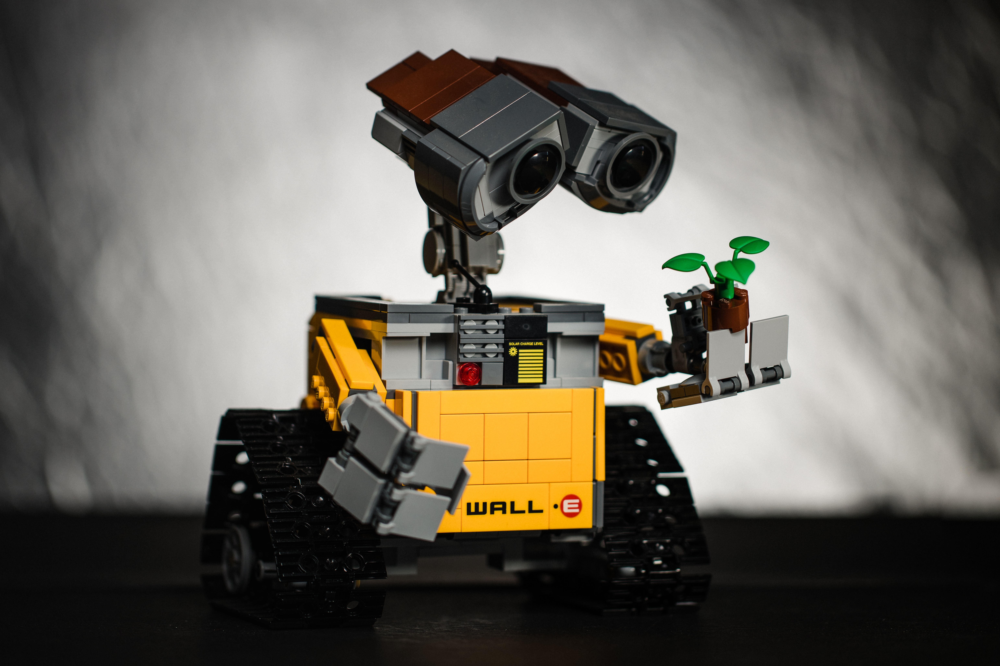

# Introduction to Robotics

> _**Robotics** is the branch of technology that deals with the design, construction, operation, structural disposition, manufacture and application of robots. Robotics is related to the sciences of electronics, engineering, mechanics, and software. The word "**robot**" was introduced to the public by Czech writer Karel Čapek in his play R.U.R. (Rossum's Universal Robots), published in 1920. The term "robotics" was coined by Isaac Asimov in his 1941 science fiction short-story "Liar!"._

    

## Agents

> **Agent** - anything that can be viewed as perceiving its environment through sensors and acting upon that environment through effectors *(Russel and Norvig, 1995)*.

Key concepts for an agent *(Jennings and Wooldridge, 1998)*:

* **Situatedness** - the agent is situated in an environment;
* **Autonomy** - the agent is autonomous;
* **Flexibility** - the agent is flexible.

---

## Autonomous Agents *(Jennings and Wooldridge, 1998)*

> **Agent** - computer system, **situated** in some environment, receiving sensory inputs form its environment and performing actions, which change the environment in some way.
>
> **Autonomous agent** - agent that should be capable of **flexible autonomous action** in order to meet its design objectives.

### Flexibility and Autonomy

**Flexibility** - includes that the agent **responds to changes it perceives** in the environment, **takes the initiative** where appropriate and **is social** with other artificial agents and humans;

**Autonomy** - means that the agent should be able to **act without the
direct intervention of humans** or other agents and that it should have
control over its own actions and internal state.

---

## Autonomous Systems

> **Autonomous system** - system that can **operate without human intervention**.

Should:

* Be able to **learn from experience**;
* Be able to **interact** and even **cooperate** with other autonomous agents;
* Have means of **handling the uncertainty** associated to its sensor inputs and the effects of its actions over a surrounding, dynamic environment;
* Have **means to take rational decisions**, leading to the achievement of its goals.

--

## Autonomous Robots

> **Autonomous robot** - **robots (embodied agents)** which can **perform desired tasks in unstructured environments**, **without** continuous human guidance. Many kinds of robots have some **degree of autonomy**. Different robots can be autonomous in different ways.

Have the ability to:

* **Gain information** about the environment;
* Work for an extended period **without human intervention**;
* **Move either all or part of itself** throughout its operating environment **without** human assistance;
* **Avoid situations that are harmful** to people, property, or itself unless those are part of its design specifications;
* Learn or gain new capabilities like **adjusting strategies** for accomplishing its tasks, or **adapting to changing surroundings**.