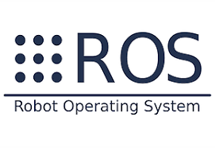
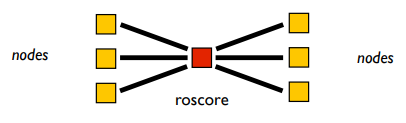

# Introduction to [ROS (Robot Operating System)](https://www.ros.org/)

> _ROS is an **open-source**, **meta-operating system** for your **robot**. It provides the services you would expect from an operating system, including hardware abstraction, low-level device control, implementation of commonly-used functionality, message-passing between processes, and package management._

<p align="center">
    
</p>

## What is ROS?

* Framework for **robot software development**, providing operating system-like functionality on a heterogeneous computer cluster;
* Works well in **Linux Ubuntu**, but there are bindings to Java, C#, and can be tunneled via web sockets;
* Large user community.

---

## Basic Concepts

<p align="center">
    
</p>

### [Nodes](http://wiki.ros.org/Nodes)

* Modularization in ROS is achieved by separated OS processes called **nodes**;
* **Node is a process that uses ROS framework**;
* Nodes may reside in different machines transparently;
* Nodes get to know each other via [`roscore`](http://wiki.ros.org/roscore), that acts as a **name server**;
* `ROS_MASTER_URI` environment variable defines the `roscore` location.

<p align="center">
    
</p>

### [Topics](http://wiki.ros.org/Topics)

* The **communication between nodes** is done via **topics**;
* Publish/subscribe pattern;
* **Publishers** send messages to a **topic**;
* Published messages are **broadcasted** to all **subscribers**.

### [Services](http://wiki.ros.org/Services)

* **Service** is a **request/response** pattern;
* A node can **request a service** from another node, which will **respond** to the request;
* Similar to **RPC** (Remote Procedure Call).

### [Messages](http://wiki.ros.org/Messages)

* **Message** is a **data structure** used for communication between nodes;
* All messages are defined in text files with the extension `.msg`.

### [Parameters](http://wiki.ros.org/Parameter%20Server)

* **Parameters** are used to **configure nodes**;
* Defined in a `.yaml` file;
* `rosparam` command line tool is used to **set** and **get** parameters.

---

## Development Environment

* Two major languages are used in ROS: **Python** and **C++**;
* ROS provides a portable **build system** that can be used to compile code in both languages - [**Catkin**](http://wiki.ros.org/catkin);
* **Package** is a encapsulation of sources, data files and building files;
* A large variety of packages are available on the web, and can be installed via `apt-get` or `rosdep`. Examples: sensor drivers, simulators, SLAM, image processing, etc.

Ros relies on the combination of spaces in the shell environment by sourcing scripts, this allows one to have multiple ros versions installed.

> `source /opt/ros/<distro>/setup.bash` -> source the **setup script** for the desired ros version.

## [Catkin](http://wiki.ros.org/catkin)

> catkin is the official **build system of ROS** and the successor to the original ROS build system, rosbuild. catkin combines **CMake macros** and **Python scripts** to provide some functionality on top of CMake's normal workflow. catkin was designed to be more **conventional** than rosbuild, allowing for better distribution of packages, better cross-compiling support, and better portability. catkin's workflow is very similar to CMake's but adds support for automatic 'find package' infrastructure and building multiple, dependent projects at the same time.

### Catkin workspaces

* catkin packages can be built as a **standalone project**, in the same way that normal cmake projects can be built;
* But catkin also provides the concept of **workspaces**, where you can build **multiple, interdependent packages** together all at once.
* Example workspace:

```
workspace_folder/         -- WORKSPACE
  src/                    -- SOURCE SPACE
    CMakeLists.txt        -- The 'toplevel' CMake file
    package_1/
      CMakeLists.txt
      package.xml
      ...
    package_n/
      CATKIN_IGNORE       -- Optional empty file to exclude package_n from being processed
      CMakeLists.txt
      package.xml
      ...
  build/                  -- BUILD SPACE
    CATKIN_IGNORE         -- Keeps catkin from walking this directory
  devel/                  -- DEVELOPMENT SPACE (set by CATKIN_DEVEL_PREFIX)
    bin/
    etc/
    include/
    lib/
    share/
    .catkin
    env.bash
    setup.bash
    setup.sh
    ...
  install/                -- INSTALL SPACE (set by CMAKE_INSTALL_PREFIX)
    bin/
    etc/
    include/
    lib/
    share/
    .catkin             
    env.bash
    setup.bash
    setup.sh
    ...
```

### Spaces

1. **Source Space**: The source space contains the source code of catkin packages.
2. **Build Space**: The build space is where CMake is invoked to build the catkin packages in the source space.
3. **Development Space**: The development space (or devel space) is where built targets are placed prior to being installed
4. **Install Space**: Once targets are built, they can be installed into the install space by invoking the install target, usually with make install.

> `catkin_make`: Builds any packages in the source space.

### Packages

To create a catkin package use the following command on the source space:

`catkin_create_pkg <package_name> [depend1] [depend2] [depend3]`

Example:

`catkin_create_pkg beginner_tutorials std_msgs rospy roscpp`

Now that you've created a catkin package, you can build it by running `catkin_make` in the catkin workspace.
After building the package, you need to add the workspace into the ROS shell environment by sourcing the `setup.bash` file in the devel space (if you don't do this, your workspace packages won't be visible to ros)

### Package dependencies

To find the first order dependencies of a package, you can execute the following command:

`rospack depends1 <package_name>`

For the previous example, the result is the following:

``` bash
$ rospack depends1 beginner_tutorials 
roscpp
rospy
std_msgs
```

The first order dependencies can be found on the `package.xml` file of the package.

Packages also have indirect dependencies, these can be found with the `rospack depends <package_name>` command.

---

## ROS Concepts

### Quick overview:

6. **Master**: Name service for ROS (i.e. helps nodes find each other)
7. **rosout**: ROS equivalent of stdout/stderr
8. **roscore**: Master + rosout + parameter server

### Commands

* `roscore` -> is the first thing you should run when using ROS;
* `rosnode` -> displays information about the ROS nodes;
* `rosrun [package_name] [node_name]` -> Allows you to run a node of a package;
* `rostopic` -> Allows you to get information about a topic;
* `rosservice` ->  Can easily attach to ROS's client/service framework with services;
* `rosparam` -> allows you to store and manipulate data on the ROS Parameter Server;
* `roslaunch [package_name] [launch_file_name]` -> Starts nodes as defined in a launch file.

### Launch file

* Provides a **convenient way to start up multiple nodes and a master**, as well as other initialization requirements such as setting parameters
* Launch files are stored in the `/launch` directory of a package.
* Example:

``` xml
<launch>

  <group ns="turtlesim1">
    <node pkg="turtlesim" name="sim" type="turtlesim_node"/>
  </group>

  <group ns="turtlesim2">
    <node pkg="turtlesim" name="sim" type="turtlesim_node"/>
  </group>

  <node pkg="turtlesim" name="mimic" type="mimic">
    <remap from="input" to="turtlesim1/turtle1"/>
    <remap from="output" to="turtlesim2/turtle1"/>
  </node>

</launch>
```

### Useful nodes

* `rosrun rqt_plot rqt_plot` -> displays a scrolling time plot of the data published on topics;
* `rosrun rqt_graph rqt_graph` -> creates a dynamic graph of what's going on in the system;
* `rosrun rqt_console rqt_console` -> attaches to ROS's logging framework to display output from nodes;
* `rosrun rqt_console rqt_logger_level` -> allows us to change the verbosity level (DEBUG, WARN, INFO, and ERROR) of nodes as they run.

### Msg Files

* **Msg files** are simple text files that **describe the fields of a ROS message**. They are used to generate source code for messages in different languages.
* Msg files are stored in the `/msg` directory of a package;
* Msgs contain a **field type** and **field name per line**. The field types you can use are: 

```
int8, int16, int32, int64 (plus uint*)
float32, float64
string
time, duration
other msg files
variable-length array[] and fixed-length array[C]
```

There is also a special type in ROS: **Header**, the header contains a timestamp and coordinate frame information that are commonly used in ROS. You will frequently see the first line in a msg file have Header `header`.

To make sure the messages are **compiled into source code at build time and used at runtime**, we need to add the following packages to the package.xml file:

```
<build_depend>message_generation</build_depend>
<exec_depend>message_runtime</exec_depend>
```

You also need to add the `message_generation` and dependency to the `find_package` call in the `CMakeLists.txt` file:

```cmake
find_package(catkin REQUIRED COMPONENTS
   roscpp
   rospy
   std_msgs
   message_generation 
)
```

And the `message_runtime` dependency to the `catkin_package` call:

```cmake
catkin_package(
  ...
  CATKIN_DEPENDS message_runtime ...
  ...)
```

Finally you need to add the msg file to the `add_message_files` call:

```cmake
add_message_files(
  FILES
  Num.msg
)
```

By adding the `.msg` files **manually**, we make sure that CMake knows when it has to reconfigure the project after you add other **.msg files**.

And also add the `std_msgs` dependency to the the `generate_msgs` call:

```cmake
generate_messages(
  DEPENDENCIES
  std_msgs
)
```

> You may notice that sometimes your project builds fine even if you did not call `find_package` with all dependencies. This is because **catkin combines all your projects into one**, so if an earlier project calls `find_package`, yours is configured with the same values. But forgetting the call means your project can easily break when built in isolation.

To view your messages you can use the `rosmg` command:

`rosmsg show [message type]` -> `rosmsg show beginner_tutorials/Num`

If you are using a new custom message defined in a different package, remember to add the dependency to the `package.xml`:

```xml
<build_depend>name_of_package_containing_custom_msg</build_depend>
<exec_depend>name_of_package_containing_custom_msg</exec_depend>
```

and also add this to `CMakeList.txt`:

```cmake
add_dependencies(your_program ${catkin_EXPORTED_TARGETS})
```

---

## Managing System Dependencies

> **ROS packages** sometimes require **external libraries and tools** that must be provided by the operating system. These required libraries and tools are commonly referred to as **system dependencies**. In some cases these system dependencies are not installed by default. ROS provides a simple tool, `rosdep`, that is used to **download and install system dependencies**.

Examples of system dependencies are `libqt4-dev` and `qt4-qmake` that turtlesim uses (`roscd turtlesim & cat package.xml`).

## Commands overview

* `rospack` -> Get information of packages;
* `roswtf` -> is a tool for diagnosing issues with a running ROS system;
* `rosdep` is a tool you can use to install system dependencies required by ROS packages.

## `rosbash` package commands

* `roscd` -> Allows you to change directory to a package;
* `rosls` -> `ls` directly on the package directory;
* `rosed` -> Allows you to directly edit a file within a package by using the package name.

To have access to catkin build (isolated packages):
`sudo apt-get install python3-catkin-tools python3-osrf-pycommon`

---

## Command Line Tools

### `rosnode`

Prints information about ROS **nodes**.

```bash
rosnode ping <node_name>    # Checks if a node is running
rosnode list                # Lists active nodes
rosnode info <node_name>    # Prints information about a node
rosnode kill <node_name>    # Kills a node
rosnode cleanup             # Kills all nodes
rosnode machine <node_name> # Prints the machine where a node is running
```

### `rostopic`

Prints information about ROS **topics**.

```bash
rostopic list -v            # Lists active topics
rostopic info <topic_name>  # Prints information about a topic
rostopic echo <topic_name>  # Prints messages from a topic
rostopic pub <topic_name> <msg_type> <msg_data>  # Publishes a message to a topic
rostopic hz <topic_name>    # Prints the publishing rate of a topic
rostopic bw <topic_name>    # Prints the bandwidth used by a topic
rostopic find <msg_type>    # Finds topics that use a message type
rostopic type <topic_name>  # Prints the type of a topic
```

### `rosservice`

Prints information about ROS **services**.

```bash
rosservice list                         # Lists active services
rosservice info <service_name>          # Prints information about a service
rosservice call <service_name> <args>   # Calls a service
rosservice type <service_name>          # Prints the type of a service
rosservice find <service_type>          # Finds services that use a service type
rosservice uri <service_name>           # Prints the URI of a service
rosservice args <service_name>          # Prints the arguments of a service
```

### `rosbag`

Manipulates ROS **bag** files (recorded messages).

```bash
rosbag record <topic_name>             # Records messages from a topic
rosbag play <bag_file>                 # Plays a bag file
rosbag info <bag_file>                 # Prints information about a bag file
# ...
```

---

## Useful ROS Facilities


### Launch Files

* **Launch files** are used to **start multiple nodes** at once;
* XML format;
* `roslaunch` command line tool is used to **start** and **stop** launch files.

### [TF (Transforms)](http://wiki.ros.org/tf)

* **TF** is a **framework** that keeps track of **multiple coordinate frames** over time;
* Represents geometric transformations in 3D, position and orientation.

### [RViz](https://www.google.com/search?q=RViz&rlz=1C1FCXM_pt-PTPT968PT968&oq=RViz&aqs=chrome..69i57j0i512l9.287j0j4&sourceid=chrome&ie=UTF-8)

* **RViz** is a **3D visualization tool** for ROS;
* Displays **sensor data** and **state information** from ROS nodes;
* Displays **TF** frames.

### [Gazebo](https://gazebosim.org/home)

* **Gazebo** is a **3D simulator** for ROS;
* Simulates **sensors** and **actuators**;
* Simulates **physics**.
* Can be used to **simulate robots**.

### [Actionlib](http://wiki.ros.org/actionlib)

* **Actionlib** is a **framework** for **asynchronous communication**;
* State-full scheme to manage action execution.

### [SMACH](http://wiki.ros.org/smach)

* **SMACH** is a **framework** for **state machines**;
* State machines are used to **model complex behavior**;
* States, transitions, outcomes.

Other packages:

* [**GMapping**](http://wiki.ros.org/gmapping) - SLAM (Simultaneous Localization and Mapping);
* [**AMCL**](http://wiki.ros.org/amcl) - Adaptive Monte Carlo Localization;
* [**MoveIt!**](https://moveit.ros.org/) - Motion Planning;
* [**MoveBase**](http://wiki.ros.org/move_base) - Navigation;
* [**OctoMap**](http://wiki.ros.org/octomap) - 3D Mapping;
* [**ROSPlan**](https://kcl-planning.github.io/ROSPlan/) - Planning.