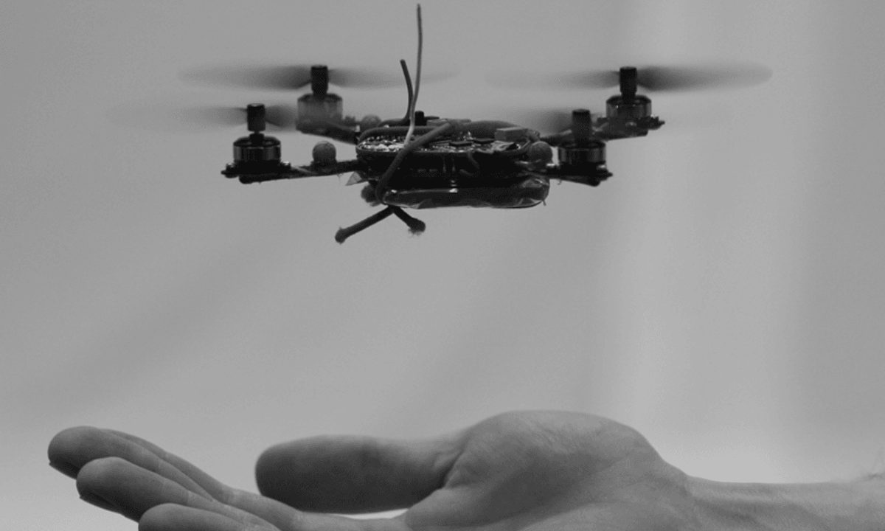
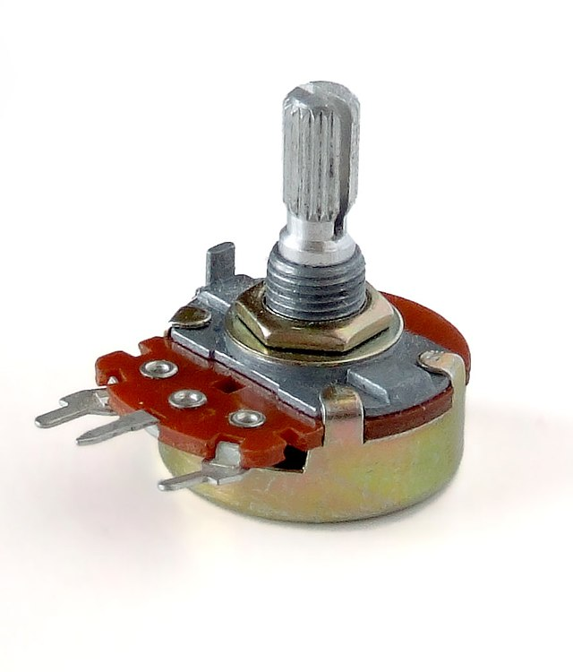
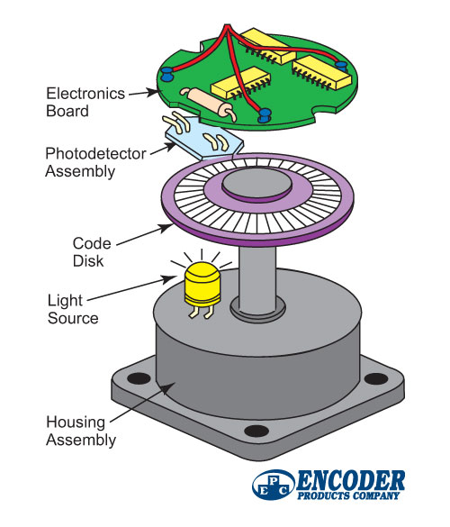
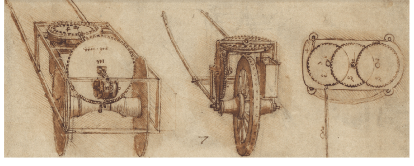
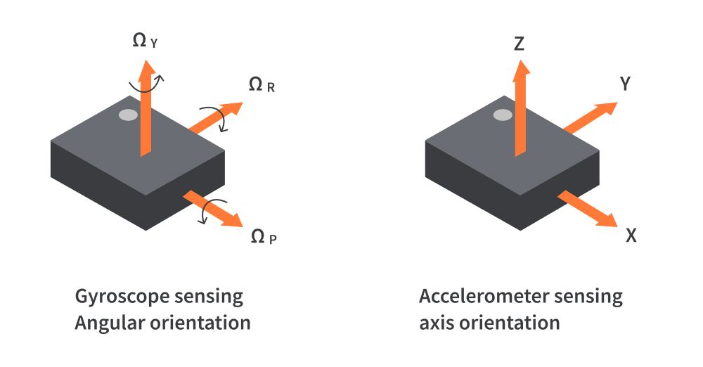
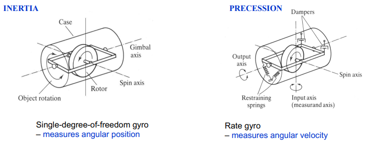
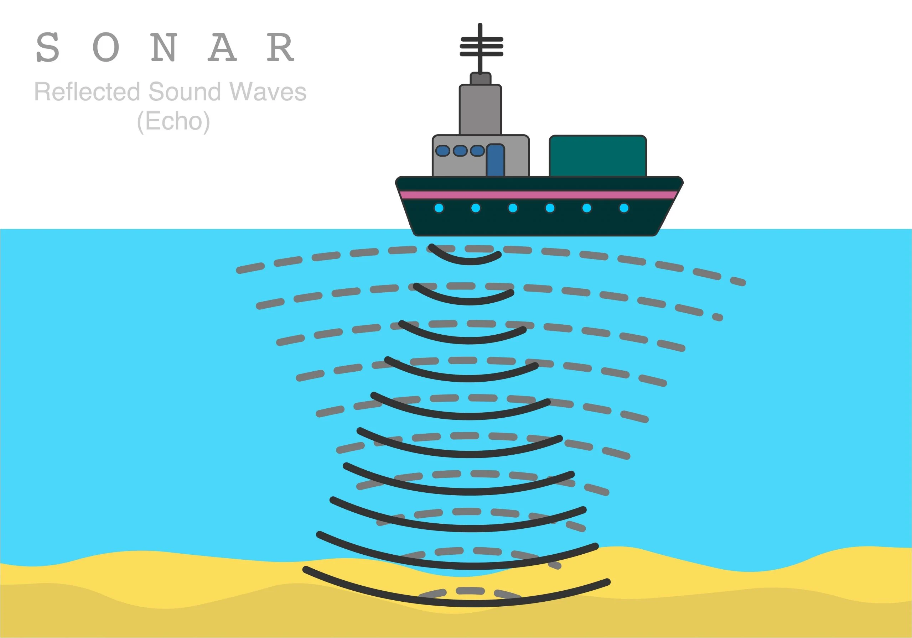
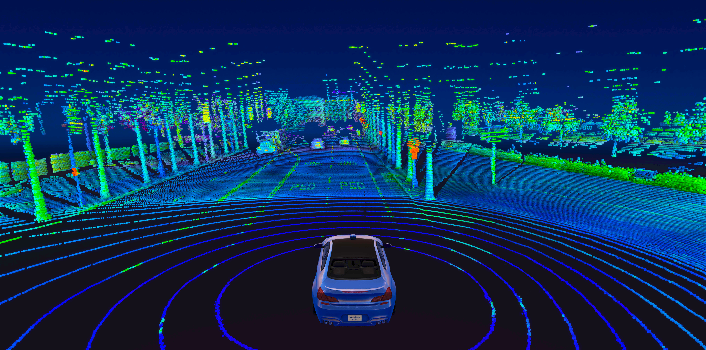

# Perception

> _A mobile robot requires **perception** to gain information about the **environment** and **its own state**._

    

Perception is the process of **extracting information** from **sensor data**. This includes:

- **Object detection and recognition**;
- **Mapping (semantic and metric)**;
- **Localization**;
- **Obstacle detection**;
- **Internal state** (e.g. battery level, joint angles, etc.).

---

---

## Sensors

> **Sensors** are devices that **measure physical quantities** and **convert** them into **electrical signals**.

Sensors can be classified by two criteria: **type of information** and **interaction with the environment**.

### Proprioceptive vs Exteroceptive

- **Proprioceptive** sensors measure **internal state** (e.g. battery level):

  - **Encoders** - wheel velocity;
  - **Potentiometers** - joint angles;
  - **Gyroscopes** - angular velocity;
  - **Accelerometers** - linear acceleration;
  - **Inclinometers** - body orientation.

- **Exteroceptive** sensors measure **external state** (e.g. distance to an obstacle):
  - **LIDAR (Light Detection and Ranging)**/ **SONAR (Sound Navigation and Ranging)** - range;
  - **Microphones** - sound;
  - **CCD/CMOS cameras** - image;
  - **Strain gauges** - force/torque.

### Active vs Passive

- **Active** sensors **emit** a **signal** and **measure** the **response**:

  - **LIDAR** emits a **laser** and measures the **time** it takes to **reflect**;
  - **Sonar** emits **sound** and measures the **time** it takes to **reflect**.

- **Passive** sensors **measure** the **signal** **emitted** by the **environment**:
  - Vision sensors;
  - Stereo-vision sensors.

---

## Perception Issues

- Sensors are **noisy**;
- Data must be **processed** to extract relevant information;
- Sensor measurements can be **incomplete**;
- The information from several **sensors can be combined** to improve accuracy.

---

---

## Potentiometers

> Potentiometers are **resistors** with a **variable resistance**.

    

- The **resistance** is **proportional** to the **angle** of the **shaft**;
- The **resistance** is **measured** by **passing** a **current** through the **potentiometer** and **measuring** the **voltage** drop.

---

## Encoders

> Encoders are **sensors** that **measure** the **rotation rate** or **angular position** of a **shaft**.

    

- Encoder = Light Beam + Light Detector + Rotating Disk with a radial grating on its surface;
- The **light beam** is **interrupted** by the **grating**;
- The **light detector** **measures** the **interruptions**;
- The **number** of **interruptions** is **proportional** to the **rotation** of the **wheel**.

There are two types of **shaft encoders**:

- **Absolute** encoders:

  - The output is a **code** that **represents** the **orientation** of the **shaft**;
  - Measures directly **angular position** and infers **velocity**;

- **Incremental** encoders:
  - The rate at which the **pulses** are produced corresponds to the **rotation rate** of the shaft;
  - Measures **rotational velocity** and infers relative **position**;
  - Needs to be **initialized** with a **reference position**.
  - Much **cheaper** and smaller than absolute encoders.

---

## Odometers

> Odometers are **sensors** that **measure** the **distance** traveled by **vehicles**.

    

---

## Inertial Sensors

> Inertial sensors are **sensors** that **measure** the **linear and angular motion** of a **robot**;
>
> - Angular motion - **Gyroscopes**;
> - Linear motion - **Accelerometers**.

    

- Proprioceptive sensors;
- Used to support **inertial navigation**: estimate the position and orientation of a robot by integrating the motion state.

### Gyroscopes

> Gyroscopes are **sensors** that **measure** the **angular velocity** of a **robot**.

Gyroscopes have two basic characteristics:

- **Gyroscopic inertia** - the axis of a rotation gyroscope tends to remain oriented in the same direction;
- **Gyroscopic Precession** - the axis of a rotation gyroscope tends to rotate in the direction of the applied force.

    

- `T = w * H`:
  - `T` - torque;
  - `w` - angular velocity;
  - `H` - angular momentum (assumed constant).

Types of gyroscopes according to the **underlying physical principle**:

- **Mechanical** gyroscopes - conservation of angular momentum;
- **Optical** gyroscopes - Sagnac effect;
- **MEMS** gyroscopes - vibrating structure.

Types of gyroscopes according to the **output**:

- **Rate gyroscopes** - measure angular velocity;
- **Rate integrating gyroscopes** - measure orientation.

### Accelerometers

> Accelerometers are **sensors** that **measure** the **linear acceleration** of a **robot**.

- `F = m * a` - Newton's second law:
  - `F` - force;
  - `m` - mass;
  - `a` - acceleration;
- `F = k * x` - Hooke's law:
  - `F` - force;
  - `k` - spring constant;
  - `x` - displacement.

### Inclinometers

> **Inclinometers** are **sensors** that **measure** the **angle** of an object reference axis with respect to a **horizontal axis**.

---

## Range Sensors

> Range sensors are **sensors** that **measure** the **distance** to an **object**.

### SONAR - Sound Navigation and Ranging

> SONAR is a **range sensor** that **measures** the **distance** to an **object** by **emitting** a **sound** and **measuring** the **time** it takes to **reflect** - **Echolocation**.

    

- `d = (TOF * v) / 2`:
  - `d` - absolute distance to a target;
  - `TOF` - time of flight - time between the emission and reception of the signal;
  - `v` - speed of sound in the medium.

**Echolocation** is the use of sound waves and echoes to determine where objects are in space. Dolphins and bats use this method to hunt prey and navigate.

### LIDAR - LIght Detection and Ranging

> LIDAR is a **range sensor** that **measures** the **distance** to an **object** by **emitting** a **laser** and **measuring** the **time** it takes to **reflect**.

    

