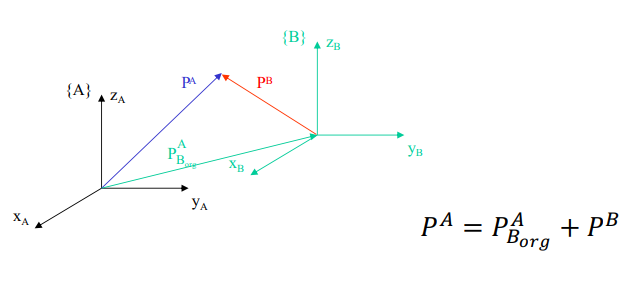

# Localization

> _**Localization** is the process of determining **where a robot is in the world**. Localization is one of the most fundamental problems in robotics. It is the basis for being able to solve other problems such as path planning and navigation._

    

* Determine the **robot posture (position and orientation)** in the world, at each time instant;
* **Structured** environments (industry, hospitals, etc.);
* **Unstructured** environments (outdoors, space, etc.).

## Localization Approaches

* **Relative Localization** (localization with relative measurements) - **dead reckoning**:
    * **Odometry** - through **wheel motion**;
    * **Inertial navigation** - through **accelerometers** and **gyroscopes** (velocities and accelerations);

> **Dead reckoning** is the process of estimating the current position of a robot by using **sensors** to measure its **movement** and then **using** **starting position** and **direction** of travel as **references**.

* **Absolute Localization**:
    * **Active beacons** - compute absolute location from **distance measurements** to 3 or more active beacons;
    * **Artificial/natural landmarks** - landmarks with **known positions**;
    * **Model matching** - match the **sensor data** with a **map** of the environment.
  
* **Hybrid Localization**:
    * **Kalman filter** - combines **odometry** and **beacon** measurements;
    * **Particle filter** - combines **odometry** and **landmark** measurements.

---

## Coordinate Systems and Transformations

> **Coordinate systems** are used to **represent** the **position** and **orientation** of an object in space. In robotics, they are represented by **frames**. An object can be the robot itself, a sensor, a landmark, etc.

* Coordinate systems are used to transform between **vectors** and **points** (sets of numbers);
* **Frames** are **attached** to **objects**.

    

In the image above, we have:

* Two **coordinate systems** (frames) - `{A}` and `{B}`;
* `xA`, `yA`, `zA` - **unit vectors** of `{A}`;
* `xB`, `yB`, `zB` - **unit vectors** of `{B}`;
* `pA` is a **point** in `{A}`.

We can make **transformations** between frames (`{A}` and `{B}`) using **translation** and **rotation**.

### Translation

To translate frame `{B}` wrt (with respect to) frame `{A}`, we need to know the **position** of `{B}` wrt `{A}`. This is done by using a **vector** `pA/Borg` that **points** from `{A}` to `{B}`:

    

Then, we can **translate** a **point** `pB` in `{B}` to `{A}` by adding the **vector** `pA/Borg` to `pB`: `pA = pB + pA/Borg`.

### Rotation

To rotate frame `{B}` wrt frame `{A}`, we need to know the **orientation** of `{B}` wrt `{A}`. This is done by using a **rotation matrix** `R` that **rotates** `{B}` wrt `{A}`: `RA/B`:

    

Then, we can **rotate** a **point** `pB` in `{B}` to `{A}` by multiplying `pB` by `RA/B`: `pA = RA/B * pB`.

> **Note:** `RA/B` is orthonormal: `(RA/B)^-1 = (RA/B)^T`.

### Rotation + Translation

If we want to **rotate** and **translate** frame `{B}` wrt frame `{A}`, we can do it by **combining** the **translation** and **rotation** matrices:

    

Then, we can **rotate** and **translate** a **point** `pB` in `{B}` to `{A}` by multiplying `pB` by `RA/B` and adding `pA/Borg`: `pA = RA/B * pB + pA/Borg`.

### Homogeneous Coordinates and Transformations

> Homogeneous Coordinates and Transformations are a **convenient** way to **represent** **points** and **transformations**.

Following the example above, we can represent the rotation and translation matrices as:

`TB/A = [RA/B pA/Borg; 0 0 0 1]`

Another example: Imagine we have 4 frames: `{W}` (world), `{B}` (body of the robot), `{C}` (camera) and `{B}` (ball). We can represent the **position** of the **ball** in the **world** frame as: `pW/ball = TW/B * TB/C * TC/B * pC/ball`.

---

## Relative Localization: Odometry

> **Odometry** is the use of **data** from **encoders** and **gyroscopes** to **estimate** the **robot position** and **orientation**.

* Uses encoders to measure the **distance traveled by each wheel**;
* The **absolute position estimation** is calculated by integrating the **relative translation and orientation** between two encoder readings;
* The performance of odometry is a funcion of the vehicle **kinematics**.

### Kinematics  

> **Kinematics** is the study of **motion** without considering the **forces** that cause it.

Consider the following **kinematic model** of a **differential drive** robot:

    

* `{W}` is the **world frame** and `{R}` is the **robot frame**;
* `vr(t)` and `vl(t)` are the **linear velocities** of the **right** and **left wheels**;
* `L` is the **distance** between the **wheels** (wheel base);
* Each drive wheel has an **encoder**, that measures the **distance** traveled by the wheel, in a given time interval `ΔT`;
* `θ(t)` is the **orientation** of the robot wrt the world frame;
* `x(t)` and `y(t)` are the **position** of the robot wrt the world frame.

The **kinematic model** of the robot is:

    

The kinematic model is used to **estimate** the **robot position** and **orientation** by **integrating** the **linear velocities** of the **wheels**.

### Discretization of the Kinematic Model

> **Discretization** is the process of **approximating** a **continuous** function or **signal** by a **finite** set of **discrete** values. In the case of the kinematic model, we want to **approximate** the **continuous** **linear velocities** of the **wheels** by a **finite** set of **discrete** values.

... <!--Discretization of the kinematis model-->
(_section in construction_)

---

## Absolute Localization Systems: Active Beacon and Landmarks

> **Active beacons** and **landmarks** are used to **estimate** the **robot position** and **orientation**.

* **Active beacons**:
  * Provide very **accurate** **distance** measurements;
  * **Require** **infrastructure** (beacons);

* **Landmarks**:
  * **Natural**: no installation required; recognition may be difficult;
  * **Artificial**: recognition is easier; require installation.

There are two types of absolute localization systems:

* **Trilateration** - uses **distance measurements** to **known beacon sources**;
* **Triangulation** - uses **angle measurements** to **known beacon sources**.

### Trilateration

> **Trilateration** is the process of **determining** the **position** of a **point** by **measuring** its **distance** to **known beacon sources**.

    

Usual configurations:

* **Active beacons**: 3 or more transmitters mounted at known locations and one receiver on board the robot; e.g. GPS;

* **Landmarks**: one transmitter on board the robot and receivers/transponders/retroreflectors mounted on the environment; e.g. LIDAR.

<!--
> #### GPS (Global Positioning System)
>
> ... -->
  
### Triangulation

> **Triangulation** is the process of **determining** the **position** of a **point** by **measuring** the **angles** to it from **known points** at either end of a fixed baseline, rather than measuring distances to the point directly.

    

---

## Model Matching

> **Model matching** is the process of **matching** the **sensor data** with a **map** of the environment.

* Correlates **laser scans** with a **metric map** of the robot surroundings, to determine **translation and rotation** of the laser scan wrt the world map;
* A known algorithm is **Iterative Closest Point (ICP)**.

### Iterative Closest Point (ICP)

> **Iterative Closest Point (ICP)** is an **algorithm** employed to **minimize** the **difference** between two **point clouds**.
>
> **Point clouds** are sets of **points** in some **coordinate system**.

    

#### Input
* Reference and source **point clouds**;
* Initial estimation of the transformation to align the source point cloud to the reference point cloud;
* Criteria to stop the algorithm.

#### Output
* Refinement of the transformation.

#### Algorithm
1. Find the **closest point** in the **reference point cloud** for each point in the **source point cloud**;
2. Estimate the combination of rotation and translation that **minimizes** the **distance** between the **source point cloud** and the **reference point cloud**;
3. Apply the transformation to the **source point cloud**, using the obtains transformation;
4. If the **criteria** to stop the algorithm is **not met**, go to step 1.

---
---

## Fundamentals of Probabilistic Robotics

...