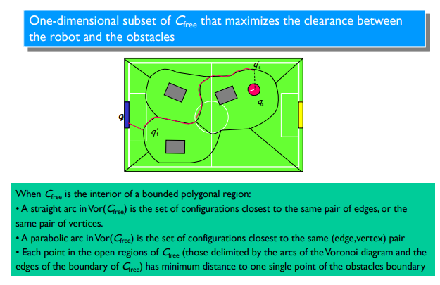
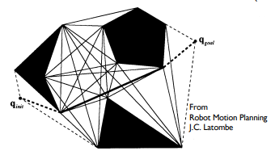
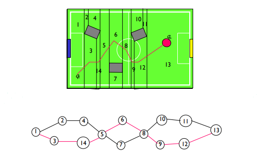
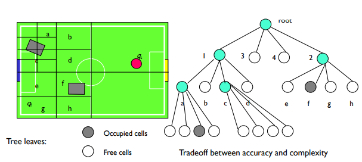
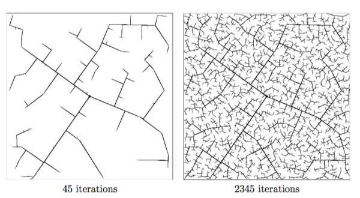
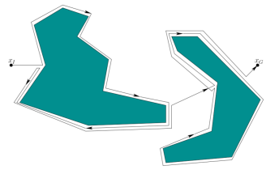

# Motion Planning and Guidance

> _The **Navigation Problem** is the problem of **planning a path** for a robot or vehicle among obstacles while obeying physical constraints on motion, known as **motion planning**._

- **Problem Statement (Global Planner)**: Find a collision free path between an initial pose and the goal, taking into account the constraints (geometrical, physical, temporal).
- **Problem Classes**:
  - **Global Planning**: plan a path from start to goal;
  - **Local Planning**: plan a path from current position to a goal;
  - **Trajectory Generation**: generate a trajectory to follow a path;
  - **Maneuver Planning**: plan a sequence of paths to reach a goal.

> ### **Path** vs **Trajectory**
>
> - **Path**: is a geometric locus of way points – in a given space – where the robot must pass;
> - **Trajectory**: is a path for which a temporal law is specified (e.g., acceleration and velocity at each point).

---

## Notation and Definitions

- `A`: single rigid object - **robot**;
- `W`: Euclidean space where `A` moves - **world**;
  - typically `W = R^2` or `W = R^3`;
- `B1, B2, ..., Bn`: fixed rigid objects distributed in `W` - **obstacles**;

Assumptions:

- The geometry of `A` and `Bi` is known;
- The localization of the `Bi` is accurately known;
- There are no kinematic constraints in the motion of `A`.

Problem: Given an initial pose and a goal pose of `A` in `W`, generate a path `t` specifying a continuous sequence of poses of `A` avoiding contact with the `Bi`.

---

## Configuration Space

- `FW` - world frame (static);
- `FA` - robot frame (moving);
- The objects `Bi` are fixed in `FW`;
- The **configuration of `A` is `q`** - a vector of `n` parameters that uniquely identify the pose of `A` in `W` - position and orientation;
- The **configuration space of `A` is `C`** - the set of all possible configurations of `A` in `W`;
- `A(q)` is the subspace of `W` occupied by `A` in configuration `q`;
- The **path of `A`** in `W` is a continuous function `t: [0, 1] -> C` such that `t(0) = qinit` and `t(1) = qgoal`.

### Obstacles in Configuration Space

- No pose of the robot `A` along a path can intersect any of the obstacles `Bi`;
- The robot has a given shape:
  - Along its path, the robot with its shape spans a region of `W`;
  - This spanned region is a function of the robot shape and consecutive poses along the path;
  - No point of this spanned area can intersect any of the obstacles `Bi`.
- `CBi` is the subspace of `C` occupied by `Bi`;
- The **C-obstacle region**: `U(CBi) = {q in C | A(q) intersects CBi}`;
- **Free space**: `F = C \ U(CBi)`.

---

## Path Planning Approaches

There are many approaches to path planning:

- **Roadmap**: a graph of configurations connected by paths;
  - **Voronoi diagram** and **Visibility graph**;
- **Cell Decomposition**: partitioning of `C` into cells;
- **Sampling-Based Planning**: sampling of `C` and connection of samples;
  - Probabilistic Roadmap (PRM) and **Rapidly Exploring Dense Trees (RDTs)**;
- **Potential Field**: a function that attracts the robot to the goal and repels it from obstacles;
- **Bug Algorithms**: a family of algorithms that use the boundary of the obstacles to guide the robot to the goal.

---

## Roadmap Methods

### Voronoi Diagram

> The Voronoi Diagram partitions `Cfree` into cells, each cell containing all the points in `Cfree` that are closer to a given obstacle than to any other obstacle.

<p align="center">
    
</p>

### Visibility Graph

> The Visibility Graph connects all the points in `Cfree` that are visible to each other.

- **Non-directed graph** whose nodes are:
  - The initial and goal positions;
  - The vertices of the obstacles;
- **Plain lines** connect the **obstacle vertices** that are visible to each other;
- **Dashed lines** connect the **initial and goal positions** to the obstacle vertices that are visible to them.

<p align="center">
    
</p>

---

## Cell Decomposition Methods

> The Cell Decomposition methods partition `Cfree` into cells, each cell containing all the points in `Cfree` that are closer to a given obstacle than to any other obstacle.

Can be classified into:

- **Exact Methods**: the decomposition is guaranteed to be correct;
- **Approximate Methods**: the decomposition is not guaranteed to be correct; the most usual method is the **Quadtree decomposition**.

### Exact Methods

There are 4 steps to the Cell Decomposition methods:

1. **Decompose the free space** into a set of cells;
2. Build a **connectivity graph** of the cells;
3. **Search the graph for a path** (sequence of adjacent cells) from the initial to the goal cell;
4. Transform the sequence of cells into a **free path**.

<p align="center">
    
</p>

### Approximate Methods - Quadtree Decomposition

> The Quadtree Decomposition recursively subdivides `Cfree` into cells until each cell is either completely inside or completely outside an obstacle.

<p align="center">
    
</p>

---

## Rapidly Exploring Dense Trees (RDTs)

> The RDTs are a **sampling-based method** that **incrementally** builds a tree of configurations by sampling `Cfree` and connecting the samples to the tree.

Simple algorithm for RDTs (without obstacles):

```
simple_rdt(q0):
    G.init(q0);
    for i = 1 to k do:
        G.add_vertex(a(i));
        qnear = G.nearest_neighbor(a(i));
        G.add_edge(qnear, a(i));
```

- `G` - Topological graph representing the RDT;
- `q0` - initial configuration;
- `a(i)` - sample `i` in `Cfree`;
- `qnear` - nearest neighbor of `a(i)` in `G`.
- `k` - number of samples.

When obstacles are present, the algorithm is:

```
rdt(q0):
    G.init(q0);
    for i = 1 to k do:
        qnear = G.nearest_neighbor(a(i));
        qs = StoppingConfiguration(qnear, a(i));
        if qs != qnear then:
            G.add_vertex(qs);
            G.add_edge(qnear, qs);
```

### Rapidly Exploring Random Trees (RRTs)

> The difference between RDTs and RRTs is that the RRTs are **biased** towards the goal.

<p align="center">
    
</p>

---

## Bug Algorithm

> The Bug Algorithms are a family of algorithms that use the b**oundary of the obstacles** to guide the robot to the goal.

<p align="center">
    
</p>

---

## Potential Fields

> The Potential Fields are a family of algorithms that use a **potential function** to attract the robot to the goal and repel it from obstacles.

...

---

---

## Motion Planning: Extensions

...
