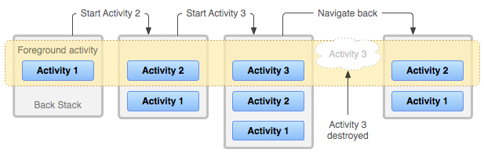

# Android Fundamentals

> **[Android](https://developer.android.com/)** is a mobile operating system developed by Google, based on a modified version of the Linux kernel and other open-source software and designed primarily for touchscreen mobile devices such as smartphones and tablets.

### Main Features

* **Beautiful UI**;
* **Connectivity** (Bluetooth, Wi-Fi, NFC, etc.);
* **Storage** (SQLite, SharedPreferences, etc.);
* **Media support** (audio, video, etc.);
* **Messaging** (SMS, MMS, etc.);
* **Web browser**;
* **Multi-touch**;
* **Multi-tasking**;
* **Resizable widgets**;
* **Multi-language support**;
* **GCM** (Google Cloud Messaging);
* **Wifi Direct** (technology that allows devices to connect directly to each other without the need for a Wi-Fi access point);
* **Android Beam** (allows two NFC-enabled devices to exchange data).

---

## [Android Architecture](https://developer.android.com/guide/platform)

  

* **Android Application Framework** provides a high-level API for creating applications;
* Android provides a number of **system libraries** which are accessible to applications through the **application framework**;
  * Written in C/C++ (e.g., **Surface Manager**, **Media Framework**, **SQLite**, **WebKit**, etc.);
* The **Android Runtime** provides a key component called **Dalvik Virtual Machine** which is a kind of Java Virtual Machine specially designed and optimized for Android;
  * **Process-based VM**;
  * Each application runs in its own process, with its own instance of the Dalvik VM;   
  * Different from the standard Java VM: absence of AWT, Swing, etc.;
* Android is based on the **Linux kernel**, however **it is not another distribution of Linux**, because it **does not support the complete set of standard GNU libraries**. It contains:
  * **Hardware Abstraction Layer (HAL)**;
  * Components for **memory management** and **inter-process communication**;
  * Drivers for **display**, **camera**, **flash memory**, etc.
  * **YAFFS** (Yet Another Flash File System) is used for NAND flash memory management.
  * **WakeLocks** are used to keep the CPU running while the screen is off;
  * **Binder** is used for IPC (Inter-Process Communication) between processes.

### Application Framework

* **Activity Manager** - manages the lifecycle of applications and activities;
* **Content Providers** - allow applications to publish and share data with other applications; information provided through a single **ContentResolver** interface;
* **Resource Manager** - provides access to non-code resources such as localized strings, graphics, and layout files - `R.java` file;
* **Notification Manager** - enables all applications to display custom alerts in the status bar;
* **View System** - an extensible set of views used to create application user interfaces;
* **Location Manager** - provides access to the location services, allowing applications to obtain the user's location.
* **Input Method Service** - manages the input methods, which are the methods that accept text input from the user;
* **Telephony Manager** - provides information about the telephony services on the device;
* **SMS Manager** - allows applications to send and receive SMS messages;
* **Power Manager** - manages the power consumption of the device.

---

## Android Applications

* Each application runs in a **sandboxed environment** with its own instance of an Android runtime;
* App is installed as a single file of type `.apk` (Android Package), containing the **compiled Java code (`.dex`)**, **resources** (compiled and uncompiled), and **manifest file** (`.xml`) that describes the application's structure;
  * Can be **signed** to ensure that it has not been tampered with, or **unsigned** to allow for easy debugging; 
* Composed by 4 components:
  * **Activities** - represent a single screen with a user interface;
    * **View** - a widget that the user can interact with (e.g., button, text field, etc.);
    * **Intent** - a message object that is used to request an action from another app component;
  * **Services** - perform long-running operations in the background;
  * **Broadcast Receivers** - respond to system-wide broadcast announcements;
  * **Content Providers** - manage a shared set of application data.

---

## Android Development Tools

* **Android Studio** - the official IDE for Android development;
* **Android SDK** - a set of tools that are required to develop Android applications;
* **Android Emulator** - a virtual mobile device that runs on the computer;
* **[Android Project](https://developer.android.com/studio/projects)** - a directory structure that contains all the necessary files for an Android app:
  * **`src/`** - contains the Java source code;
  * **`res/`** - contains the resources (e.g., images, layouts, etc.);
  * **`AndroidManifest.xml`** - contains the app's metadata;

### Manifest File

* All components of an Android application must be declared in the `AndroidManifest.xml` file;
* Specifies the **package name**, **version**, **permissions**, **components**, etc.;
* For each component, you can specify:
  * **Permissions** - what the app can access on the device;
  * **Intent Filters** - what intents the component can respond to;
  * **Metadata** - additional information about the component;
* `<application>` tag is the root element of the manifest file;
* `<activity>` tag is used to declare an activity component;
  * `android:name` - the name of the activity class;
  * `android:label` - the label that will be displayed in the launcher;
  * For each activity, you can specify:
    * `<intent-filter>` - the types of intents that the activity can respond to - `MAIN` (entry point) and `LAUNCHER` (icon in the launcher);
    * `<meta-data>` - additional information about the activity;
* `<service>` tag is used to declare a service component;
* `<receiver>` tag is used to declare a broadcast receiver component;
* `<provider>` tag is used to declare a content provider component.

> **Strings.xml** - a file that contains all the strings used in the app, allowing for easy localization.
>
> In previous versions of Android, layouts were defined in XML files, but now they can also be defined programmatically, using **[Jetpack Compose](https://developer.android.com/develop/ui/compose)**.

---

## Activities

> An android application **does not have complete control over its own lifecycle**. Instead, the **Android system** manages the lifecycle of an application and provides a well-defined lifecycle that the application must follow. For example, if hardware resources are low, the system might stop the application to free up resources.

  

* An activity starts when an **intent** is received;
* Activities are arranged in a **stack** (**back stack**);
  * When a new activity is started, it is pushed onto the stack, and the previous activity is stopped (but remains in the stack);
  * When the user presses the **back button**, the current activity is popped from the stack, and the previous activity is resumed;
  * Activities in the stack are never rearranged, only pushed and popped;

  

### Starting Activities - Intents

* **Explicit Intents** - specify the component to start by name (e.g., `new Intent(this, MainActivity.class)`);
  * Used to start a specific activity in the same application;
* **Implicit Intents** - specify the action to perform and let the system determine the best component to handle the intent (e.g., `new Intent(Intent.ACTION_VIEW)`);
* It is possible to pass data between activities using **extras** (key-value pairs) in the intent.
* You can also start activities for a result, using `startActivityForResult()`, and receive the result in the `onActivityResult()` method - you need to define a **request code** to identify the request.

### Finishing Activities

* An activity can be finished by calling the `finish()` method;
* When an activity is finished, it is removed from the stack and destroyed;
* `finishActivity()` can be used to finish an activity from another activity.

---

## [Services](https://developer.android.com/develop/background-work/services)

> A **service** is a component that runs in the **background** to perform **long-running** operations **without needing to interact with the user**.

A service can be:

* **Started** - started by calling `startService()`, and runs indefinitely, even if the component that started it is destroyed;
  * **Foreground Service** - a service that has a **notification** associated with it, to indicate that it is running in the foreground;
  * **Background Service** - a service that runs in the background without a notification;
* **Bound** - bound to a component by calling `bindService()`, and runs only while the component is bound to it.

  

---

## [Broadcast Receivers](https://developer.android.com/guide/components/broadcasts)

> A **broadcast receiver** is a component that responds to **broadcast messages** from other applications or from the system itself.

* Broadcasts are messages that the system sends when an event of interest occurs;
* Broadcast receivers are registered in the `AndroidManifest.xml` file, or at runtime;
* System events are broadcasted as **intents**, for example:
  * **BOOT_COMPLETED** - when the device finishes booting;
  * **BATTERY_LOW** - when the battery is low;
  * **SMS_RECEIVED** - when an SMS is received;
  * **CONNECTIVITY_CHANGE** - when the network connectivity changes;
* To broadcast a custom intent, you can use the `sendBroadcast()` method, and include the intent in the broadcast.

---

## [Intents and Intent Filters](https://developer.android.com/guide/components/intents-filters)

> An **intent** is a messaging object that can be used to request an action from another app component.

* An intent can be used to:
  * **Start an activity** - `startActivity(intent)`;
  * **Start a service** - `startService(intent)`;
  * **Deliver a broadcast** - `sendBroadcast(intent)`;
* They can be:
  * **Explicit** - specify the component to start by name;
  * **Implicit** - specify the action to perform and let the system determine the best component to handle the intent;
* To build an intent, you specify the **action** to perform, the **data** to act on, and the **category** of the component that should handle the intent;
  * You can also include **extras** (key-value pairs) in the intent, and **flags** to control the behavior of the intent;
* An **intent filter** is used to specify the types of intents that a component can respond to;
  * It is declared in the `AndroidManifest.xml` file.