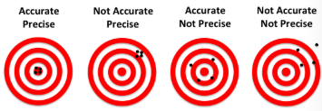
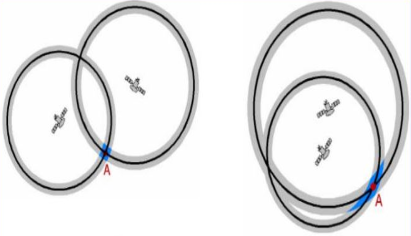
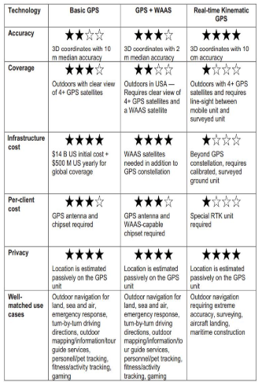
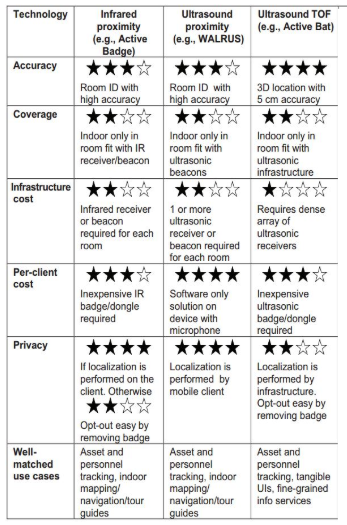
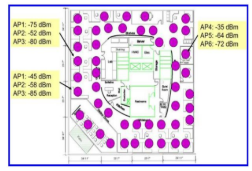
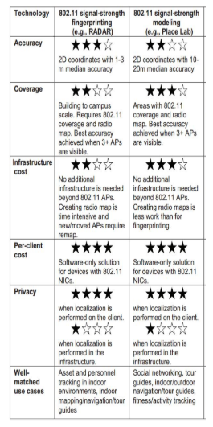
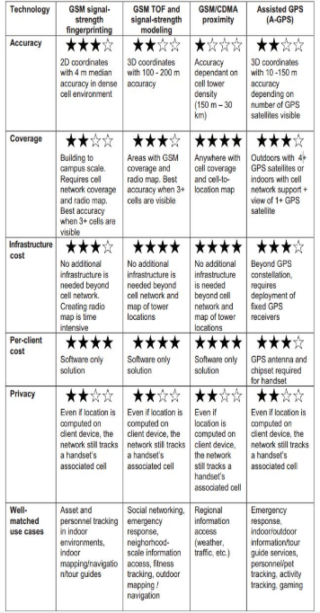

# Location Mechanisms

- Commonly used to **infer user context**;
- **Symbolic** - abstract ideas of where something is (e.g., home, work);
- **Physical** - actual coordinates (e.g., latitude, longitude).
- **Accuracy** - "correctness" - how close the location is to the real location.
- **Precision** - "consistency" - how detailed the location is - **high precision** means less variability in the location.

    

- **GPS** - **outdoor** location mechanism;
- **Infrared and Ultrasonic** - **indoor** location mechanisms;
- **802.11 (Wi-Fi)** - **indoor/outdoor** location mechanism;
- **Cellular-based Systems** - **outdoor** location mechanism.

---

## GPS - Outdoor Location Mechanism

- **Global Positioning System** - a satellite-based navigation system;
- **Passive one-way system** - satellites send signals, and GPS receivers calculate the distance to each satellite;
- World-wide coverage;
- Preserves **user privacy**;
- Scales to **large number of users**;
- Supports a range of location services with accuracies from **meters to centimeters**;
- **Selective Availability** - the US government can degrade the accuracy of GPS signals for non-military users, by adding **intentional noise** to the signals (turned off in 2000).

### GPS Architecture

- Constellation of **earth-orbiting satellites** that broadcast a continuous signal - currently 31 satellites;
  - Full coverage with 24 satellites - the additional ones operate as active spares to accommodate maintenance and failures;
- **Ground stations** monitor and control the satellites;
  - Clock corrections and orbit updates;
  - There are enough ground monitoring stations to ensure that **each satellite is visible from at least two stations at all times**;
- **GPS receivers** receive the signals and calculate the location (latitude, longitude and altitude).;
  - Determine the position using **at least 4 satellites**, but commonly use up to 12 for better accuracy - this can be **augmented with other location mechanisms** (accelerometers, gyroscopes, etc.).

### GPS Algorithm

- The distance ($R_i$) from the satellite to the receiver is calculated using the **time it takes for the signal to travel**, **multiplied by the speed of light**;
- This requires **synchronized clocks** between the satellites and the receiver;
  - **Low-cost crystal oscillators in the receiver** introduces **bias**, making the distance calculation **inaccurate**;
  - Satellites have **atomic clocks** that are **synchronized** with each other, but not with the receiver;
  - Calculate the **receiver location (x, y, z)** and the **clock bias b**:

$$
R_i = \sqrt{(x - x_i)^2 + (y - y_i)^2 + (z - z_i)^2} + b
$$

- This way, **four satellites** are needed to calculate the **four unknowns** (x, y, z, b) - three satellites would be enough with **perfect clocks**;
- When more than 4 signals are available, **redundant data** can be used to **improve accuracy**.

#### Satellite Range Estimation

- GPS satellites transmit **radio signals** modulated by **pseudorandom noise (PRN) codes** - appear to be random, but are **deterministic** to each satellite and **known to the receiver**;
- Receiver continually **compare the received signal with the PRN code** to determine the **time delay** between the satellite and the receiver - delay is proportional to the distance;
- GPS receiver obtains the **satellite's position** from a **navigation message** transmitted by the satellite, containing:
  - Coordinates of the satellites as a function of time;
  - Satellite clock correction;
  - Satellite direction of motion;
  - Constellation health information;
  - Parameters for the **ionospheric delay correction**.
- **Atomic clocks** are **very stable**, but still **need to be corrected** because accumulated errors can lead to **significant inaccuracies**;
- **Ionospheric delay** - the signal travels through the **ionosphere**, which causes a **delay** that is **proportional to the frequency** of the signal - **higher frequencies** are **less affected**.

> **Quality** of GPS location estimation depends on:
>
> - How well satellites are **spread out** in the sky;
> - **Size of uncertainty area** - as the satellites are **closer together**, the uncertainty area is **higher**, because the **satellites are less spread out**.

    

### Drawbacks

- Signals do not **penetrate** walls, soil, or water very well - requires **unobstructed view** of at least **four satellites**;
- **Indoor** and **urban canyon** environments can **block signals**;

### Real-Time Differential GPS (DGPS)

- **Differential GPS** can be used to **improve accuracy** by **correcting errors** caused by the **ionosphere** and **satellite clock drift**;
- **Real-time** differential GPS uses a **network of ground stations** to **monitor the GPS signals** and **broadcast corrections** to the GPS receivers;
  - **One or more GPS receivers** are placed at **known locations** and **measure the error** in the GPS signals, sending the corrections to **nearby GPS receivers** that can move around;
  - **Maritime DGPS** - network of stations installed at **lighthouses**;
  - **WAAS (Wide Area Augmentation System)** - a network of ground stations that **broadcast corrections** to **airborne GPS receivers**.
- Provides **sub-meter accuracy**.

### Real-Time Kinematic GPS (RTK)

- Achieves **centimeter-level accuracy**;
- **Measuring the number of fractional and full signal cycles** between the satellite and the receiver.

    

---

## Indoor Location Mechanisms - Infrared and Ultrasonic

- Light and sound move freely through the air, but are both largely **blocked by materials**;
  - Two types of signals well suited for **indoor location**;
- **Infrared or ultrasound beacons and listeners** - beacons may be embedded in the environment, and listeners remain mobile, or vice-versa;
- Possible indoor location approaches:
  - **Infrared proximity** - active badges;
  - **Ultrasound proximity** - Walrus;
  - **Ultrasound TOF (Time of Flight)** - Active Bat.

### Active Badge

- First indoor location system;
- **Badges** emit **infrared signals** that are **received by sensors** placed in the room;
- Each person has a badge that sends unique pulses at regular intervals, received by **base stations**, that decoded the **infrared signals** and send the decoded badgeIDs to a **centralized location server**;
- Base stations are mounted on **known locations** and the server can infer **in which room** the person is located;
- **Drawbacks**:
  - **Line-of-sight** is required between the badge and the base station, and infrared signals are **easily blocked**;
  - Requires specialized infrastructure.

### Walrus

- Uses **PC and PDA speakers and microphones** to **transmit and receive ultrasound signals**;
- PCs are the **beacons** and PDAs are the **receivers**;
- It encodes the roomID using a **radio side channel**;
- ...

### Cricket

- **Sub-room-level** location system using **ultrasound**;
- **Privacy-preserving** - **no centralized server**;
- **Badges** are the receivers and **beacons** are the infrastructure;
- Beacons are placed on the ceiling and emit **ultrasound signals**, **advertising their identity**, using a combination of RF (radio frequency) and ultrasound;
- Listeners not only listen for an ultrasound pulse, but also for how long it takes for the RF signal to arrive, to **calculate the distance to the beacon**;

### Active Bat

- Goal is to estimate absolute location within a room with **high accuracy**;
- **Badges are beacons** and receivers are the infrastructure;
- Similar to cricket, but **bats** (small pager-like devices) emit **ultrasound signals** and the receivers in the infrastructure **calculate the distance** to the bats;

    

---

## Location Estimation with 802.11 (Wi-Fi)

- 802.11 (Wi-Fi) is a **common wireless technology** that is **ubiquitous** in many environments;
- **802.11 radios and their supporting drivers** allow a device to **scan for nearby access points (APs)** and **measure the signal strength** of the signals;
- APs have a **limited range** and if a device can hear an AP, it is **close to it**;
- If a device can see **more than one AP**, it can **estimate its own location more precisely** - **signal strength** and **packet loss** can be used to **estimate distance**;
- Client devices can:
  - **passively** listen for APs;
  - **actively** send probe requests to APs;
- APs send **beacon frames** to announce their presence to clients, containing:
  - **SSID** - network name readable by humans;
  - **BSSID** - MAC address of the AP;
  - **Signal strength**;
  - **Channel**;
  - **Supported data rates**;
  - **Security settings**.

### Signal Strength Fingerprinting

- Two phases:
  - **Mapping phase** - collect signal strength measurements at known locations;
    - Distances need to be **small** to capture the **variability** of the signal strength;
  - **Localization phase** - estimate the location of the device based on the signal strength measurements;
- **Spatial variation** of the signal strength is **unique** to each location;
- **Temporal consistency** - the signal strength at a location is **relatively stable** over time;
- RADAR by Microsoft Research - uses **signal strength** and **packet loss** to estimate the distance to the APs;
- Drawbacks:
  - **Signal strength** can be **affected by many factors** - **interference**, **obstructions**, **multi-path fading**, **device orientation**, **device type**, etc.;
  - If the **environment changes**, the **fingerprinting map** needs to be **updated**.

    

### Signal Strength Modeling

- Radio signals **propagate** through the environment in **predictable ways**;
- Device location can be estimated by **modeling the propagation of the signal**;
- There is an **AP database** that stores the location of each known AP;
- **Signal strength** is **affected by the distance** between the device and the AP, and **obstructions** in the environment;
- Client's location can be estimated by **comparing the measured signal strength** with the **expected signal strength** at each known AP location;
- **War-driving** - driving around with a laptop to **collect signal strength measurements** from APs;
- Drawbacks:
  - **Decreased accuracy**;
  - We assume that all APs can be heard from the same distance in all directions;

    

---

## Cellular-based Systems

- Location systems based on **cellular signals** like **GSM (Global System for Mobile Communications)** and **CDMA (Code Division Multiple Access)** has advantages:
  - Leverage existing infrastructure;
  - **Widespread coverage**;
- Categories of cellular-based location systems:
  - **Cell-ID** - location is estimated based on the **cell tower** that the device is connected to - **GSM/CDMA Proximity**;
    - **Low accuracy** - **hundreds of meters**;
  - **Radio Modeling** - estimate the location based on the **signal strength** and **time of flight** of the signals;
    - **TDOA (Time Difference of Arrival)** - estimate the location based on the **time difference** between the signals from different cell towers;
    - **Higher accuracy** - **tens of meters**;
  - **Assisted GPS** - provides **faster and more accurate** location estimates by **offloading some of the calculations** to the network;
    - **High accuracy** - **tens of meters**.
  - **Radio Fingerprinting** - similar to **Wi-Fi signal strength fingerprinting**, but is more potential to work ir more places, due to **higher coverage** of cellular signals.

    

