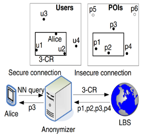

# Privacy in Location-based Services (LBS)

> **Uncontrolled disclosure of location information can lead to serious privacy breaches**, if the data falls in the hands of malicious users. This is a major concern in location-based services, where the user's location is a key piece of information. In this context, it is important to understand the privacy implications of location-based services and how to protect the user's location information.

There are three aspects of **location information disclosure**:

- **Position awareness**: a device monitors and individual's location - **no data is transmitted**;
  - Position is only used locally, e.g., to provide location-based services.
  - Example: GPS receiver in a smartphone.
- **Sporadic queries**: a user **reports his location** to a service provider;
  - The user sends his location to a service provider, e.g., to get directions.
  - Example: Google Maps.
- **Location tracking**: a service provider **monitors the user's location**;
  - The service provider continuously monitors the user's location.
  - Example: Google Maps Timeline.

There are two types of privacy:

- **Weak privacy**: no sensitive data should be directly disclosed, to a party that is not trusted - but if the current location does not reveal sensitive information, it can be disclosed.
- **Strong privacy**: no sensitive data should be disclosed, even if the current location does not reveal sensitive information - **no publication of location snapshots**.

---

## Privacy-Preserving Spatial Transformations

- To preserve privacy, the exact location of the user that sends requests to a LBS **must not be disclosed** - location is first **perturbed and/or encrypted**.
  - E.g., send a number of fake redundant queries to the LBS, to hide the real query;
- However, there is a **trade-off between privacy and performance** - additional processing is required to perturb the location;
- We can classify the existing privacy-preserving spatial transformations in two categories:
  - **Two-tier spatial transformation**: query anonymization is performed by the mobile user itself - **no trusted third party is required**;
  - **Three-tier spatial transformation**: presence of a **trusted third party** that performs the query anonymization.

### Two-tier Spatial Transformation

- **Dummy locations**: generate a number of redundant queries, to hide the real query;
  - But, the the **resulting trajectories need to mimic realistic movement patterns** - e.g., in a sequence of queries, the user should not teleport from one location to another (in one query send from Lisbon and from Madrid (dummy), and in the next query send from Setubal and from Toledo (dummy - close to Madrid));
- **PROBE**: an obfuscation system - it prevents the **association between users and sensitive locations**;
  - In an **offline phase**, an **obfuscated map** is constructed by **partitioning the space into a set of disjoint regions** such that the **probability of associating each region with a certain feature type is bounded by a given threshold** - **obfuscation**;
  - Obfuscation may require an additional trusted third party, but in the **online phase**, PROBE is a **two-tier protocol**;
- **⚠️Limitation**: if a user is situated in a remote location, and issues a query, an attacker who knows that the user is the only one in that area can associate the query with the user - **three-tier protocols solve this issue**.

### Three-tier Spatial Transformation

- **Spatial k-anonymity**: a **cloaking region (CR)** contains **k-1 users** in addition to the query source, and the LBS processes the query with respect to the CR;
- Since **all the k locations enclosed by the CR correspond to actual users**, the **probability of identifying the query source is at most 1/k**;

  

- **Quasi-identifiers**: a set of attributes that can be used to identify an individual;
  - Records with the same quasi-identifiers are indistinguishable - **anonymized group**;
- All users **subscribe** to the **anonymizer** (trusted third party), sending their location to the anonymizer;
- The user sends a query to the anonymizer, which creates a **cloaking region** and sends the query to the LBS;
- The LBS computes the answer, and sends it to the anonymizer, which **filters the answer** and sends it to the user.
- Two techniques can be used to transform a relation to a k-anonymous relation:
  - **Suppression**: remove some attributes from the relation;
  - **Generalization**: replace an attribute value with a more general value;
- **Interval cloak** - based on quad-trees:
  - **Quad-tree**: a tree data structure in which each internal node has exactly four children;
  - Anonymized maintains a quad-tree with the locations of all users, and when receives a query, it creates the CR with the **quadrant** that contains the user's location;
- **Casper** - also based on quad-trees, but the anonymizer uses a **hash table** on the user id pointing to the **lowest level quad-tree node** that contains the user's location - **more efficient**.

> **Features of PROBE and Spatial k-anonymity are not directly compatible**:
>
> - Probe achieves **spatial diversity**, but does not achieve **k-anonymity**;
> - Spatial k-anonymity achieves **k-anonymity**, but may not always achieve **spatial diversity** - e.g. if all users are in the same region.
