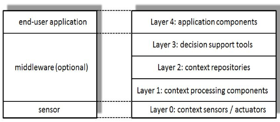
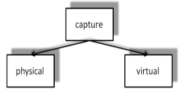
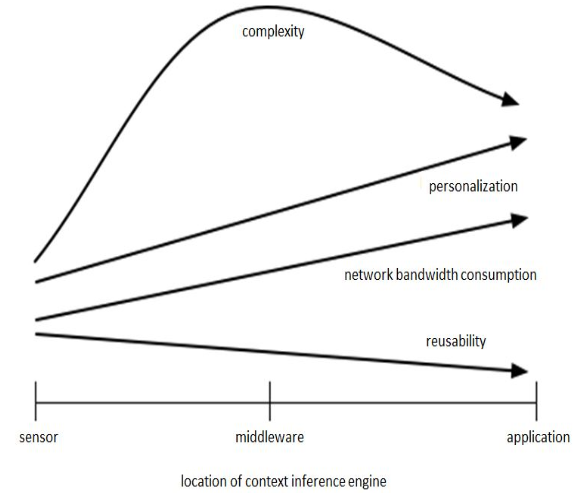

# Context-Awareness

> **Context** is any information that can be used to **characterize the situation of an entity**. An entity is a person, place, or object that is considered relevant to the interaction between a user and an application, including the user and the application themselves.

- Types of context:
  - **Computing context**: such as network connectivity, communication costs, etc;
  - **User context**: such as user's profile, location, people nearby, etc;
  - **Physical context**: such as temperature, light, etc.
  - **Temporal context**: such as time of day, day of the week, etc.

> A **system is context-aware** if it uses context to provide relevant information and/or services to the user, where relevancy depends on the user's task.

This results in main features that context-aware systems may provide:

- **Presentation of information and services**: the system adapts the presentation of information and services to the user's context;
- **Automatic execution of services**: the system automatically performs services based on the user's context;
- **Tagging of context to information for later retrieval**: the system tags context to information for later retrieval;
- **System reconfiguration**: the system adapts its behavior to the user's context.

---

## Architecture

Usually, a context-aware system is composed of:

- **End-user application**: **consumers** of context information;
- **Middleware layer (optional)**: communication and coordination issues between distributed components;
- **Sensors layer**: **producers** of context information;

  

- **Layer 0 - Context Sensors/Actuators**: provide the **interface with the environment**, either by **capturing it (sensors)** or by **changing it (actuators)**;
- **Layer 1 - Context Processing Components**: assist with processing sensor outputs to produce context information that can be used by applications;
- **Layer 2 - Context Repositories**: provide persistent storage of context information and advanced query capabilities;
- **Layer 3 - Decision Support Tools**: help applications to select appropriate actions based on context information;
- **Layer 4 - Application Components**: use context information to provide services to users.

---

## Local vs Distributed Context-Aware Systems

- **Local context-aware systems**:
  - Sensors and applications are **tightly coupled**;
  - E.g., a mobile phone that uses its sensors to provide context-aware services to the user.
- **Distributed context-aware systems**:
  - There is **no direct physical connection** between sensors and applications;
  - It is possible to have **multiple applications using the same context information**;
  - It is also possible to have **multiple sensors providing information to the same application**.

---

## Context Processing: Taxonomy

Four layers:

- **Capture**: context data is captured by sensors;
- **Infer**: needed to obtain high-level context information from raw sensor data;
- **Distribute**: context information is distributed to applications;
- **Consume**: applications consume context information.

### Capture

- Sensor not only refers to sensing hardware but also to every data source which may provide context information;
- **Physical sensors**: sensors that capture **physical data** (e.g., temperature, light, motion, location);
- **Virtual sensors**: sensors that capture data from **software applications, operating systems, or network protocols** (e.g. detecting new appointments in a calendar).

  

### Infer

- Responsible for **reasoning** and **interpreting** raw context information provided by sensors - also known as **pre-processing layer**;
- Usually involves some kind of reasoning:
  - A **transformation** is needed to reach a high-level context;
  - **Classification** techniques;
- The type of information inferred from sensorial data is **specific to the application**;
- But where the inference is done? On the sensor? On the middleware? On the application? This three locations are related to the following properties of context-aware systems:
  - **Network bandwidth consumption** - moving the inference layer **closer to the sensor** reduces the amount of data that needs to be transmitted;
  - **Complexity (CPU/memory consumption)** - inference can lead to high CPU/memory consumption, which can cause energy consumption issues on mobile devices - most developers deploy the **inference layer on the middleware** in a server.
  - **Reusability** - moving the inference layer **closer to the sensor** can lead to a more reusable system.
  - **Personalization** - moving the inference layer **closer to the application** can lead to a more personalized system.

    

### Consume

- **Pull-based (query)**: applications request context information when needed;
  - **Polling**: applications may need to poll the context server frequently to get the latest information - if the interval is too short, it may lead to high energy consumption, but if it is too long, the information may be outdated;
- **Push-based (subscription)**: applications subscribe to context information and are notified when it changes - **more complex**;
  - The component who has the information has to **know how to reach every possible consumer** - usually a permanent connection with all consumers is needed;
  - However, with a large number of consumers, its **performance may degrade** - **poor scalability**;
  - There are two measures to overcome the scalability problem:
    - **Reduce scope** - users may be interested **only in a subser** of the context information;
    - **Relax delivery time** - the information may be delivered **with some delay**.
  - Must decide when to send the information:
    - **Fixed criteria**: such as a time interval;
    - **Dynamic criteria**: amount of retained information, number of consumers, etc.
    - Both can be combined.
