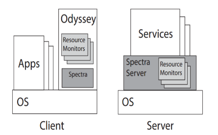

# Execution Offloading and Cyber Foraging

- **Motivation**: mobile devices have limited resources (CPU, memory, battery) and may not be able to execute all applications locally;
  - How should we **partition** the application across mobile devices and fixed infrastructure?
- **Static partitioning**: fails to adapt to **dynamic changes** in the environment, like **network and connectivity**, cloud **availability**, and **device capabilities**;
- **Cyber foraging**: partition, migration and replication of application components across mobile devices and fixed infrastructure based on context (application state and environment);
  - Users are given the illusion that the application is running locally.

### Benefits of Partitioning

- Better **performance** - there is a considerable **gap** between mobile and infrastructure processing power;
  - Compute-intensive tasks can be offloaded to the cloud;
  - Other factors like memory, storage, ability to parallelize computation, and network bandwidth should also be considered.
- Less **battery** used;
- Data **fidelity** - a mobile device operating alone may choose to **reduce application fidelity** to achieve better performance and battery life.

### Costs of using Remote Infrastructure

- Offloading may decrease **performance** if the network is slow or unreliable;
- Unless the computation is asynchronous and not on the critical path, **performance is only improved if the time saved by offloading exceeds the time spent on communication and computation**;
- When the **latency is high**, **bandwidth is low**, or the **amount of data shipped is large**, offloading may not be beneficial.

---

## Candidate Partitions

- The number of possible partitions is very large, since partitioning can be done at different **granularities** and **levels of abstraction**;
- Very fine-grained partitions may lead to **high communication overhead**;
- Cyber foraging systems enumerate a small number of possible partitions - **candidate partitions** - and choose the best one based on the current context.
- How to enumerate candidate partitions:
  - **Programmer effort**: ask a programmer the ways of partitioning the app;
    - Number of candidate partitions is **small** and the **granularity is large**;
    - E.g., Chroma, Spectra;
  - **No Programmer effort**: automatically generate candidate partitions taking advantage of modern language runtimes - static analysis, profiling, and dynamic analysis;
    - E.g., CloneCloud.
  - **Method granularity**: hybrid of the two above;
    - **MAUI** considers candidate partitions specified at method granularity, specified by the programmer - this requires that the developer performs some of the checks that would be done automatically in CloneCloud;
  - **Component granularity**: if the app has already been divided into components, the system can consider these components as candidate partitions;
    - **Odessa** targets apps that have already been modified to use the Sprout distributed stream processing system.

---

## Partitioning Metrics

- The goal os partitioning is to **maximize one or more metrics**;
- Policies for relating metrics **without user help**:
  - Focus on **one metric that must respect some constraints**;
  - Execute **only if all metrics indicate that it is a good idea**;
  - Define **conversion factors** between metrics to allow them to be compared;
- We can also define policies with **user help**: ask the user to choose the best partition - ask for a target battery lifetime, or a target performance level, etc;
  - Spectra;
  - Aura - **Off-line profiling**: it allows the user to express thresholds for satisfaction of metrics;
- There is a **trade-off** in soliciting user help: it can **improve quality of partition** but it can also **distract the user**.

---

## Resource Measurement and Estimation

- The resources that cyber foraging systems most often use for **supply-and-demand estimation** are **CPU**, **memory**, **network bandwidth**, and **battery**;

### CPU

- Spectra and Chroma measure the demand **usage of CPU**;
- First challenge is to measure the **CPU usage on both the mobile device and the remote server(s)**;
- Second challenge: the **distributed nature of the system**;
- **Spectra** uses slightly stale estimates of remote state;
  - It runs **resource monitors** on the mobile device and the remote server;
  - The remote server periodically and asynchronously sends **resource usage** to the mobile device;
  - To avoid round-trip latency, the mobile device uses **slightly stale estimates** of remote stat - it uses the most recent estimate it has received;

  

### Network

- Cyber foraging systems measure **network supply (bandwidth, latency)** using a variety of techniques:
  - **Active** measurements - **inject traffic** into the network to measure its properties - provides more recent measurements;
  - **Passive** measurements - observe the network traffic, not inject traffic - may become stale;
  - Hybrid approaches;
- **Spectra** uses **passive** - its network monitor predicts bandwidth and latency;
  - **Small** RPCs are used to **predict latency** and **large** RPCs are used to **predict throughput**;
- **MAUI** uses **both active and passive** measurements;
  - **Active** measurements are used to **calibrate** the **passive** measurements;
  - **Sends 10 KB of data to the remote server and measuring the throughput** - 10KB is chosen because it is the size of the **average RPC** in MAUI.
  - Uses **passive** to **refine** the **active** measurements - active measurements are **only employed if no transfers have provided recent passive estimates**.

### Battery

- The **supply of battery** energy of the **simplest** resource values to measure and estimate - most devices have **simple APIs** to query the amount of charge remaining;
- The **demand for battery** energy is **harder** to measure and estimate - the amount of battery energy consumed by a particular computation;
  - Systems use one of two methods:
    - **Direct measurement** (e.g., Spectra, Chroma) - measure the battery before and after a computation, and calculate the difference;
      - Drawbacks:
        - if **more than one activity** is running - Spectra discards all measurements in which operations are running in parallel;
        - many mobile computers **do not provide fine-grained battery measurements** - 1% granularity is common, but it is not fine-grained enough for many applications;
    - **Model-based approach** - executes a series of **micro benchmarks on the mobile device** in a lab, while an **external power measurement device** measures;
      - Models specific to particular brand and model of device;
