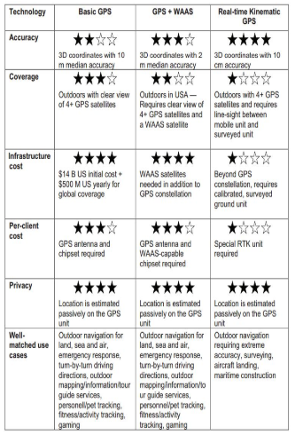
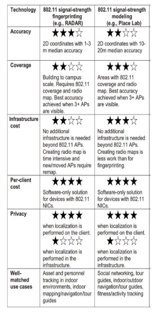
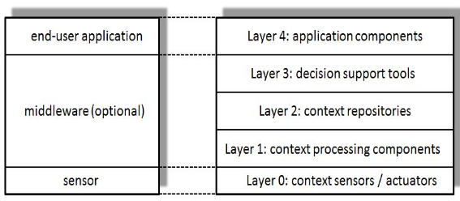

# [Mobile and Ubiquitous Computing](https://fenix.tecnico.ulisboa.pt/disciplinas/CMov23/2023-2024/2-semestre)

## Syllabus

1. [Introduction to Mobile and Ubiquitous Computing](01-introduction.md) - definitions and challenges;
2. [Fundamentals of Android OS](02-android-fundamentals.md) - Android architecture, activities, services, broadcast receivers, content providers, intents;
3. [Mobile UI Design](03-mobile-ui-design.md);
4. [Location Mechanisms](04-location-mechanisms.md) - GPS, Infrared/Ultrasound, 802.11 (WiFi), Cellular Networks;
5. [Privacy using Location-based Services](05-privacy-location-based-services.md) - two-tier (PROBE) and three-tier spatial transformations (spatial k-anonymity);
6. [Context-Awareness](06-context-awareness.md) - context definition, architecture, local vs distributed context-aware systems, context processing taxonomy (capture, infer, distribute, application);
7. [Energy in Mobile and Ubiquitous Computing](07-energy.md);
8. [Replication and Consistency in Mobile Environments](08-replication-consistency.md) - consistency models and session consistency;
9. [Execution Offloading](09-execution-offloading.md);
10. [Augmented Reality](10-augmented-reality.md) - overview, characteristics, marker-based and feature-based tracking, SLAM;

---

---

# Key Concepts

## Android

- **Activities** - represent a single screen with a user interface;
- **View** - a widget that the user can interact with (e.g., button, text field, etc.);
- **Intent** - a message object that is used to request an action from another app component;
  - **Start an activity** - `startActivity(intent)`;
  - **Start a service** - `startService(intent)`;
  - **Deliver a broadcast** - `sendBroadcast(intent)`;
  - **Explicit Intents** - specify the component to start by name (e.g., `new Intent(this, MainActivity.class)`) - Used to start a specific activity in the same application;
  - **Implicit Intents** - specify the action to perform and let the system determine the best component to handle the intent (e.g., `new Intent(Intent.ACTION_VIEW)`);
  - It is possible to pass data between activities using **extras** (key-value pairs) in the intent.
  - You can also start activities for a result, using `startActivityForResult()`, and receive the result in the `onActivityResult()` method - you need to define a **request code** to identify the request.
- An activity starts when an **intent** is received;
- Activities are arranged in a **stack** (**back stack**);
- **Services** - perform long-running operations in the background;
  - **Started** - started by calling `startService()`, and runs indefinitely, even if the component that started it is destroyed;
    - **Foreground Service** - a service that has a **notification** associated with it, to indicate that it is running in the foreground;
    - **Background Service** - a service that runs in the background without a notification;
  - **Bound** - bound to a component by calling `bindService()`, and runs only while the component is bound to it.
- **Broadcast Receivers** - respond to system-wide broadcast announcements;
  - To broadcast a custom intent, you can use the `sendBroadcast()` method, and include the intent in the broadcast.
- **Content Providers** - manage a shared set of application data.

  

---

## Localization

- **GPS** - **outdoor** location mechanism;

  - One-way: satellites send signals;
  - Preserves **user privacy**;
  - **Ground stations** monitor and control the satellites;
    - Clock corrections and orbit updates;
    - There are enough ground monitoring stations to ensure that **each satellite is visible from at least two stations at all times**;
  - **GPS receivers** receive the signals and calculate the location;

    - Determine the position using **at least 4 satellites**, but commonly use up to 12 for better accuracy - this can be **augmented with other location mechanisms** (accelerometers, gyroscopes, etc.).
    - The distance ($R_i$) from the satellite to the receiver is calculated using the **time it takes for the signal to travel**, **multiplied by the speed of light**;

    $$
    R_i = \sqrt{(x - x_i)^2 + (y - y_i)^2 + (z - z_i)^2} + b
    $$

    - This way, **four satellites** are needed to calculate the **four unknowns** (x, y, z, b) - three satellites would be enough with **perfect clocks**;
    - **Real-time** differential GPS uses a **network of ground stations** to **monitor the GPS signals** and **broadcast corrections** to the GPS receivers;
      - Used to **improve accuracy** by **correcting errors** caused by the **ionosphere** and **satellite clock drift**

    

        
    

- **Infrared and Ultrasonic** - **indoor** location mechanisms;

  - **Infrared proximity** - active badges;
    - **Badges** emit **infrared signals** that are **received by sensors** placed in the room;
  - **Ultrasound proximity** - Cricket/Walrus;
    - **Privacy-preserving** - **no centralized server**;
    - **Badges** are the receivers and **beacons** are the infrastructure;
    - Beacons are placed on the ceiling and emit **ultrasound signals**, **advertising their identity**, using a combination of RF (radio frequency) and ultrasound;
  - **Ultrasound TOF (Time of Flight)** - Active Bat.

    - Similar to cricket, but **bats** (small pager-like devices) emit **ultrasound signals** and the receivers in the infrastructure **calculate the distance** to the bats;

    

        
    

- **802.11 (Wi-Fi)** - **indoor/outdoor** location mechanism;

  - **Signal Strength Fingerprinting** (indoor)
    - **Mapping phase** - collect signal strength measurements at known locations;
      - Distances need to be **small** to capture the **variability** of the signal strength;
    - **Localization phase** - estimate the location of the device based on the signal strength
  - **Signal Strength Modeling** (indoor/outdoor)

    - Based on the distance to the APs I am receiving;
    - **War-driving** - driving around with a laptop to **collect signal strength measurements** from APs;

    

        
    

- **Cellular-based Systems** - **outdoor** location mechanism.

    

        
    

---

## Privacy in Location

- **Two-tier spatial transformation**: query anonymization is performed by the mobile user itself - **no trusted third party is required**;

  - **Dummy locations**: generate a number of redundant queries, to hide the real query;
    - But, the the **resulting trajectories need to mimic realistic movement patterns** - e.g., in a sequence of queries, the user should not teleport from one location to another;
  - **PROBE**: an obfuscation system - it prevents the **association between users and sensitive locations**;
    - In an **offline phase**, an **obfuscated map** is constructed by **partitioning the space into a set of disjoint regions** such that the **probability of associating each region with a certain feature type is bounded by a given threshold** - **obfuscation**;
    - Obfuscation may require an additional trusted third party, but in the **online phase**, PROBE is a **two-tier protocol**;
  - **⚠️Limitation**: if a user is situated in a remote location, and issues a query, an attacker who knows that the user is the only one in that area can associate the query with the user - **three-tier protocols solve this issue**.

- **Three-tier spatial transformation**: presence of a **trusted third party** that performs the query anonymization.

  - **Spatial k-anonymity**: a **cloaking region (CR)** contains **k-1 users** in addition to the query source, and the LBS processes the query with respect to the CR;
  - Since **all the k locations enclosed by the CR correspond to actual users**, the **probability of identifying the query source is at most 1/k**;

---

## Context-Awareness

- Architecture:

  - **End-user application**: **consumers** of context information;
  - **Middleware layer (optional)**: communication and coordination issues between distributed components;
  - **Sensors layer**: **producers** of context information;

    

    
    

- Context Processing:

  - **Capture**: context data is captured by sensors (Physical or Virtual sensors)
  - **Infer**: needed to obtain high-level context information from raw sensor data;
    

        
    

  - **Distribute**: context information is distributed to applications;
  - **Consume**: applications consume context information.
    - **Pull-based (query)**: applications request context information when needed;
      - **Polling**: applications may need to poll the context server frequently to get the latest information - if the interval is too short, it may lead to high energy consumption, but if it is too long, the information may be outdated;
    - **Push-based (subscription)**: applications subscribe to context information and are notified when it changes - **more complex**;

---

## Energy

- **Energy-aware OSs**: main idea is to reduce energy consumption by unifying resource and energy management, and by using collaboration between the OS and applications;

---

## Consistency

- **Session consistency**: provides a **user** with a view of the data that is consistent with the **user's updates**;
  - **Read your writes**: a user sees updates made by the user;
  - **Monotonic reads**: a user sees updates in the order they were made;
  - **Writes follow reads**: updates are made after reads on which they depend;
  - **Monotonic writes**: updates are made in the order they were requested;

---

## Cyber Foraging

- **Cyber foraging**: partition, migration and replication of application components across mobile devices and fixed infrastructure based on context (application state and environment);
  - Users are given the illusion that the application is running locally.

---

## Augmented Reality

- **Identifying the location and position** of the device to **decide what to render and where**;
- Can be sensor-based or **vision-based**;
- Virtual-based tracking can be **marker-based** or **feature-based**;
  - **Marker-based**: uses a **predefined marker** to identify the position and orientation of the device; markers are precise by impractical outdoors;
  - **Feature-based**: uses **natural features** in the environment to identify the position and orientation of the device; less precise but more versatile.
