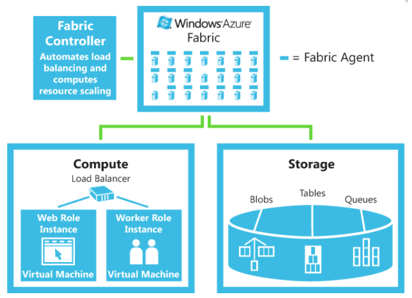

# Microsoft Azure

- **Flexible** application hosting platform;
- **Transparent** application management;
- Includes large-scale storage;
- Goal properties (similar to other platforms):
  - **High availability**;
  - **Scalability**;
  - **Performance**;
  - **Resource sharing**;
  - Support **familiar** programming models;
  - Hide **infrastructure** details;

  

- **Fabric Controller** - manages all hardware in Azure Fabric nodes;
- **Node** - a physical or virtual machine running Windows HPC Server;
  - **Head node** - manages the cluster;
  - **Compute node** - runs jobs;
  - - Each node is running **Windows HPC Server** - a **Windows Server** with:
  - **Cluster manager** - organizes nodes into **head** and **compute** nodes, and performs software updates;
  - **Scheduler** - schedules jobs and manages resources;
  - **Cluster monitor** - monitors the cluster and reports status;
  - **Replication** of head nodes for **high availability**;
- A node can be a **physical machine** or a **virtual machine** on top of **Hyper-V**;
- **Azure Storage** - provides scalable storage;

---

## Hyper-V

- **Hyper-V** is a **hypervisor** from Microsoft, based on Xen (open-source);
- **Paravirtualization** is used to improve performance;
  - Guest OS (Windows) is aware of the hypervisor - explicitly modified to invoke hypervisor services;
  - **✅ Pros**: no binary translation, no patching, no overhead;
  - **❌ Cons**: requires guest OS modification - no **transparency**;
- Compared to VMWare, **Hyper-V** is **cheaper** and **easier** to use;
  - Free with Windows Server;
  - Based on micro-kernel architecture;
  - No inclusion of third-party drivers for **better security**;

---

## Azure Fabric Controller

- **Manages all hardware** in Azure Fabric nodes;
  - Distributes services among available processors;
- **Monitors** the system and **relocates** services when necessary;
- **Starts instances** of services on **available nodes**;
- **Maintains replicated state machine** of how to lead the system to a desired state;
  - Controller is a 5 to 7 node cluster;
  - State is replicated **passively**;
  - A new leader is elected when the current leader fails;
  - Running applications do not fail if the controller fails;
