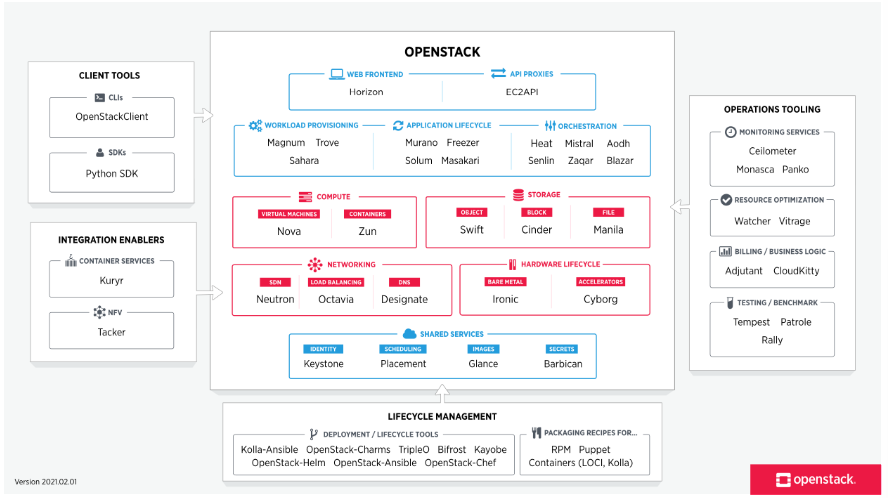

# OpenStack

- **Free** and **open-source** cloud computing platform;
- Predominantly **IaaS**;
  - Set of **interconnected services** accessible through REST, web UI, or CLI;
  - Largely **compatible** with AWS:
    - Compute - **Nova (EC2)**;
    - Storage - **Swift (S3)**;
- **Modular** and **extensible** architecture.

  

- Main services:
  - **Nova** - Compute service;
  - **Neutron** - Networking service;
  - **Cinder** - Block storage service;
  - **Swift** - Object storage service.
  - **Horizon** - Dashboard;
- Other:
  - **Keystone** - Identity service;
  - **Glance** - Disk image service;
  - **Heat** - Orchestration service;
  - **Ceilometer** - Telemetry service.

  

---

## Nova

- **Computation** component of OpenStack;
- Connects to **hypervisors** on **compute nodes**;
- Starts VMs based on **Glance** images and **Cinder** volumes;
- **Scheduler** decides VM allocation/placement;
- All of this written in **Python**;
- Resources divided in **regions** and **availability zones**;
- **CPU overcommit** factor ratio: **16:1 - each core can be shared by 16 VMs**;
- **Memory overcommit** factor ratio: **1.5:1 - each GB of RAM can be shared by 1.5 VMs**;
  - Memory is much less elastic than CPU;
  - Cost of swapping is high.

### Nova Scheduler

- **Receive requests** to run VM instances;
- **Decide VM allocation/scheduling/placement** - which physical host should be used;
  - Instruct hypervisor to start the VM;
- **Store decisions** in DB (Nova shared state);
- There are **multiple schedulers** for faster throughput;
- **Filter Scheduler**:
  - Uses user-defined filters and weights, allowing expressing **requirements**, **preferences** and **policies**.
  - Gets state of all compute nodes;
  - **Filtering** - removes nodes that don't meet **requirements**; examples of filters:
    - `ComputeFilter` - removes nodes that are full;
    - `AvailabilityZoneFilter` - removes nodes that are not in the requested availability zone;
    - `RamFilter` - removes nodes that don't have enough RAM;
    - `CoreFilter` - removes nodes that don't have enough cores;
    - `DifferentHostFilter` - removes nodes that already have an instance of the same VM;
    - `SameHostFilter` - removes nodes that don't have an instance of the same VM;
  - **Weighting** - sorts nodes by weight (e.g., least load); based on **preferences** and **policies**;
    - For each host, Nova virtually consumes resources and calculates the weight;
    - Weights are normalized and compared;
    - `RamWeigher` - weights nodes based on available RAM;
    - `CoreWeigher` - weights nodes based on available cores;
    - `DiskWeigher` - weights nodes based on available disk space;
    - `MetricsWeigher` - weights nodes based on metrics (e.g., CPU utilization).

---

## Swift

- OpenStack's **object storage** service;
- Used by **Glance** to store VM images and by **Cinder** to store volumes;
- **Hierarchical** structure based on:
  - **Accounts**, **containers**, and **objects**;
  - Each account and container is a **SQLite file**;
  - Objects are binary streams;
- Based on **3 DHTs (Distributed Hash Tables)** - on **account**, **container**, and **object** levels;

---

## Neutron

- Manages **network connectivity** between nodes;
- **Floating IPs** - public IPs that can be assigned to VMs;
  - Similar to **Elastic IPs** in AWS;
- Network design is based on **networks**, **subnets**, **routers**, and **ports**;
- Usual REST API operations:
  - **Create**, **read**, **update**, **delete**.
