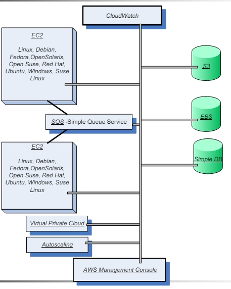

# Infrastructure as a Service (IaaS)

> **Infrastructure as a Service (IaaS)** - rent virtual machines - **System-level Virtualization**;
  * User controls the **OS**, storage, network, applications;
  * User does not control the underlying infrastructure;
  * e.g. **Amazon EC2 - Elastic Compute Cloud**.

### AWS Main Architecture

  

* **AWS Management Console** - web-based interface for managing AWS services;
* **Amazon EC2** - allows users to launch virtual machines;
* **Simple Queue Service (SQS)** - message queuing service - allows multiple EC2 instances to communicate;
* **Storage Services** - **Simple Storage Service (S3)**, **Elastic Block Store (EBS)**, **DynamoDB**;
* **CloudWatch** - monitoring service;
* **AWS Auto Scaling** - automatically adjusts the number of EC2 instances;
* **Elastic Load Balancing** - distributes incoming application traffic across multiple EC2 instances;
* **Elastic Cache** - in-memory caching service;
* **CloudFront** - content delivery network (CDN);
* **CloudFormation** - infrastructure as code service;
* **Elastic Beanstalk** - platform as a service (PaaS).

## Amazon EC2 - Elastic Compute Cloud

* **On-demand** virtual server provisioning service;
* Uses **disk images** created by users and then transferred/pre-built by Amazon;
  * **Amazon Machine Images (AMIs)** - pre-configured templates for instances;
* **Low granularity billing** - pay for what you use (hourly, minutes, ...);
* Access via **web services**: **APIs**, **CLI**, **SDKs**;
  * **Amazon Management Console** - web-based interface;

### AWS Regions and Availability Zones

* **Region** - geographical area with multiple data centers (**Availability Zones**);
* **Availability Zone** - a data center consisting of a large number of servers;
* AZs are interconnected by high-speed networks;
* Regions do not share resources, and communication between them is over the internet;
* **Wave Length Zones** - AZs that are close to 5G networks;
* **AWS Outposts** - on-premises data centers - extension of AWS cloud.

### EC2 Instances

* An **Instance** is a **virtual server - system VM**, with a **well-defined hardware configuration**;
* A **guest VM** running a particular **image (AMI)**;
  * **OSs** - Red Hat, Ubuntu, Windows, ...
  * **DBs** - MySQL, Oracle, ...
  * **High-performance computing** - Hadoop, OpenMPI, ...
  * **Web servers** - Apache, Nginx, ...
* The user chooses:
  * **region** and **availability zone** where the instance will run;
  * **instance type**, from a **limited** set of predefined configurations;
* When launched, the instance is provided with a DNS name, that maps to:
  * a **public IP address** - accessible from the internet (only assigned only for the lifetime of the instance);
  * a **private IP address** - accessible only within the AWS network;
  * IP addresses are **dynamic** - change when the instance is stopped and restarted, and require that a dynamic DNS service be used;
* An instance can request an **Elastic IP address** - a **static public IP address** allocated to an instance from the pool of public IP addresses, and **paid** for;
  * **Not released when the instance is stopped**, but must be released when no longer needed. 
* CPU performance is measured using **EC2 Compute Units (ECUs)** - a relative measure of CPU capacity;
* **Instance types**:
  * **Small** - 1 ECU, 1.7 GB memory, 160 GB storage;
  * **Large** - 2x2 ECUs, 7.5 GB memory, 850 GB storage;
  * **XL** - 4x2 ECUs, 15 GB memory, 1690 GB storage;
  * There are other types: micro, high-memory, high-CPU, high-I/O, GPU instances, ...
* Requires creating a **key pair** - a public/private key pair used to encrypt and decrypt login information;
  * The public key is placed on the instance, and the private key is used to log in.

> **Start an EC2 Instance**:
> * `ImageId` - AMI ID (Amazon Linux, Ubuntu, ...);
> * `InstanceType` - instance type (Small, Large, XL, ...);
> * `KeyName` - key pair name;
> * `SecurityGroup` - security group (firewall rules);
> * `Region` and `AvailabilityZone`;
> * `MinCount` and `MaxCount` - number of instances to launch.

### Security Groups

* **Security Groups** - groups of network rules to control the access to EC2 instances;
* Just a label for a set of rules, that can be added/removed at any time;
* Only **limit inbound traffic** - all **outbound traffic is allowed and paid for**;
* **IP rules** - allow traffic from specific IP addresses;
* **Group rules** - allow traffic from other instances in the same security group;
* Each instance can be associated with **multiple** security groups;
* Each security group can have up to **100 rules**.

---

## Cloud Monitoring

* **Monitoring** - the process of collecting, processing, and displaying data about the performance of a system;
* Goals:
  * Detect **faulty/failed** nodes/applications;
  * Detect **overloaded** nodes;
  * Detect **load imbalance**;
  * Correct these problems by **reconfiguring** the system (restarting nodes, moving applications, ...).

### Amazon CloudWatch

* EC2 instances can be monitored using **Amazon CloudWatch**;
* **Goal**: allow users and services to check the status of AWS running nodes;
* Set of VM, and application-probing tools;
* When launching an AMI, user can start monitoring the instance, specifying the **type of monitoring**:
  * **Basic** - 5-minute intervals; free;
  * **Detailed** - 1-minute intervals; paid;
* Definition of provided **measures**:
  * **Measure** - measuring events that are aggregated per minute;
  * **Metric** - time-ordered series of data points AWS CloudWatch returns;
  * **Unit** - the unit of measure for the metric - seconds, bytes, ...
  * **Statistic** - a metric's functional characteristics - average, minimum, maximum, sum, count;
  * **Namespace** - a container for CloudWatch metrics;
  * **Dimension** - aggregation scale for metrics - instance ID, AMI ID, group name, ...

### Elastic Load Balancing and Auto Scaling

* **AWS Load Balanced (ELB)** redirects inbound requests to a set of EC2 instances;
  * Supports **Session affinity/stickiness** - the same client is always redirected to the same instance; 
  * Monitors the health of the instances and redirects traffic only to healthy instances;
* **Auto Scaling** - automatically adjusts the number of EC2 instances;
  * Scale according to **user-defined conditions**;
  * Used to meet demand, and reduce costs by scaling down when demand is low.