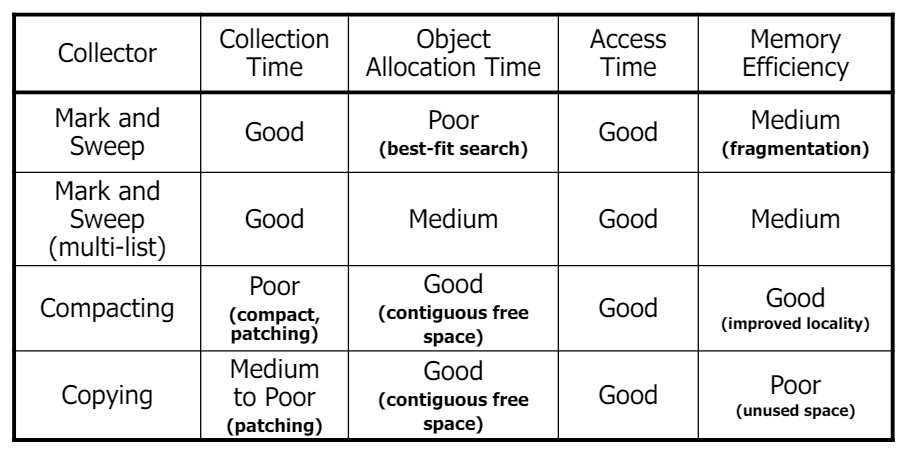

# High-Level Language VMs

## Overview

* Different from **traditional process VMs**;
* **Portability** as a primary goal;
* Design a new **guest-ISA** that is independent of the host-ISA;
  * **Virtual ISA** is a **high-level language**;
  * Free of implementation-specific details;
  * Defined for user programs, and not real hardware;
  * Includes:
    * Instruction set;
    * Meta-data;
    * **Data set architecture**;
* Consolidates features easily supported by most OS;
* Supports features of **high-level languages**.

### Pascal P-Code VM

* **Pascal** was a popular language in the 70s;
* **P-Code** was a **stack-based** VM - similar to **Java**;
* Requires **only one** Pascal compiler for all platforms;
* Its **much simpler** to implement a **P-Code interpreter** than a **Pascal compiler** from scratch.
* P-Code Instruction Set:
  * Op-code and offset with operand relative location;
  * **Stack-based** - push and pop values from/to the stack;
  * **ALU** operations operate on the top of the stack;
  * **Typed instructions** - type information is stored in the instruction.

---
---

# Java Virtual Machine (JVM) Architecture

* The Java virtual-ISA is composed of:
  * **Bytecode** instructions;
  * Set of pre-defined **data types**;
  * **Metadata** - data definitions and inter-relationships (formalized in the **class file** format);
* **No explicit registers** in bytecode leads to **simpler code**;
* Minimal OS dependence through libraries;
* Metadata allows **verification/interoperability**;

### Data Types

* **Primitive types**: `int`, `float`, `double`, `long`, `byte`, `short`, `char`, `boolean`;
* **Reference types**: hold references to objects or null;
* Objects carry data declared by classes;
  * **Array** is a special kind of object with **ISA support**.
* Avoid implementation-specific details:
  * **No fixed representation or sizes for data, only ranges**;
  * **No direct data addressing** - all data is accessed through **references**.

### Data Storage

* For each **running thread**:
  * Implicit **VM registers** - **PC**, **stack pointer**, **frame pointer**;
  * **Stack** - **typed**:
    * On method invocation, a new **frame** is allocated on the stack;
    * **Arguments** and **local variables** are stored in the frame (argument 0 is `this` for instance methods);
    * **Operand stack** - used to pass arguments and return values;
* **Type and Method area**:
  * One method area per JVM;
  * Analogous to `text/code` segment in a process VM;
  * **Type definitions** - class and interface definitions;
  * **Method tables** - method definitions;
* **Constant pool**:
  * Collection of all symbolic data within a class;
  * Instructions often need constants;
  * **Pooling advantages**: allows sharing/saving space; smaller code footprint; fixed pre-determined size for each instruction type;
* **Global data**:
  * **Heap** - objects and arrays;
    * Only one heap per java application (all threads share it);
    * **Garbage collection** is used to manage the heap;
  * **Class file contents** - class definitions, method bodies, static fields, **constant pool** (holds immediate values and references).

## Instruction Set

* **Opcode byte + 0 or more operands**;
* Operands fetched from the **constant pool**, **local variables**, or **stack**;
* Each **primitive type** has its own set of **instructions**;
  * `iadd`(int), `fadd`(float), `dadd`(double), `ladd`(long), ...
* Types of instructions:
  * **Data-movement instructions**:
    * Pushing constants onto the stack - `iconst_0`, `iconst_1`, ...
    * Moving values between the stack and local variables - `aload_0`, `istore_1`, ...
    * Via constant pool - `ldc`, `ldc_w`, `ldc2_w`;
    * Stack manipulation - `dup`, `swap`, `pop`;
  * **Functional instructions**:
    * Arithmetic, logical, and comparison operations;
  * **Control-flow instructions**:
    * Jumps, conditional jumps - `goto`, `if_icmpeq`, `if_acmpne`, ...
    * Switches - `tableswitch` (used for `switch` statements with ranges), `lookupswitch` (used for `switch` statements with arbitrary values);
    * Method invocation - `invokevirtual` (indexes constant pool for method reference, check if arguments match, allocate stack frame of appropriate size, and jump to the method);
    * `invokestatic`, `invokespecial` (constructors, private methods, or methods of superclass), `invokeinterface`;
    * Method return - `ireturn`, `freturn`, `dreturn`, `lreturn`, `areturn`, `return` (void return) - pops the stack frame and returns to the caller;
  * **Others**:
    * Object creation - `new` (creates a new object and pushes a reference to it onto the stack) - proper creation requires a constructor call;
    * Field access - `getfield`, `putfield`, `instanceof`, `checkcast`;
    * Array access, synchronization, exception handling;
* All data movement is done through the **stack**.

<p align="center">
    
</p>

Example of object creation and method invocation:

```bytecode
new #1 // creates a new object of type #1 (java.lang.Object) and pushes a reference to it onto the stack

dup // duplicates the top value on the stack

invokespecial #4 // invokes the constructor of the object (java.lang.Object.<init>)

areturn // pops the stack frame and returns the reference to the caller
```

### Exceptions and Errors

* `athrow` instruction is used to throw an exception;
* **Exception table** is used to map **PC ranges** to **exception handlers**, specifying:
  * **Address range** of the code that can throw the exception;
  * **Target address** of the exception handler;
  * **Type of exception** to catch;
* Table defined in the class file.

### Java Threads

* Synchronization through **monitors** is supported: `synchronized` method;
* `monitorenter` and `monitorexit` instructions;
* Each object has a **monitor** associated with it;
* An exception table is implicitly created when a `synchronized` block is used.

---

# JVM Implementation

* The implementation:
  * incarnates the VM specification;
  * provides an execution environment for Java programs;
  * carries out the bytecode interpretation.
* Major components:
  * **Security** - handled in **class loading** and during **emulation**;
  * **Memory management** - **garbage collection**;
  * **Emulation engine** - **interpreter** and **JIT compiler**;

## Implementing Security

**Sandbox model** - default security model in Java:

* Creates barrier around Java execution environment;
* **User applications** (possibly dynamically downloaded) run in a **sandbox**, and **cannot affect resources outside the sandbox**;
* Basic rules of sandbox:
  * JVM code and data protection: enforced by **static and dynamic checks**;
  * Protection of files and other resources: enforced by **security manager**.

### Intra Process Protection

* **Static checking** (class loading time - avoid constant/repetitive checks at runtime - types are statically known and all control flow paths are known):
  * **Consistency checks** - types, method signatures, valid references, etc.;
  * **Integrity checks** - correct data usage - **operand stack tracking**; control transfer to ensure jump/branch targets are valid;
    * Analyze bytecode of methods sequentially -> **track potential data movement, types stack configuration** resulting from execution but without actually executing the code;
    * **Regardless of the actual execution path**, the **operand stack** is always in a **consistent state** - same number of elements, same types, etc.;
* **Dynamic checking** (runtime):
  * Check **null pointers**, **array bounds**, **type casts**, etc.;

### Security Policy Enforcement

* **Security manager** - **Java API** that allows applications to define a **security policy**;
* Explicitly ask/check for permissions to perform certain operations;
* Check if the requested operation is allowed by the **security policy** - includes `FilePermission`, `SocketPermission`, `RuntimePermission`, etc.;
* Throws a `SecurityException` if the operation is not allowed;
* Attached when application starts - cannot be changed during execution;
* **⚠️Limitation**: only **qualitative** security checks - **no quantitative** checks (e.g., **CPU time**, **memory usage**, nr of threads, ...).

---

## Garbage Collection

* Application is called the **mutator** - **allocates** and **de-allocates** memory;
* To prevent **memory exhaustion** and **memory leaks**, use **garbage collection**: 
  * **Collects** objects that are no longer reachable;
  * **Reuses** memory for new objects;
* Not part of the **JVM specification** - **implementation-dependent**;
* Causes **overhead** (pause time, performance, heap space) but **improves memory locality** and **reduces fragmentation**;
* **Root set** - set of objects that are reachable from the **stack** and **static fields**;
* **Reachable/live objects** - objects that are reachable from transitive closure of the **root set**;
* **Unreachable/dead/garbage objects** - objects that are not reachable from the **root set**;
* Two main families:
  * **Tracing collectors**;
  * Reference counting collectors;
* Algorithms:
  * Mark-and-sweep;
  * Compacting GC;
  * Copying GC;
  * Generational GC;
  * Incremental and concurrent GC; 

### Mark-and-Sweep

* Two phases:
  * **Mark phase** - mark all reachable objects (when an marked object is found, stop tracing that path - avoid cycles);
  * **Sweep phase** - sweep through the heap and deallocate unmarked objects;
* **✅Advantages**:
  * Relatively **fast**;
  * Relatively **short garbage collection time**;
* **❌Disadvantages**:
  * **Fragmentation** - memory is not compacted;
  * **Long object allocation time** - need to find a contiguous block of memory.

### Compacting GC

* **Mark-and-sweep** with **compaction**;
* Two phases:
  * **Mark phase**;
  * **Compact phase** - move all live objects to one end of the heap;
* **✅Advantages**:
  * **No fragmentation**;
  * **Fast allocation** - no need to find contiguous blocks;
* **❌Disadvantages**:
  * **Slow** - need to move objects;
  * **Longer garbage collection time**;
  * Multiple passes through the heap (marking, compute new locations, moving objects, updating references (**patching**));
  * Too much overhead if is **fully executed at each GC cycle**.

### Copying GC

* **Mark-and-sweep** with **compaction** and **copying**;
* **Divide the heap into two halves** - **from-space** and **to-space**;
* Perform collection when **from-space** is full;
* Copy all live objects from **from-space** to **to-space** - **compact**;
* **Swap the roles** of the two spaces;
* **✅Advantages**:
  * **No fragmentation**;
  * **Faster than compacting GC** - reduces number of passes through the heap;
* **❌Disadvantages**:
  * **Half of the heap is unused**;
  * **More memory** is needed.

### Generational GC

* **Most objects die young** - **weak generational hypothesis**;
* Goal: **avoid scanning long-lived objects**;
* Divide heap into **generations**:
  * **Young generation - nursery** - new objects;
    * GC is **frequent** - copying GC;
    * Objects that survive multiple GCs are promoted to the **old generation**;
  * **Old generation - tenured/mature** - long-lived objects;
    * GC is **infrequent** - mark-and-sweep;

> ⚠️ All algorithms described above are **stop-the-world** algorithms - **pause the application** to perform GC.
>
> Solution:
> * **Incremental GC** - divide the GC process into small steps;
> * **Concurrent GC** - run the GC in parallel with the application.
>
> Requirement: **synchronization** between the **GC** and the **application (mutator)**.

### Incremental and Concurrent Mark-and-Sweep

* **Tri-color marking**:
  * **White** - suspected to be garbage - not yet scanned;
  * **Black** - known to be reachable;
  * **Gray** - reached by GC, but descendants not yet scanned;
* **Read-barrier** - when object is white, and is read by the mutator, it is marked gray;
* **Write-barrier** - when object is black and is written by the mutator, it needs to be **re-analyzed** - put at the end of the scanning list;

<p align="center">
    
</p>

---

## High Performance Emulation - JIT Compilation

* **Optimization framework** - basic framework to achieve high-performance emulation - **combination of several emulation methods**;
* Performance tradoff:
  * Startup time (S)
  * Steady state performance (T)
  * Time for emulating an instruction N times: `S + N * T`;
* If **N is small** - **interpretation** is better;
* If **N is large** - **binary translation** is better;

<p align="center">
    
</p>

### Staged Emulation

**How to predict how many times instruction is emulated?** - **Staged emulation**:

* Start with minimal fixed cost (interpretation);
* **Monitor** the number of times an instruction is executed;
* When the number exceeds a threshold, **translate** the instruction - minimal marginal cost;
* When higher thresholds are reached, **optimize** the translation.

### Method Inlining

* **Frequent use of small methods** - solved by **method inlining**;
  * Replace method call with the method body;
* Need to check if the method is **small** and **frequently used**;
* Two approaches:
  * **Call graph analysis** - build a call graph and inline methods that are frequently called;
  * **Stack frame** - goal is to reduce analysis overhead of call graph creation - decide based on localized view;

<p align="center">
    
</p>

* **✅Advantages**:
  * **Reduces method call overhead**;
  * **Increases locality** - reduces cache misses;
* **❌Disadvantages**:
  * **Only beneficial for small methods**;
  * **Increases code size** - can lead to **cache misses**;
* Inlining in static methods is easy, but most of the methods are instance methods - **virtual methods**: the **target** of `invokevirtual` is determined at runtime;
  * **Solution**: often the target does not change much:
    * **Guarded inlining** - inline the **most common target** and add a **check** for the **other targets**;
    * **Polymorphic inline cache** - **cache** the **target** of the **invokevirtual** instruction.

### Array Bounds Check Elimination

* Array bound checking is very frequent within loops;
* **Hoist invariant check** checks if the array is within bounds outside the loop:

<p align="center">
    
</p>