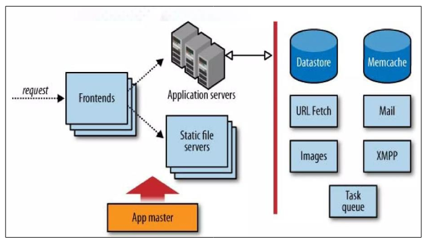
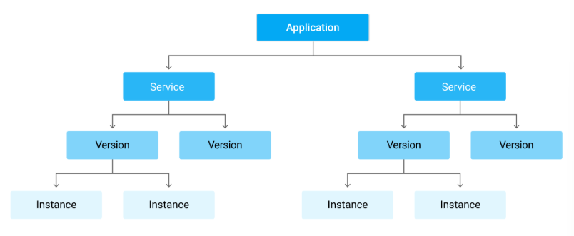
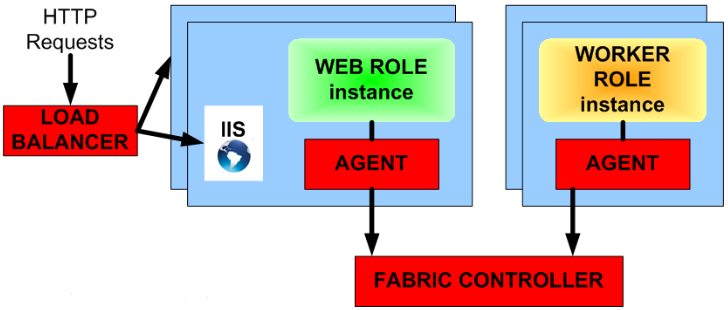
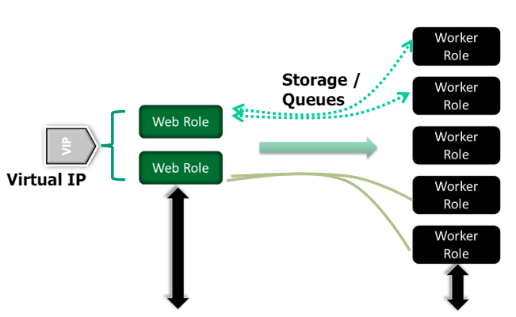
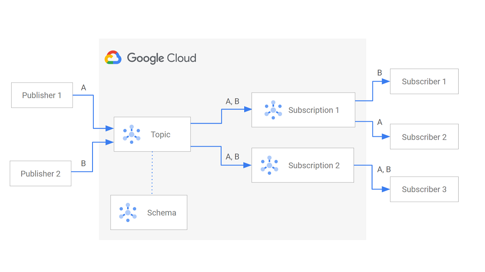
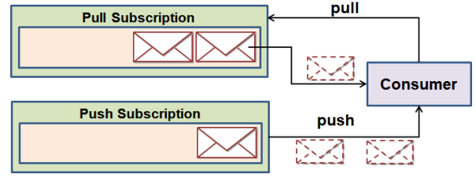
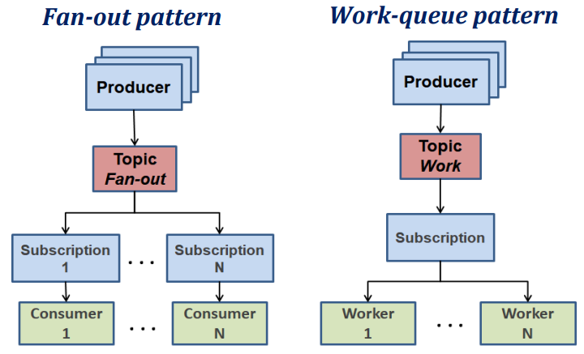

# Cloud PaaS

## Google App Engine

* Google App Engine is a Platform-as-a-Service (PaaS) that allows developers to build and deploy applications on Google's infrastructure;
* Application configuration is quite **simple**, with **limited access** to the underlying infrastructure - **almost completely abstracted**;
* **Goal**: reduce interactions so as not to limit number of apps, requests per second, etc.;
  * Primarily designed for **scalability**;
* The user has control over:
  * **Application code**;
  * Application **configuration**;
  * **Middleware stack** - but choosing from a limited set of options;

> **✅ Advantage**: Payment is independent from the number of servers - automatic decision up to GAE;

### Architecture

  

* **Frontend**: identifies the application based on the URL;
  * Separates requests for **static content** from **dynamic content**;
  * May redirect request to Google authentication service;
  * Applications configured using `app.yaml` file;
  * Additional configuration can be done using `dispatch.yaml` file (override request routing rules) and `cron.yaml` file (schedule tasks);
* **Static File Servers**: serve static content (e.g., images, CSS, JavaScript);
* **Backend**: runs work in the background;
  * Different classes of machines for **services**, versions, instances, etc.;
  * Can be **dynamic** (request-driven) or **resident** (always running, manual start);

  

### Execution Environment

* Applications execute within a **strict sandbox**;
* By default, is not possible to:
  * Process a request for more than **60 seconds**;
  * Write to the filesystem;
  * Open a socket or connect to an IP address;
  * Create threads or processes;
  * Make system calls;
  * etc.
* Apps can call GAE's **APIs** to access services like:
  * Datastore;
  * Blobstore;
  * Images;
  * Mail;
  * **Memcache - memory cache management**;
    * **Not stable or persistent** - entries can be eliminated at runtime;
  * Task queues;
  * URL fetch;
  * **Pub/Sub - messaging service**;
  * etc.

### Scalability

* Scalability is mainly achieved by:

1. Number of frontends and applications is **automatically scaled** based by GAE;
2. Web apps are **kept in memory**;
3. Web requests are sent to the server(s), where the app is **already running**;

* Can be defined by using **scaling policies**, in the `app.yaml` file;

---

## Microsoft Azure

* Composed of **web roles** and **worker roles**;
* **Web roles**: web service running in IIS (Internet Information Services) on Windows VM;
  * An `.aspx` page deployed on a user chosen URL;
* **Worker roles**: services without outside interface, running in a Windows VM;
  * Can be used to process data, etc.;
  * C# classes that implement `RoleEntryPoint` class;
    * `onStart` method - called when the role starts - used for initialization;
    * `Run` method - called when the role is running - used for the main logic;
    * `onStop` method - called when the role is stopped - used for cleanup;
  * All worker roles have to **start a thread**;
* **Agent**: exposes the API and monitors the failure conditions of the app;
* **Fabric Controller**: manages the VMs and the deployment of the app;
* **Service model**: defines the roles and the configuration of the app;
  * Described in the XML files `.cscfg` and `.csdef`;

  

  

* Communication between roles is done through **queues** and **storage**;

---

## Service Integration

* Integration between services is done through **messaging services**;
* Why?
  * Participants are **decoupled**;
* E.g., **Amazon SQS**, **Microsoft Azure Queues**, **Google Cloud Pub/Sub**.

### Amazon SQS (Simple Queue Service)

* Message delivery triggered by receiver - no delivery times are guaranteed;
* **Message queues are replicated** - fault-tolerant and scalable;
* Limited message size of 8KB/64KB/256KB;
* Fault tolerance mechanism: when messages are read, they become **invisible** for a certain period of time, to avoid being read by another consumer, and they need to be **deleted** after processing;
* Use an **idempotent message protocol** - do not design operations that assume a particular application state, e.g.: `setValue` instead of `incrementValue`;
* Do not use when app has **time constraints**.

### Microsoft Azure Queues

* Reliable and persistent messaging service;
* **Unlimited** queues per account and messages per queue;
* Limited message size of 8KB/64KB;
* Fault-tolerant mechanism as in Amazon SQS.

### Google Cloud Pub/Sub

* Google messaging service;
* Usage: streaming analytics and data integration pipelines;
* Guarantees: synchronous replication of all data to at least **two zones**, and **best-effort** replication to a **third zone**;
* Core concepts:
  * **Topic**: a named resource to which messages are sent by publishers;
  * **Subscription**: a named resource representing the **stream of messages** from a single, specific topic, to be delivered to the subscribing application;
  * **Message**: data that is sent to a topic and then delivered to subscriptions;
  * **Publisher**: an application that creates and sends messages to a topic;
  * **Subscriber**: an application that receives messages from a subscription;
  * **Acknowledgement**: a message is considered **delivered** when the subscriber acknowledges it - **acked messages are removed from the subscription queue**;

  

* Message delivery methods:
  * **Push**: messages are **pushed** to the subscriber to a specified endpoint;
  * **Pull**: subscriber **pulls** messages from the subscription;

  

* Publisher/subscriber relationships:
  * **Fan-out**: one-to-many or many-to-many - **many subscriptions** to a single topic;
  * **Fan-in** or **Work Queues**: many-to-one - **only one subscription** to a single topic.

  

> For more information, check the [Pub/Sub notes](https://github.com/andre-j3sus/isel-leic-notes/blob/main/6th-semester/cn/8-pub-sub.md) from my bachelor's degree.