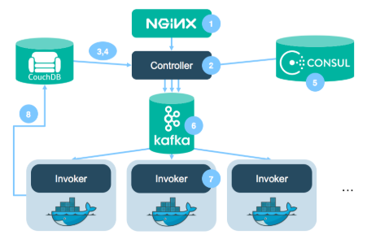
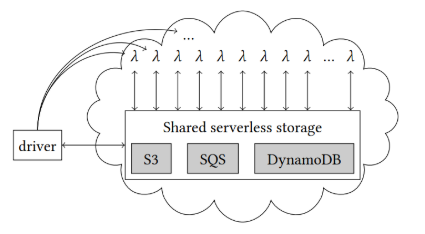

# Function-as-a-Service (FaaS)

> **FaaS** is a recent cloud computing paradigm that allows developers to deploy and execute code in response to events without the need to manage servers - also referred to as **serverless computing**.

- The next generation of cloud computing;
- Technology is still maturing - extremely active research area;

    

- Application is expressed as a **set of functions** and a **set of triggers** that activate the functions based on events - **event-based** programming model;
  - Events can be **HTTP requests**, **database changes**, **file uploads**, **timers**, etc.;
- Concurrency/scalability is managed by the platform;
- Usually **simpler code** and **faster development**;
- **Finer granularity** of resources - pay only for what you use.

---

## Serverless Platforms

### AWS Lambda

- **AWS Lambda** is a serverless computing service provided by **Amazon Web Services** - **most popular** serverless platform;
- Lambdas:
  - Have a **maximum execution time** of 15 minutes;
  - Execute inside **Firecracker microVMs**;
  - Cannot modify the **underlying infrastructure**;
  - Cannot communicate with other Lambdas directly - must use **storage**, **queues**, or **databases** - can generate **events**;
- **Function**: a piece of code that receives an **event** and returns a **response**;
- **Trigger**: a resource or event that causes a function to execute;
- **Event**: a JSON object that represents the input to the function;
- **Lifecycle**:
  - When a function is **invoked**, AWS Lambda provisions an instance to process the event;
  - When the function code finished, it can handle another event;
  - If invoked while the function is processing an event, AWS Lambda will provision another instance - increasing **concurrency** - **configurable**;
- **Pricing**: based on the number of **requests** and the **execution time**;
  - **Single knob: memory** - affects CPU and network;
    - Invocation has fixed price;
    - ~0.1 vCPU per 128 MB of memory;
  - Temporary/ephemeral storage is charged separately;
  - Price **rounded to milliseconds**.

### Google Cloud Functions

- **Google Cloud Functions** is a serverless execution environment for building and connecting cloud services - **similar** to AWS Lambda;

### Azure Functions

- **Azure Functions** is a serverless compute service that enables you to run event-triggered code without having to explicitly provision or manage infrastructure - **similar** to AWS Lambda;
- **Pricing**:
  - **Pay-as-you-go** - based on the number of **executions** and **memory** used - similar to AWS Lambda;
  - **Premium plan** - **additional payment per each vCPU** used.

### IBM OpenWhisk

- **IBM OpenWhisk** is an **open-source** serverless platform;
- Components:
  - **NGINX** - load balancer;
  - **Controller** - lambda scheduler;
  - **CouchDB** - metadata storage;
  - **KV Store (Consul)** - keeps active nodes;
  - **Kafka** - pushes actions to invokers;
  - **Invoker** - manages a local lambda;
  - **Docker** - lambda execution environment.

    

---

## Design and Implementation Challenges

- **Where to run lambdas?**
  - In a dedicated VM/container? - **resource waster would be enormous**;
  - Applications are event-driven - idle most of the time;
  - **Solution**: function runs **with no dedicated server\* - **serverless\*\*;
  - Users do not select a VM nor OS type, only the language runtime and the memory size;
  - Provides can decide where to host invocation **use leftovers from IaaS**;
  - Use **already started environments** - **warm start**;
    - **Cold start** - first invocation of a lambda - **slow**;
    - **Warm start** - subsequent invocations - **fast**;

---

## Advanced FaaS Applications

### Video Encoding - ExCamera

- **ExCamera** - low-latency video encoding tool based on FaaS;
- **Problem**: video encoding is **computationally intensive** and **time-consuming**;
- **Solution**:
  - Upload video to cloud storage (e.g., S3);
  - **Start thousands of lambdas** that consume a chunk of the video;
  - Merge the output chunks into a single video;

> **Lambdas can be used for massively parallel bursts of computation.**

### Data Analysis - Lambada

- **Lambada** - low-latency data analysis tool based on FaaS;
- **Problem**: can we use FaaS for low-latency data analysis? E.g. running MapReduce jobs - data needs to be **shuffled** - lambdas cannot directly communicate with each other;

    

---

## FaaS Optimizations

The following are some FaaS/Serverless open problems:

- **Cold start latency**: due to slow VM/container boot time + runtime initialization;
- **Resource redundancy**: multiple lambdas may be running the same code;
- **Long warm-up time**: JIT compilers and interpreters take time to optimize code;

### Function Co-execution

- Execute **multiple concurrently lambdas in the same runtime**;
  - Runtime can be shared;
  - Libraries can be shared;
  - Global state can be shared (e.g. ML models);
  - Invocation-private state is low;
- **#[Photons](https://www.dpss.inesc-id.pt/~rbruno/papers/vdukic-socc20.pdf) >> #Runtimes**;
  - Photons reduce overall memory utilization by **sharing memory** between functions - **global state requires data isolation**;
  - Uses **automatic bytecode transformation** using Javassist;

    

### AOT Compilation

- **Ahead-of-Time (AOT) compilation** (an initialization): can we compile high level apps into binaries?
  - Such binary would reduce number of cold starts and memory footprint;
- **GraalVM**: a polyglot VM that can run multiple languages;
  - **Native image**: AOT compilation of Java applications;
  - **Truffle**: framework for building interpreters and JIT compilers;
  - **GraalVM**: JIT compiler for Java applications.

    
    

### Sharing Code and Profiles

- **Problem 1**: every time a new runtime is launched, it needs to profile and compile the code - **long warm-up time**;
- **Problem 2**: all code profiling and compilation is lost when the runtime is destroyed;
- Idea: can we **cache/share** code and profiles between runtimes?
