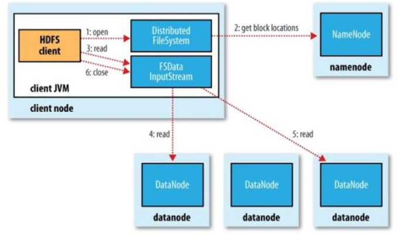

# Cloud Storage

## Storage Types

- **Object Storage**
  - Allows to store and retrieve data as objects or bytes;
  - Supports only Object ID indexing;
  - Examples: **Amazon S3** (Dynamo), Google Cloud Storage, Azure Blobs;
- **Cloud File Systems**
  - Hierarchical organization of files, permissions and metadata;
  - Examples: **Hadoop File System**, Google File System;
- **Tables (NoSQL)**
  - Records and tables;
  - Search and range scans;
  - Examples: **Amazon DynamoDB** (Dynamo), Apache HBase, **Google BigTable**;
- **Relational Databases**
  - Full relational model;
  - Conventional services;
  - Examples: Amazon RDS, SQL Azure, Google Cloud SQL.

---

## Dynamo System

- Powers **DynamoDB** and **S3** Amazon services;
- Dynamo focus more on **availability** and **partition tolerance** than on **consistency**;
  - At Amazon, availability equals the client's trust;
  - In large data centers, partitions are inevitable;
  - Most data services tolerate small inconsistencies - **eventual consistency**;

> ### Consistency Models
>
> - **Strong Consistency**: once a write operation completes, all subsequent read operations will return the value of the write operation;
> - **Weak Consistency**: after a write operation completes, reads may or may not see it;
> - **Eventual Consistency**: after a write operation completes, reads will eventually return the value of the write operation; e.g., a DNS name update is propagated between zones until all clients eventually see the new IP address.

- Dynamo interaction model:
  - Total/full/complete reads and writes with unique IDs;
  - Binary objects with up to 5GB;
  - No operations on multiple objects;
- ACID properties:
  - **Atomicity**: all or nothing;
  - **Isolation**: concurrent operations do not interfere;
  - **Durability**: data is persistent;
  - **Consistency is relaxed**.
- Two operations:
  - `put(key, context, object)`;
    - `key`: object identifier;
    - `context`: versioning information (**vector clocks**);
    - `object`: data to store;
  - `get(key) -> (object versions, context)`;
    - `key`: object identifier;
    - `object versions`: list of versions;
    - `context`: versioning information.

### Design Decisions

| Problem                              | Technique                             | Advantage                                       |
| ------------------------------------ | ------------------------------------- | ----------------------------------------------- |
| **Partitioning**                     | Consistent Hashing                    | Incremental Stability                           |
| **Write availability**               | Vector clocks and conflict resolution | Version size does not depend on the update rate |
| **Temporary failures**               | Sloppy Quorum and Anti-Entropy        | High availability and durability                |
| **Permanent failures**               | Anti-Entropy with Merkle Trees        | Syncs replicas asynchronically                  |
| **Membership and failure detection** | Gossip-based protocol                 | Scalability and fault tolerance                 |

- **Incremental scalability**: adding a new node has to be simple;
- The system must distribute requests uniformly and support nodes with different characteristics (**heterogeneity**) - Solution is to use **Chord**;
  - **Chord**: a distributed lookup protocol that addresses the problem of distributed hash tables - **P2P and DHT**;
  - **Symmetry**: All nodes are equal and responsible for a range of keys;
  - **Decentralization**: No central node;
- **Partitioning**:
  - Uses **consistent hashing** to partition data;
  - Inspired by Chord - each node has a unique ID in the key space;
  - Nodes are arranged in a ring;
  - Data items are stored in the node with the lowest key that is greater than the object key;
- **Replication**:
  - All objects are **replicated in the N nodes** that follow the home node associated with the object;

  

### Consistency

- **Data Versions**:
  - Nodes for writing and reading are **selected based on load**;
  - There may be **different versions written on different replicas**;
  - **Conflict resolution is done when reading - promotes full availability and reduces latency in writes**;
  - **Semantic reconciliation** - the application resolves the conflict: for all read operations, the system returns all versions and the application decides which one to use;
  - **Timeouts**: after number of generations without writing, the system deletes the old versions;
- **Vector Clocks**: represent time in a distributed system, without clock synchronization;
  - **Replace physical time with causality**;
  - _If all positions of the vector clock time of A are less than or equal to the vector clock time of B, then A happened before B_;
  - We assign a **vector clock to each version of an object** to **detect divergent replicas and conflicts**;
- Dynamo uses a **quorum model** for **read and write operations**, allowing not waiting for all replicas to respond;

  - **Reads**: `R` replicas must respond;
  - **Writes**: `W` replicas must respond;
  - **R + W > N** to ensure consistency - ensures that the read and write quorums intersect;
  - To ensure availability, Dynamo uses **sloppy quorum** - if the quorum is not met, the system returns the data anyway and stores the request in backup nodes for later reconciliation;
  - **Hinted Handoff**: if a node is down, the system stores the data in the next node in the ring and sends it later - uses a **preference list**.

- When an **hinted replica (has temporary writes that belong to another node)** is considered failed, the system **reconciles the data** using **Merkle Trees**;
  - **Merkle Trees**: a hash tree that allows to verify the contents of a data structure efficiently;
  - Very easy and fast to identify what needs to be exchanged and synchronized;

---

## DynamoDB - Table Storage Service

- Hierarchical data storage based on Dynamo;
- Adds multiple attributes, indexing and queries;
- No schema;
- Automatic scaling;
- **Efficient for data where read operations dominate** due to the **eventual consistency** model;
- **❌ Missing features**: joins and ordering;
- Data model:
  - **Table**: collection of items, identified by a string;
  - **Item**: identified by a **key** and contains attributes;
    - Indexed by an **hash key**;
    - Additional **range key** for indexing;
    - Limited to 400KB;
  - **Attributes**: name-value pairs;
- Queries: allows to query by key, range key or secondary indexes;
  - Supports conditional modifications;
  - Supports atomic counters.

---

## S3 - Object Storage Service

- **Simple Storage Service**;
- Used for storing disk images, photos, videos, often as **CDN for web content**;
- **⚠️ Occasionally, some S3 calls fail and must be repeated**;
- Include SLA for 99.99% availability;
- **Data model**:
  - **Bucket**: collection of objects - delimiting namespace;
  - **Object**: identified by a key and contains data.

---

---

## Cloud File Systems

- Distributed file systems;
- **Hadoop File System (HDFS)**: reimplementation of the **Google File System (GFS)**;
- Runs on clusters of generic machines;
- Tuned for **large files** and **streaming reads**;
- **Scalability: data operations don't go through a central server**.

### Architecture

- **Block-based**: files are divided into blocks of 64MB;
  - A file smaller than a block does not occupy the full block - a smaller local file is used;
- **Namenode**: manages the file system namespace - folder hierarchy and name uniqueness;
  - Files can be written, read, renamed and deleted, but its no possible to:
    - Write in the middle of a file;
    - Write concurrently in the same file;
- **Datanode**: manages a set of blocks;
  - Processes client/namenode requests;
  - Periodically sends a heartbeat to the namenode;
  - Block replication management: when replica number drops below a threshold, the datanode replicates the block.
- **Reading**: the client asks the namenode for the block locations and reads directly from the datanodes;

  

- **Writing**: the client asks the namenode for a list of datanodes to write the block;
  - The client writes to the first datanode and then to the next - **chain replication**;
  - Block write requests are kept in a data queue;
  - Unconfirmed write requests are kept in an _ack queue_;
  - If the datanode fails, the client changes the block ID so the corrupted replica is deleted later;

    

---

---

## Table Storage Systems - Google BigTable

- Google large-scale replicated storage system;
- Google Datastore (NoSQL) is based on BigTable;
- Stores all persistent state on **top of Google File System (GFS)**.

### Data Model

- A **table** has **entities**;
- A table has **column families** - like a property;
  - Created statically;
- Each column family has **columns** - instance of a property;
  - Created dynamically;
  - Each column is **timestamped**;
- Entities are **ordered alphabetically**, and can be:
  - Written;
  - Deleted;
  - Read as single row, scanned or range scanned.
  - **ACID transactions only for a single entity**.
- **Sequences of entities** are stored in **tablets**;
  - **Tablet**: a range of rows;
  - Stored in **SSTable** files;

### Architecture

- Client application uses library to interact with service;
- **Master** performs the following tasks:
  - **Table creation**;
  - **Column family creation**;
  - **Startpoint for entity location**;
  - **Allocation and elimination of tablets**;
- **Tablet Servers**:
  - Performs reading, writing directly with clients;
  - Partitioning for tablets that are too large, employing tree with levels of **metadata tablets**, and leaves are **data tablets**;
- **Writing** is done on two tablet server structures: **redo log** and **memtable**;
  - **Minor**: when a **memtable** is full, it is flushed to disk as an **SSTable**;
  - **Merge**: groups SSTables from minor compactions;
  - **Major**: converts SSTables to a minimum by filtering entity removals;

---

### Google Datastore/Megastore

- Object storage over BigTable;
- **Object = Entity**;
- Each entity has an unique ID that includes **appID** and **kindID**;
  - **AppID**: application identifier;
  - **Kind** is a namespace;
- **Data items are stored in the entities columns**, and columns have a name and a value;
- **Megastore** is an intermediate layer between BigTable and Datastore, that:
  - Executes queries;
  - Builds indexes;
  - Performs multi-record transactions.
- Datastore supports **transactions on several entities**, but are limited:
  - Only operate on one entity group;
  - No distributed transactions.

---

---

## Azure Storage

- **Blob Storage**: object storage service;
- **Table Storage**: NoSQL storage service - similar to BigTable;
  - Table is a collection of entities;
  - Entity is a collection of properties;
  - Optimistic concurrency control;
  - Entities have a **PartitionKey** and a **RowKey**.
