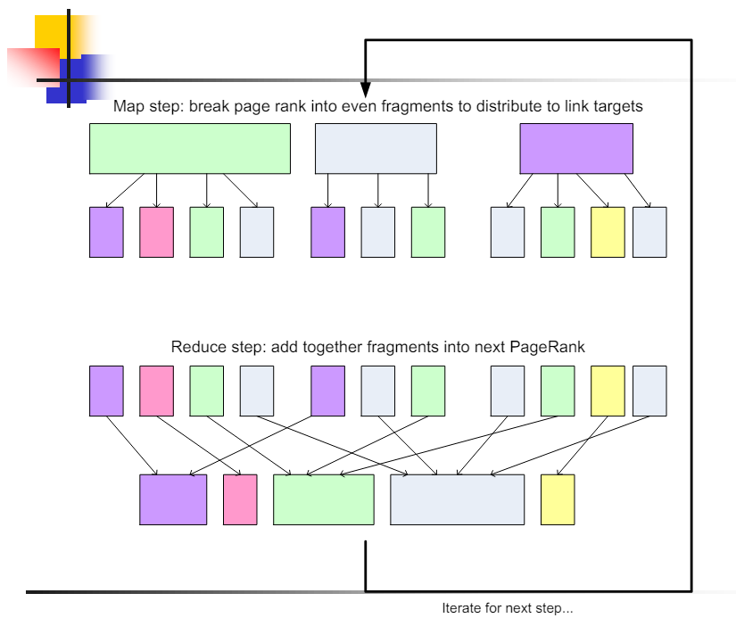
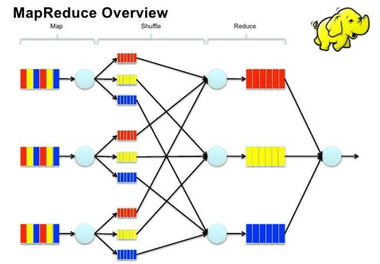
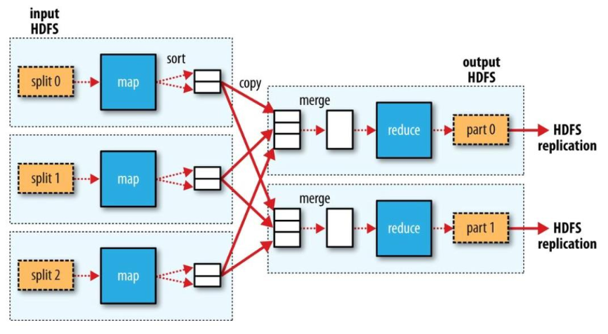
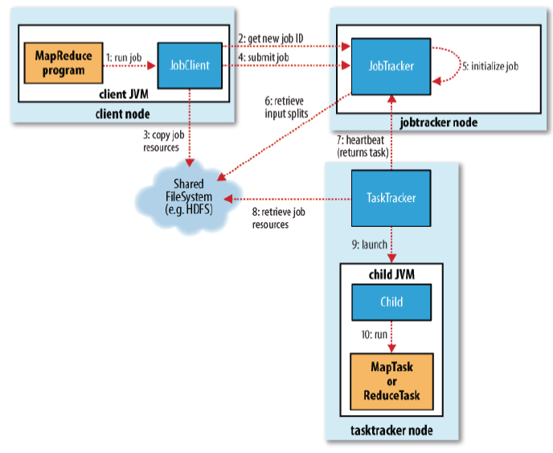
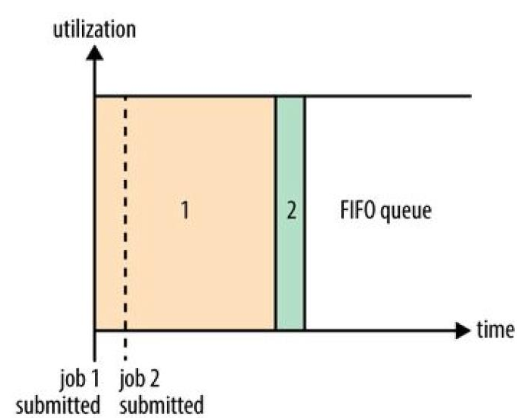
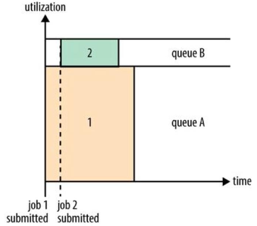
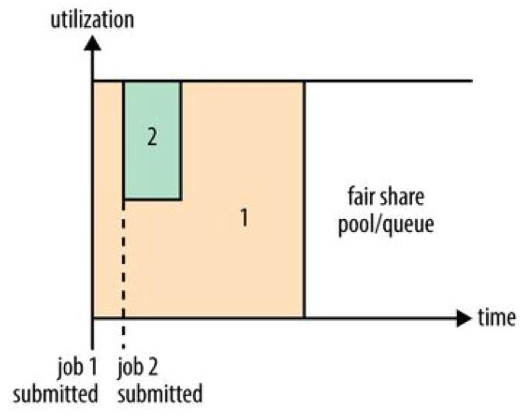

# Big-Data Processing: MapReduce

* **MapReduce** is a programming model for processing large data sets with a parallel, distributed algorithm on a cluster;
* It solves typical challenges in parallel and distributed computing:
  * How to assign tasks to workers?
  * What if the workers need to shared partial results? How to aggregate them?
* It uses two basic concepts of functional programming:
  * **Map**: applies a function to each element of a list;
  * **Reduce/Fold**: applies a function to a list of elements to produce a single result;
    * It uses an **accumulator** to store the intermediate results;
  * Both are second-order functions, i.e., they take functions as arguments;
* **MapReduce** operates over lists of `<key, value>` pairs;
  * **Map** operation: processes each `<key1, value1>` pair and produces a list of intermediate `<key2, value2>` pairs;
  * **Reduce** operation: processes all intermediate values associated with the **same intermediate key** `<key2, list(value2)>` and produces a list of final `<key3, value3>` pairs;
* **Hadoop** is an open-source implementation of the **MapReduce** programming model.

## Examples

### Word Count

* **Map** operation: reads a line of text and splits it into words;
* **Reduce** operation: sums the counts of each word.

### Page Rank

* Famous algorithm used by Google to rank web pages;
* **If a page is linked by many other pages, it is considered more important**;
* Given a page `A` and other pages `T1, T2, ..., Tn` that link to `A`, the **PageRank** of `A` is:
  * `PR(A) = (1 - d) + d * (PR(T1)/C(T1) + PR(T2)/C(T2) + ... + PR(Tn)/C(Tn))`;
  * `d` is a damping factor that can be set between `0` and `1`;
  * `C(Ti)` is the number of links on page `Ti`.
* **1st Implementation**:
  * Create two tables: **current** containing the initial values of PR and the adjacent pages, and traverse the graph distributing current PR among the **next** PR elements;
* **Phase 1 - Reading the HTML**: 
  * **Map** operation: reads `<URL, page-content>` and transforms them into `<URL, (PRinit, url-list)>` - `PRinit` is the initial PR value for the particular `URL` and `url-list` is the list of URLs that `URL` links to; 
  * **Reducer is identity in this phase**;
* **Phase 2 - PageRank Distribution**: 
  * **Map** operation: reads `<URL, (current-PR, url-list)>` and for each `u` in `url-list`, emits `<u, current-PR/len(url-list)>`; 
    * It also emits `<URL, url-list>` to preserve the graph structure; 
  * **Reducer** operation: receives `<URL, url-list>` and many `<URL, PR_frag>` pairs, and sums the `PR_frag` values to get the new PR for `URL`, generating `<URL, (new-PR, url-list)>`.

> **Note**: A non-parallel component decides whether the algorithm has converged or not, based on: a fixed number of iterations, a threshold value, or the difference between the PR values of two consecutive iterations.

  

---

## MapReduce in Hadoop

### Architecture

  

* Execution controlled by the **master** process:
  * Input data are **split** into **blocks of 64MB** and distributed to the **worker** nodes dynamically - workers can be **mappers** or **reducers**;
  * Hadoop tries to create splits containing data **local** to the worker node, to minimize network traffic;
* Master assigns each **map task (1 split)** to a **mapper**;
  * Worker reads the input data from the **closest location** and produces a set of intermediate `<key, value>` pairs;
* Master assigns each **reduce task** to a **reducer** node;
  * Reducer reads the intermediate data from the **mappers** and produces the final output applying the **reduce function**;
* **Shuffling**: input to the reducer is the output **sorted** by the mappers;
  * The framework **fetches (copies)** the intermediate data from the mappers to the reducers, and while is being copied, it is **merged** for efficiency.

  

### Task Management

* Number of mappers is determined by the number of **input splits**;
* By default, the number of reducers is **1**;
  * Both the number of mappers and reducers can be set by the user: `conf.setNumMapTasks(int)` and `conf.setNumReduceTasks(int)`;
* **Partitioners** partition the intermediate data into **reducer tasks**;
  * The default partitioner is the **hash partitioner** based on the `hashCode` of the key;
  * The user can define a new `hashCode` method for the key class;
* **Combiners** are used to **aggregate** the intermediate data before sending it to the reducers;
  * They are **optional** and can be used to **reduce the amount of data** transferred between the mappers and reducers;
  * By default, there is no combiner;
  * `conf.setCombinerClass(Class<? extends Reducer>)`.

### Resource Management

* `JobTracker` is the **master** process that manages the **job execution**;
  * It **schedules** the jobs, **monitors** their progress, and **re-executes** the failed tasks;
  * It **assigns** the tasks to the **TaskTrackers**;
* `TaskTracker` is the **worker** process that executes the tasks;
  * It **reports** the progress to the `JobTracker`;
  * It **re-executes** the failed tasks;
  * It **sends** the output to the `JobTracker`;
  * Periodically, it **sends** a **heartbeat** to the `JobTracker` to indicate that it is alive.

  

### Scheduling

The **scheduling** of Hadoop MapReeduce has evolved over time:

* 1st Generation: **FIFO scheduler**;
  * Jobs scheduled in the order they arrive;
  * **Challenge**: long jobs can starve short jobs;
  * Later, it was improved with **job priorities**;
* 2nd Generation: **Capacity scheduler** (Yahoo!);
  * **Queues** are created and each queue has a **capacity**;
  * Guarantees resources for shorter jobs at the cost of lower cluster utilization;
  3rd Generation: **Fair scheduler** (Facebook);
  * **Free slots** are divided among the jobs;
  * Dynamically balance resources between all running jobs;
* 4th Generation: **YARN** (Yet Another Resource Negotiator).

  
  
  

### Fault Tolerance

* **Master failure**: master state is **checkpointed** periodically to the **distributed file system**;
  * A **secondary master** is elected to take over;
* **Worker failure**: the task is **re-executed** on another worker.
* **Tasktracker failure**: the tasks are **re-executed** on another tasktracker;
* **Jobtracker failure**: all work of specific job is **lost**.