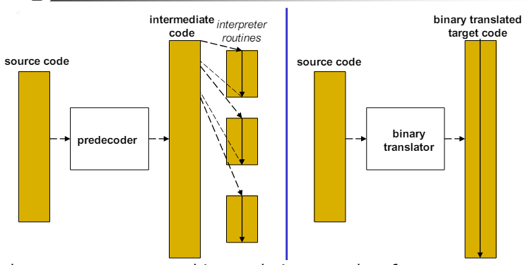
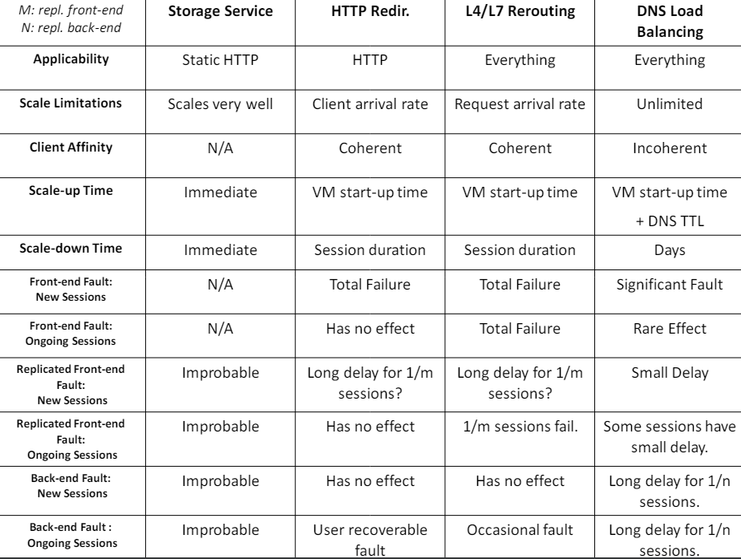
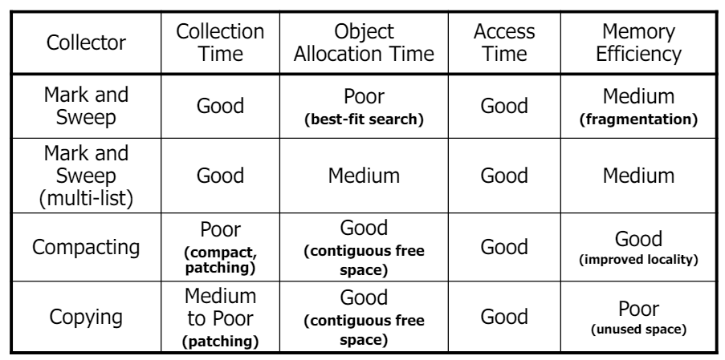
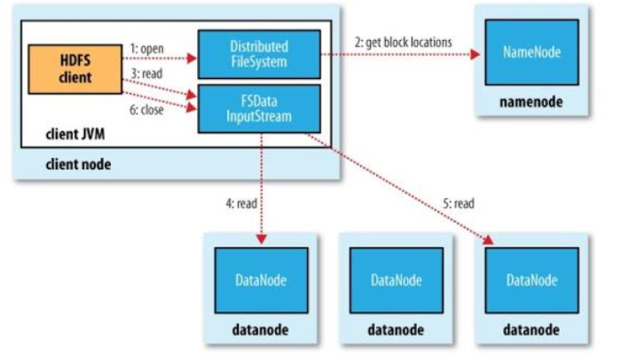
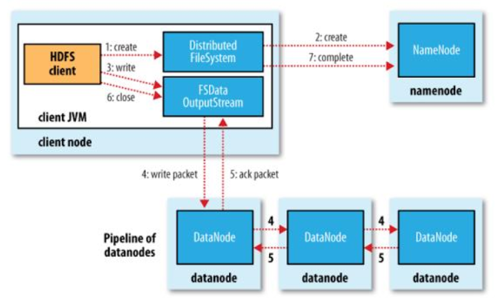

# [Cloud Computing and Virtualization](https://fenix.tecnico.ulisboa.pt/disciplinas/AVExe23/2023-2024/2-semestre)

## Syllabus

1. Introduction;
   1. [Introduction to Cloud Computing and Virtualization](./01-1-introduction-to-cloud-computing-and-virtualization.md) - cloud computing, virtualization techniques and abstraction levels;
   2. [Core Emulation Techniques](./01-2-core-emulation-techniques.md) - interpretation and translation techniques;
   3. [System Virtualization](./01-3-system-virtualization.md) - ISA virtualizability, memory virtualization, paravirtualization and hardware support;
2. [Infrastructure-as-a-Service](./02-infrastructure-as-a-service.md) - overview of IaaS platforms, SLA, scaling architectures;
   1. [Amazon Web Services](./02-1-amazon-web-services.md) - EC2, CloudWatch, Auto Scaling, Elastic Load Balancing;
   2. [Microsoft Azure](./02-2-microsoft-azure.md) - Fabric Controller, Hyper-V;
   3. [OpenStack](./02-3-openstack.md) - Nova, Neutron, Swift;
3. Platform-as-a-Service;
   1. [High-Level Language VMs](./03-1-high-level-language-vms.md) - architecture overview, JVM, bytecode, security, garbage collection and JIT;
   2. [Cloud PaaS](./03-2-cloud-paas.md) - Google App Engine, Microsoft Azure, messaging services (Amazon SQS, Microsoft Azure Queues, Google Cloud Pub/Sub);
   3. [Function-as-a-Service](./03-3-function-as-a-service.md) - overview, platforms (AWS Lambda, Google Cloud Functions, Azure Functions, IBM OpenWhisk), design and implementation challenges, advanced FaaS apps (ExCamera and Lambada) and FaaS optimizations;
4. [Cloud Storage](./04-cloud-storage.md) - Object Storage (Amazon S3, Azure Blob Storage), File Storage (Google File System, Hadoop Distributed File System), Table Storage (Amazon DynamoDB, Google BigTable), NoSQL (Google Datastore);
5. Big-Data Processing
   1. [MapReduce](./05-big-data-processing-mapreduce.md) - MapReduce programming model, examples (Word Count, Page Rank), MapReduce in Hadoop architecture (master, worker nodes, splits, tasktracker and jobtracker);
   2. [Dataflows and Stream Processing](./05-2-dataflows-and-stream-processing.md) - Spark (RDDs, Spark Streaming), Flink;
6. [Cloud Datacenters Design and Operation](./06-cloud-datacenters-design-and-operation.md).

## Recap

Here are some notes from two courses I took in my bachelor's degree that are related to this course:

- [Systems Virtualization Techniques](https://github.com/andre-j3sus/isel-leic-notes/tree/main/5th-semester/tvs);
- [Cloud Computing](https://github.com/andre-j3sus/isel-leic-notes/tree/main/6th-semester/cn);

## Labs/Tools

1. [Pin](./labs/01-pin.md) - dynamic binary instrumentation tool;
2. [AWS](./labs/02-aws.md) - Amazon Web Services;

---

---

# Key Concepts

## Cloud Computing and Virtualization

### Introduction to Cloud Computing and Virtualization

- **Cloud computing**: computing as an utility, on-demand, pay-as-you-go (small granularity), elastic, scalable, ...;
  - **Deployment models**:
    - **Public cloud**: services are offered over the public internet and available to anyone who wants to purchase them;
    - **Private cloud**: services are maintained on a private network and are protected by a firewall;
    - **Community cloud**: services are shared by several organizations and support a specific community that has shared concerns;
    - **Hybrid cloud**: services are distributed among some combination of private, public, and community cloud;
  - **Advantages**: shared resources, eliminates initial investment, pay-as-you-go (cost reduction), elasticity, portability;
  - **Disadvantages**: availability of service, vendor lock-in, data security, resource management;
- **Virtualization**: abstraction of computer resources, decoupling of software from hardware, multiple OS on the same hardware, ...;
  - Different from **abstraction**, because virtualization does not necessarily hide the underlying details;
  - There is a **virtual guest** and a **real host**;
  - **Computer system interfaces**:
    - **ISA**: instruction set architecture; division between **hardware** and **software**; apps only run on the same ISA - allows for **IaaS**;
    - **ABI**: application binary interface; division between **application** and **OS**; apps only run on the same ISA and OS - allows for **PaaS**;
    - **API**: application programming interface; division between **application** and **library**; apps only run on the same ISA, OS and library - allows for **SaaS**;

### Core Emulation Techniques

- **Emulation** is the process of implementing the interface and functionality of one system on another system - **ISA emulation** is a key component of virtualization;
- **Interpretation** is the simplest form of emulation, where the source code is transformed into an **intermediate form** and executed by the host system;
  - **Decode-and-dispatch interpreter** - for each instruction, fetch, decode and dispatch it to an interpreter routine;
  - **Threaded interpretation** - **avoid inefficient control flow**;
    - **Indirect threaded interpretation** - **reduce number of branches** by duplicating decode-dispatch code, at every instruction (remove the loop);
    - **Basic pre-decoding** - **pre-decode** instructions and **save it** in an intermediate form - dispatch table;
    - **Direct threaded interpretation** - replace instruction code with pointers to interpreter routines;
- **Translation** is a technique to convert the binary code of a program from one ISA to another, instead of having intermediate code - **remove interpretation overhead**;
  - **Simple binary translation** - translate instructions from source to target ISA; using **state mapping** by mapping registers ad memory;
  - **Incremental pre-decoding and translation** - initially interpret and dynamically perform translation; if the instruction is already translated, execute it directly; if not, interpret it and translate it - **translation block**;
  - **Control transfer optimization** - optimize control transfer instructions by **replacing** them with **direct branches** to other translated blocks;

  
   
  <em>Pre-decoding vs Binary Translation</em>

|                              | **Decode-and-Dispatch** | **Indirect Threaded Interpretation** | **Basic Pre-decoding** | **Direct Threaded Interpretation** | **Binary Translation** |
| ---------------------------- | ----------------------- | ------------------------------------ | ---------------------- | ---------------------------------- | ---------------------- |
| **Memory Requirements**      | ✅Low                   | ✅Low                                | ❌High                 | ❌High                             | ❌High                 |
| **Start-up Performance**     | ✅Fast                  | ✅Fast                               | ❌Slow                 | ❌Slow                             | ❌Very Slow            |
| **Steady-state Performance** | ❌Slow                  | ❌Slow                               | ✅Medium               | ✅Medium                           | ✅Fast                 |
| **Code Portability**         | ✅High                  | ✅High                               | ✅High                 | ✅Medium                           | ❌Low                  |

### System Virtualization

- **VMM** (Virtual Machine Monitor) - software layer that abstracts the hardware and provides a virtual machine interface - **schedule** and **manage** allocation of resources for VMs;
  - Point of **control** for **shared physical resources**; - **approach is to intercept all privileged instructions and all accesses to privileged resources**;
  - **Type 1** - runs directly on the hardware, with no OS;
  - **Type 2** - runs on a host OS;
- **CPU Virtualization** - only **VMM runs on system mode**, **guest OS runs on user mode**;

  - Core emulation techniques to **virtualize** the **ISA**;
    - **Well behaved ISA** - **efficiently virtualizable**; trap occurs naturally when emulation is needed, handler jumps to appropriate interpreter routine;
    - **Ill behaved ISA** - **not efficiently virtualizable**; trap does not occur naturally, need of **code discovery**;
  - Instructions:
    - **Privileged instructions** - **trap-and-emulate** if user mode, does not trap in system mode - all guest-OS is forced to run in user mode and trap;
    - **Not privileged instructions** - do not trap;
    - **Sensitive instructions** - interact with HW; **control sensitive** - change the config of the system; **behavior sensitive** - change the behavior of the system;
    - **Innocuous instructions** - neither control nor behavior sensitive;
    - **Critical instructions** - **sensitive instructions** that are **not privileged**
  - **Theorem 1** - **efficient VMM construction**: **sensitive instructions is a subset of privileged instructions**; there can be **any number of innocuous instructions**; there must not be **any critical instructions**.
    - However, its still possible to virtualize the system with critical instructions: **hybrid** approach - some instructions must be specially emulated, using **binary translation**;

- **Memory virtualization**

  - **Virtual memory -> Real memory -> Physical memory**: **VM** -> **VMM** -> **Physical memory**;
  - VMM maintains a real map table: real pages -> physical pages;
  - Page translation supported by **page table** and **TLB** (Translation Lookaside Buffer);
    - Page table maintained by the OS and TLB maintained by the HW;
    - When occurs a page fault (TLB miss), the MMU walks page table to find an entry; If the entry is not found, the OS is called to handle the page fault;
  - VMM maintains **optimized mapping information**:
    - **Shadow page table** - one for each process in each guest VM;
    - **Direct virtual-to-physical mapping**;

- **Performance Enhancement**
  - **Paravirtualization** - modify the guest OS to make it aware of the virtualization layer;
    - **Hypercalls** - **trap-and-emulate** for privileged instructions;
    - Guest OS can issue fewer privileged instructions, reducing the number of traps, replacing them with hypercalls;
  - **Hardware support** - **Intel VT-x**;
    - New CPU modes, new instructions, new data structures;
    - **VT-x** - **VMX root** (full privilege access to HW) and **VMX non-root** (limited control of global resources);

---

## Infrastructure-as-a-Service

- User **does not control the underlying infrastructure**, but has **control over the OS, storage, and deployed applications**;
- **Amazon Web Services:**
  - **EC2** (Elastic Compute Cloud) - allows users to launch virtual machines on demand;
    - Choose **region** and **availability zone** - regions do not share resources, and communicate through the internet; there are also **wave-length zones** for ultra-low latency, and **AWS outposts** for on-premises;
    - **Instance** is a virtual server in the cloud, with an **instance type** (family, generation, size), and a private and a public IP (lifetime of the instance); can also have **Elastic IP** (static IP that is paid for, and can be moved between instances);
    - Uses **AMI** (Amazon Machine Image) to launch instances, which is a template for the root volume of the instance - you can use a public AMI, or create your own;
    - CPU measured in **ECU** (Elastic Compute Unit);
    - Requires **security groups** (firewall rules - only limit inbound traffic - IP rules limit inbound traffic, while group rules limit access to other instances) and **key pairs** (public and private keys);
  - **SQS** (Simple Queue Service) - message queuing service;
  - Storage services: **S3** (Simple Storage Service), **EBS** (Elastic Block Store), **DynamoDB** (NoSQL);
  - **CloudWatch** - monitoring service: basic monitoring (5 minutes interval, free) and detailed monitoring (1 minute interval, paid);
    - Can access **measures**, returns a list of data-points (**metric**), expressed according to a given **unit**; Results from different services are organized across different **namespaces**;
  - **Auto Scaling** - automatically adjust the number of EC2 instances;
  - **Elastic Load Balancing** - distribute incoming application traffic across multiple EC2 instances;
  - Elastic Beanstalk - deploy and manage applications;
  - Elastic Cache - in-memory data store;
  - CloudFront - content delivery network;
  - CloudFormation - infrastructure as code;
- **Microsoft Azure:**
  - **Fabric Controller** - manages the lifecycle of VMs; a **node** can be a **physical machine** or a **virtual machine on top of the hypervisor**; nodes run **windows server** with cluster manager, scheduler, cluster monitor and replication;
  - **Hyper-V** - hypervisor; uses **para-virtualization**;
  - **Azure Blob Storage** - object storage;
  - **Azure Queues** - message queuing service;
- **OpenStack** - open-source software platform for cloud computing;
  - **Nova** - compute service; connects to hypervisors on compute nodes; it uses:
    - **Cinder** - block storage;
    - **Glance** - image service;
    - Hierarchical structure based on accounts, containers and objects;
    - CPU overcommit factor ratio is 16:1 and memory overcommit factor ratio is 1.5:1 - memory is less elastic than CPU;
    - **Filter scheduler** - **filters** (finds suitable hosts using **requirements**) and **weighers** (selects the best host, based on **preferences** and **policies** - all weights are normalized);
  - **Swift** - object storage;
  - **Neutron** - networking service; floating IP = elastic IP in AWS;
  - **Horizon** - dashboard;
  - Keystone - identity service;
  - Heat - orchestration service;
  - Ceilometer - telemetry service.

  

---

## Java VM

- Java **virtual ISA** includes:
  - **Bytecode** - instructions for the JVM;
  - Pre-defined **data types**;
    - **Primitive** types: `boolean`, `byte`, `char`, `short`, `int`, `long`, `float`, `double`;
    - **Reference** types: hold references to objects or null;
  - **Metadata** - information about classes, methods, fields, etc, in the class file;
- Data Storage:
  - For each **thread**:
    - **PC** (Program Counter) - points to the next instruction to be executed; and other registers;
    - **Stack (typed)** - contains the **frame** of the method being executed;
  - **Global**:
    - **Heap** - contains objects and arrays;
    - Class file contents, like **constant pool**;
- Instruction Set:
  - **Opcode byte + 0 or more operands**;
  - Operands fetched from the **constant pool**, **local variables**, or **stack**;
  - Each **primitive type** has its own set of **instructions**: `iadd`(int), `fadd`(float), `dadd`(double), `ladd`(long), ...
  - Types of instructions:
    - **Data-movement instructions**:
      - Pushing constants onto the stack - `iconst_0`, `iconst_1`, ...
      - Moving values between the stack and local variables - `aload_0`, `istore_1`, ...
      - Via constant pool - `ldc`, `ldc_w`, `ldc2_w`;
      - Stack manipulation - `dup`, `swap`, `pop`;
    - **Functional instructions**: Arithmetic, logical, and comparison operations;
    - **Control-flow instructions**:
      - Jumps, conditional jumps - `goto`, `if_icmpeq`, `if_acmpne`, ...
      - Switches - `tableswitch` (used for `switch` statements with ranges), `lookupswitch` (used for `switch` statements with arbitrary values);
      - Method invocation - `invokevirtual` (indexes constant pool for method reference, check if arguments match, allocate stack frame of appropriate size, and jump to the method);
      - `invokestatic`, `invokespecial` (constructors, private methods, or methods of superclass), `invokeinterface`;
      - Method return - `ireturn`, `freturn`, `dreturn`, `lreturn`, `areturn`, `return` (void return) - pops the stack frame and returns to the caller;
    - **Others**:
      - Object creation - `new` (creates a new object and pushes a reference to it onto the stack) - proper creation requires a constructor call;
      - Field access - `getfield`, `putfield`, `instanceof`, `checkcast`;
      - Array access, synchronization, exception handling;
      - `athrow` - throws an exception (`a` stands for any object);
      - `monitorenter`, `monitorexit` - synchronization;
  - All data movement is done through the **stack**.

* **Security**
  - Sandbox model: create a barrier around Java execution environment;
  - Security enforced by **static and dynamic checks**;
    - **Static checks** - performed at **load time**: consistency checks (types, references, etc) and integrity checks (**operand stack tracking**, and control transfer);
    - **Dynamic checks** - performed at **runtime**: check null pointer, array bounds and casting;
  - **Operand stack tracking** - ensures that the stack is not empty when an instruction requires operands, and that the stack is not full when an instruction pushes operands;
    - Operand stack at any given point should has the same number of operands, the same types and in the same order, **regardless of the path taken**;
  - **Security policy enforcer** - checks if the code is allowed to perform certain operations; limitation: **only qualitative checks, not quantitative checks** (excess threads, recursion, CPU usage, etc);
* **Garbage Collection**
  - **Mark-and-sweep** algorithm: mark phase (mark all reachable objects), sweep phase (reclaim all unmarked objects); ❌ **fragmentation**;
  - **Compacting** - move all live objects to one end of the heap, and update all references; ❌ **stop-the-world**;
  - **Copying** - divide the heap into two semispaces, allocate objects in one space, and copy them to the other space when the first one is full; ❌ high **copying cost**;
  - **Generational** - divide the heap into generations, and collect the younger generations more frequently than the older ones; ❌ **stop the world**;
  - **Incremental and concurrent mark-sweep** - mark and sweep in small increments, and allow the application to run concurrently with the GC; tri-color abstraction (white, gray, black);

    

- **Emulation engine optimizations**
  - **Method inlining** - replace small method calls with the method body;
  - The problem is that the target of virtual calls is not known at compile time;
    - **Guarded inlining** - inline the most common target, and add a guard to check if the target is the same;
    - **Polymorphic inline cache** - inline code for a small set of cases.

---

## Platform-as-a-Service

- **Google App Engine**: allows users to deploy web apps written in multiple languages; framework designed for scalability; cloud infrastructure almost completely **hidden** from the developer;

  - User controls the **application code**, **configuration** and **middleware stack**;
  - Composed of **front-end** (serves user requests) and **back-end** (performs background tasks); or **static content servers**;
    - **Frontend**: identifices the app based on the URL, and routes the request to the appropriate instance; applications are configured using `app.yaml` file;
    - **Backend**: can be dynamic (request-driven) or resident (always running);
  - Apps execute within a strict **sandbox** (not possible to write to files except for `/tmp`, no sockets, no threads, no native code);
  - Apps can call other **apis** (Google Cloud Storage, Google Cloud SQL, Google Cloud Datastore, Google Cloud Pub/Sub, Google Cloud Endpoints, Google Cloud Messaging, Google Cloud Logging, Google Cloud Monitoring, Google Cloud Task Queue, Google Cloud User Authentication);
  - **Scalability**: number of frontends and servers scales automatically by GAE; web apps are kept in memory; scaling policies can be defined in `app.yaml`;
  - **Payment is independent from number of servers** - user charged on real usage, like CPU time, bandwidth, storage, etc;

- **Microsoft Azure**: made of **Web roles** (web apps) and **Worker roles** (background tasks);

  - **Agents** - run on the VMs and communicate with the fabric controller, exposing the API both for web and worker roles;
  - **Fabric controller** - manages the lifecycle of the VMs;
  - Communication between roles is done through **queues**;

- **Messaging services**:
  - **Amazon SQS** - message queues are replicated for fault tolerance and scalability;
    - Limited message size of 8KB/64KB/256KB;
    - Fault tolerance mechanism: when messages are read, they become **invisible** for a certain period of time, to avoid being read by another consumer, and they need to be **deleted** after processing;
    - Use an **idempotent message protocol** - do not design operations that assume a particular application state, e.g.: `setValue` instead of `incrementValue`;
    - Do not use when app has **time constraints**.
  - **Microsoft Azure Queues**;
    - **Unlimited** queues per account and messages per queue;
    - Limited message size of 8KB/64KB;
  - **Google Cloud Pub/Sub** - messaging service; **push-based**;
    - Guarantees: synchronous replication of all data to at least **two zones**, and **best-effort** replication to a **third zone**;
    - Core concepts:
      - **Topic**: a named resource to which messages are sent by publishers;
      - **Subscription**: a named resource representing the **stream of messages** from a single, specific topic, to be delivered to the subscribing application;
      - **Message**: data that is sent to a topic and then delivered to subscriptions;
      - **Publisher**: an application that creates and sends messages to a topic;
      - **Subscriber**: an application that receives messages from a subscription;
      - **Acknowledgement**: a message is considered **delivered** when the subscriber acknowledges it - **acked messages are removed from the subscription queue**;

### Function-as-a-Service

- Also known as **serverless computing**;
- Concurrency is not managed by the developer - simple code;
- Applications are composed of **functions** that are **triggered** by **events**;
- **Amazon Lambda**
  - Max 15 mins timeout;
  - Execute on **Firecracker** microVMs;
  - Lambdas communicate via storage, queues, db, etc;
  - Concurrency is subject to quotas at the region level, and can be configured;
  - **Cost: number of invocations and memory used** - single knob: memory, because invocation has fixed price; temporary storage also charged;
- **Google Cloud Functions**
- **Microsoft Azure Functions** - similar to lambdas, but with a specific pricing in **premium plan** (additional payment per each **vCPU usage time**)
- **IBM OpenWhisk**
  - NGINX - load balancer;
  - Controller - lambda scheduler;
  - CouchDB - metadata storage;
  - KV store - keeps active nodes;
  - Kafka - pushes actions to the invokers;
  - Invokers - run the lambdas;
  - Docker - lambda execution environment;
- Lambda **startup time** is **high** because of the **cold start** - the first time a lambda is executed, it needs to be loaded into memory, and the execution time is higher - **solution is to reuse already started environments (warm)**;
- Problems:

  - Cold start latency;
  - Resource redundancy;
  - Long warm-up time - JIT compilers and interpreters optimize the code over long periods of time;

- **Optimizations**:
  - **Function co-execution** - execute multiple concurrently lambdas in the same runtime, sharing runtime, libraries and global state - **photons**;
  - **AOT compilation** - compile HLL into binaries - **GraalVM**;
  - **Sharing code and profiles** - share code and profiles between lambdas;

## Cloud Storage

- Types of cloud storage:

  - **Object Storage**
    - Allows to store and retrieve data as objects or bytes;
    - Supports only Object ID indexing;
    - Examples: **Amazon S3** (Dynamo), Google Cloud Storage, Azure Blobs;
  - **Cloud File Systems**
    - Hierarchical organization of files, permissions and metadata;
    - Examples: **Hadoop File System**, Google File System;
  - **Tables (NoSQL)**
    - Records and tables;
    - Search and range scans;
    - Examples: **Amazon DynamoDB** (Dynamo), Apache HBase, **Google BigTable**;
  - **Relational Databases**
    - Full relational model;
    - Conventional services;
    - Examples: Amazon RDS, SQL Azure, Google Cloud SQL.

### Object Storage - Dynamo (DynamoDB and Amazon S3)

- **Dynamo** - powering DynamoDB and Amazon S3;
  - **Availability** and **partition tolerance** are prioritized over **consistency** - **eventual consistency**;
  - Reads and writes with **unique IDs**;
  - Two operations:
    - `put(key, context, object)`;
      - `key`: object identifier;
      - `context`: versioning information (**vector clocks**);
      - `object`: data to store;
    - `get(key) -> (object versions, context)`;
      - `key`: object identifier;
      - `object versions`: list of versions;
      - `context`: versioning information.

| Problem                              | Technique                                    | Advantage                                       |
| ------------------------------------ | -------------------------------------------- | ----------------------------------------------- |
| **Partitioning**                     | **Consistent Hashing**                       | Incremental Stability - **Chord**               |
| **Write availability**               | **Vector clocks** and conflict resolution    | Version size does not depend on the update rate |
| **Temporary failures**               | **Relaxed/sloppy Quorum and hinted handoff** | High availability and durability                |
| **Permanent failures**               | **Anti-Entropy with Merkle Trees**           | Syncs replicas asynchronically                  |
| **Membership and failure detection** | **Gossip-based** protocol                    | Scalability and fault tolerance                 |

- **DynamoDB** - hierarchical data storage;

  - **Ad hoc** data model - no schema;
  - Adds multiple attributes, indexing and queries;
  - **Efficient** of read operations;
  - **❌ Missing features**: joins and ordering;
  - Data model:
    - **Table**: collection of items, identified by a string;
    - **Item**: identified by a **key** and contains attributes;
      - Indexed by an **hash key**;
      - Additional **range key** for indexing;
      - Limited to 400KB;
    - **Attributes**: name-value pairs;

- **Amazon S3**
  - **Simple Storage Service**;
  - Used for storing disk images, photos, videos, often as **CDN for web content**;
  - **⚠️ Occasionally, some S3 calls fail and must be repeated**;
  - Include SLA for 99.99% availability;
  - **Data model**:
    - **Bucket**: collection of objects - delimiting namespace;
    - **Object**: identified by a key and contains data.

### File Storage - Google File System and Hadoop Distributed File System

- Very large-scale distributed file system;
- **Scalability**: data operations don't go through the central server;
- **Block-based**: files are divided into blocks of 64MB;
  - A file smaller than a block does not occupy the full block - a smaller local file is used;
- **Namenode**: manages the file system **namespace** - folder hierarchy and name uniqueness;
  - Files can be written, read, renamed and deleted, but its no possible to:
    - Write in the middle of a file;
    - Write concurrently in the same file;
- **Datanode**: manages a set of **blocks**;
  - Processes client/namenode requests;
  - Periodically sends a heartbeat to the namenode;
  - Block replication management: when replica number drops below a threshold, the datanode replicates the block.
- **Reading**: the client asks the namenode for the block locations and reads directly from the datanodes;

  

- **Writing**: the client asks the namenode for a list of datanodes to write the block;
  - The client writes to the first datanode and then to the next - **chain replication**;
  - Block write requests are kept in a data queue;
  - Unconfirmed write requests are kept in a _ack queue_;
  - If the datanode fails, the client changes the block ID so the corrupted replica is deleted later;

    

### Table Storage - Google BigTable

- **BigTable** - distributed storage system for structured data;
- Stores all persistent state on top of Google File System;
- Data model:
  - A **table** has **entities**;
  - A table has **column families** - like a property, created **statically**;
  - Each column family has **columns** - instance of a property, created **dynamically**;
    - Each column is **timestamped**;
  - Entities are **ordered alphabetically**, and can be:
    - Written;
    - Deleted;
    - Read as single row, scanned or range scanned.
    - **ACID transactions only for a single entity**.
  - **Sequences os entities** are stored in **tablets**;
    - **Tablet**: a range of rows;
    - Stored in **SSTable** files;
- Architecture:

  - **Master** performs the following tasks:
    - **Table creation**;
    - **Column family creation**;
    - **Startpoint for entity location**;
    - **Allocation and elimination of tablets**;
  - **Tablet Servers**:
    - Performs reading, writing directly with clients;
    - Partitioning for tablets that are too large, employing tree with levels of **metadata tablets**, and leaves are **data tablets**;
  - **Writing** is done on two tablet server structures: **redo log** and **memtable**;
    - **Minor**: when a **memtable** is full, it is flushed to disk as an **SSTable**;
    - **Merge**: groups SSTables from minor compactions;
    - **Major**: converts SSTables to a minimum by filtering entity removals;

- **Datastore**: BigTable for programmers;
  - NoSQL database;
  - Each entity has an unique ID that includes **appID** and **kindID**;
    - **AppID**: application identifier;
    - **Kind** is a namespace;
  - **Data items are stored in the entities columns**, and columns have a name and a value;
  - **Megastore** is an intermediate layer between BigTable and Datastore, that:
    - Executed queries;
    - Builds indexes;
    - Performs multi-record transactions.
  - Datastore supports **transactions on several entities**, but are limited:
    - Only operate on one entity group;
    - No distributed transactions.

---

## Big-Data Processing

### MapReduce

- **MapReduce** is a programming model for processing large data sets with a parallel, **distributed** algorithm on a cluster;
- Operates over lists of `<key, value>` pairs;

  - **Map** operation: processes each `<key1, value1>` pair and produces a list of intermediate `<key2, value2>` pairs;
  - **Reduce** operation: processes all intermediate values associated with the **same intermediate key** `<key2, list(value2)>` and produces a list of final `<key3, value3>` pairs;

- **Hadoop**
  - Execution controlled by the **master** process:
    - Input data are **split** into **blocks of 64MB** and distributed to the **worker** nodes dynamically - workers can be **mappers** or **reducers**;
    - Hadoop tries to create splits containing data **local** to the worker node, to minimize network traffic;
  - Master assigns each **map task (1 split)** to a **mapper**;
    - Worker reads the input data from the **closest location** and produces a set of intermediate `<key, value>` pairs;
  - Master assigns each **reduce task** to a **reducer** node;
    - Reducer reads the intermediate data from the **mappers** and produces the final output applying the **reduce function**;
  - **Shuffling**: input to the reducer is the output **sorted** by the mappers;
    - The framework **fetches (copies)** the intermediate data from the mappers to the reducers, and while is being copied, it is **merged** for efficiency.

### Streaming

- **Spark** makes working sets a first-class concept, to efficiently support two common types of applications that **repeatedly reuse a working set of data**;
- Provides a **distributed memory abstractions** for clusters to support apps with **working sets**;
- Data flow model with **RDDs (Resilient Distributed Datasets)**;

  - **Immutable** collections **partitioned** across the nodes of the cluster that can be **reused** across multiple parallel operations;
  - It is not needed to be materialized on disk;
  - Created by **RDD transformations** - map, filter, join, etc;
  - Can be **cached** in memory across operations;
  - **Parallel operations**: reduce, collect, count, etc;
  - Consistency is easy due to **immutability**.

- **Spark Streaming** is an extension of the core Spark API that enables scalable, high-throughput, fault-tolerant stream processing of live data streams;

  - Run a streaming computation as a **series of small batch computations** on small time intervals;

- Open-source **stream processing framework** with powerful stream and batch processing capabilities;

---

## Data Centers Design and Operation

- **PUE (Power Usage Effectiveness)** - ratio of total facility power to IT equipment power;
  - $PUE = \frac{Total Facility Power}{IT Equipment Power}$;
- **DCIE (Data Center Infrastructure Efficiency)** - reciprocal of PUE;
  - $DCIE = \frac{1}{PUE}$;
- **tPUE (Total PUE)** - includes the power used by the IT equipment - critical components;
  - $tPUE = \frac{Total Facility Power}{Total IT Equipment Power}$;
  - Not easy to implement, but it can be an ideal metric;
- **Chiller** - a device that removes heat from a liquid via a vapor-compression or absorption refrigeration cycle; e.g., air conditioning units;
  - **Chiller-less DCs** - DCs that use outside air for cooling.
- **CEMS (Cooperative Expendable Micro-Slice Servers)** - servers with low-power CPUs and no local storage;
