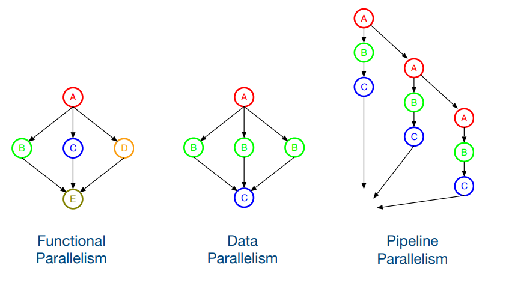

# Parallel Programming with OpenMP

### Dependency Graphs

* Programs can be represented as **dependency graphs**;
  * **Nodes**: instructions;
  * **Edges**: data dependencies between instructions;
* **Functional parallelism**: parallelism between **different tasks**, running on each processor, on the **same or different sets of data**;
* **Data parallelism**: **same task**, running on each processor, on **different sets of data**;
* **Pipeline parallelism**: **same sequence of tasks**, running in parallel, **synchronized at a given point**;

<p align="center">
    
</p>

> **Incremental Parallelism**: process of converting a sequential program into a parallel program, a little bit at a time, while ensuring that the parallel program is correct and efficient.
>
> * Initially, only **master thread** is active, executing sequential code;
> * **Fork**: master thread creates/awakens additional threads to execute parallel code;
> * **Join**: master thread waits for all threads to finish executing parallel code;

## POSIX Threads (Pthreads)

* **POSIX Threads** (Pthreads) is a **standardized** API for **thread creation** and **management**;
* Thread **creation**:
  * `pthread_create(pthread_t *thread, const pthread_attr_t *attr, void *(*start_routine) (void *), void *arg)`;
  * Starts a new thread in the calling process;
* Thread **termination** and **synchonization**:
  * `pthread_join(pthread_t thread, void **retval)` - Waits for the thread specified by `thread` to terminate;
  * `pthread_cancel(pthread_t thread)` - Sends a cancellation request to the thread;
  * `pthread_exit(void *retval)` - Terminates the calling thread;
* Thread **synchronization** - use of **mutexes** (mutual exclusion locks) and **condition variables**;
  * `pthread_mutex_init(pthread_mutex_t *mutex, const pthread_mutexattr_t *attr)` - Initializes a mutex;
  * `pthread_mutex_lock(pthread_mutex_t *mutex)` - Locks a mutex - blocks if the mutex is already locked;
  * `pthread_mutex_unlock(pthread_mutex_t *mutex)` - Unlocks a mutex.

---
---

## [OpenMP](https://www.openmp.org/)

> **OpenMP** (Open Multi-Processing) is an open specification for **multi-threaded**, **shared memory** parallel programming in C, C++, and Fortran;

* Simpler programming model than **Pthreads** - **compiler directives** and **library routines** - use of **annotations** in the source code that specify **parallel regions** (**pragma directives**);
* Programmer must **detect dependencies** (similar to **Pthreads**) - determines which parts of the code can be parallelized;
* Programmer must **prevent data races** - use of **critical sections** and **atomic operations**.

### Number of Threads

* The number of threads created is determined by, in order of precedence:
  * Clause `num_threads(N)` - specifies the number of threads to use in a parallel region;	
  * Use of `omp_set_num_threads(N)` - sets the number of threads to use;
  * Environment variable `OMP_NUM_THREADS`;
  * Implementation default - typically the number of cores in the system - it is possible to query number of CPUs with `omp_get_num_procs()`.
* To get the **thread number (ID)** and the **total number of threads** in a parallel region, use `omp_get_thread_num()` and `omp_get_num_threads()`.

---

### OpenMP Directives

To use **OpenMP**, the programmer must include the `omp.h` header file and compile the program with the `-fopenmp` flag.

The format of an **OpenMP** directive is:

```c
#pragma omp directive [clause [clause] ...]
statement

// or, for multiple statements
#pragma omp directive [clause [clause] ...]
{
    statements
}
```

There are several types of **OpenMP** directives:

* **Parallelization** directives:
  * Parallel region: `#pragma omp parallel` -  creates N parallel threads, that execute the code inside the block, and wait for the other threads to finish at the end of the block;
  * Parallel loop: `#pragma omp parallel for [clauses]` - parallelizes the execution of a loop; each thread executes a subset of the iterations, and all threads synchronize at the end of the loop;
  * Parallel sections: `#pragma omp parallel sections` - divides the code into sections, each executed by a different thread;
  * Parallel task: `#pragma omp task`;
* **Data environment** directives (in OpenMP, all variables are shared by default, and are visible to all threads, with some exceptions):
  * Shared data: `#pragma omp shared` - specifies that a variable is shared;
  * Private data: `#pragma omp private` - creates a private copy of the variable for each thread - the value **undefined**;
  * `firstprivate(list)` - variables are private, but **initialized** with the value of the original variable;
  * `lastprivate(list)` - variables are private, but the value of the last iteration is **copied to the original variable**;
  * Thread-local data: `#pragma omp threadprivate` - creates a private copy of the variable for each thread, but the variable is shared between all threads - `copyin` clause can be used to initialize the variable;
  * Reduction: `#pragma omp reduction`;
  
* **Synchronization** directives:
  * Critical section: `#pragma omp critical` - ensures that only one thread at a time can execute the code inside the block;
    * Uses locks implicitly - OpenMP provides a way to define locks explicitly: `omp_init_lock`, `omp_destroy_lock`, `omp_set_lock`, `omp_unset_lock`;
    * Explicit use of locks is less clean, but more prone than critical sections, but is more flexible;
  * Atomic operation: `#pragma omp atomic` - ensures that the operation is executed atomically - read and write operations are atomic;
  * Barrier: `#pragma omp barrier` - all threads wait for the others to reach the barrier;
  * Ordered: `#pragma omp ordered`;
  * Master: `#pragma omp master` - only the master thread executes the code inside the block;
  * Single: `#pragma omp single` - only one thread executes the code inside the block;
    * The `nowait` clause can be used to avoid the implicit barrier at the end of the block;
    * The `copyprivate(list)` clause can be used to update all copies of the variables in the list with the value of the original variable;

* **Conditional Parallelism**: `#pragma omp if` - specifies a condition that must be true for the parallel region to be created; 

There is also the **reduction** clause, which is used to perform a reduction operation on a variable:

```c
#pragma omp parallel for reduction(+:sum)
for (i = 0; i < N; i++) {
    sum += a[i];
}
```

* The `reduction` clause specifies the operation to be performed on the variable;
* `reduction(op:variable)` - `op` is the reduction operation (`+`, `-`, `*`, `&`, `|`, `^`, `&&`, `||`, `min`, `max`), and `variable` is the variable to be reduced;

### Load Balancing - Scheduling

The `schedule` clause is used to specify how the iterations of a loop are divided among the threads:

```c
#pragma omp parallel for schedule(static, chunk)
for (i = 0; i < N; i++) {
    a[i] = b[i] + c[i];
}
```

* `schedule(static, chunk)` - divides the iterations into chunks of size `chunk`, and assigns each chunk to a thread;
  * If `chunk` is not specified, the compiler determines the chunk size: `chunk = ceil(N / number_of_threads)`;
* `schedule(dynamic, chunk)` - assigns a chunk of iterations to a thread, and when the thread finishes, it gets another chunk;
* `schedule(guided, chunk)` - similar to `dynamic`, but the chunk size decreases over time;
* `schedule(runtime)` - the schedule type and chunk size are determined at runtime - can be set with the `OMP_SCHEDULE` environment variable;
* `schedule(auto)` - the compiler determines the schedule type and chunk size;

The `collapse` clause is used to collapse nested loops into a single loop:

```c
#pragma omp parallel for collapse(2)
for (i = 0; i < N; i++) {
    for (j = 0; j < M; j++) {
        a[i][j] = b[i][j] + c[i][j];
    }
}
```

---

### Tasks

* There are two main work sharing directives:
  * `parallel for`
  * `parallel sections`
  * These directives always occur within a `parallel` region, and are both **synchronous**;
  * This do not create new threads, just divides the execution of the enclosed code region among the members of the team;
* The `task` directive allows for the definition of tasks to be performed which are **added to a pool and eventually executed by a thread**;
* The execution order is not guaranteed, but is possible to specify a `priority` clause;
* Tasks are guaranteed to have completed at:
  * Thread barriers;
  * **Task barriers**: `#pragma omp taskwait`;
* Contrary to other directives, variables in scope become `firstprivate` for the task;
* A `depend` clause can be used to **specify dependencies** between tasks:
  * `(out: x)` indicates that the task produces a variable `x`;
  * `(in: y,z)` task can be executed after the tasks that produce variables `y` and `z` have completed;
  * `(inout: k)`: tasks reads and writes to variable `k` and cannot be executed in parallel with any other task that also produces `k`.

---

### OpenMP Efficiency Rules

* Optimization for **scalability and performance**:
  * Minimize forks/joins;
  * Minimize synchronization;
  * Maximize private/independent data;