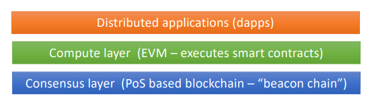

# Ethereum

> **Ethereum** is a decentralized platform that runs smart contracts: applications that run exactly as programmed without any possibility of downtime, fraud or third-party interference.

- The **second largest cryptocurrency** after Bitcoin;
- Very **generic** platform for decentralized applications, with **several currencies** (NFTs, stablecoins, etc.);
- Introduced the concept of **smart contracts** - self-executing contracts with the terms of the agreement directly written into code;
  - Programs that run in the blockchain and have the ability to **read and modify the blockchain state**;
  - **Turing complete** - can perform any computation that can be performed by a computer;
- **Decentralized** - no single point of failure, no single point of control;
  - Guaranteeing safety is key;
- **EVM** - Ethereum Virtual Machine - a runtime environment for smart contracts:

  

## From PoW to PoS

- Ethereum moved from **Proof-of-Work** to **Proof-of-Stake** to reduce energy consumption and increase scalability;
- **PoW**:
  - **Miners** compete to solve a cryptographic puzzle, they aggregate transactions in blocks, allowing for better throughput;
  - They compete to get block appended to the blockchain, and they are rewarded with new coins;
  - **Cons**: energy consumption, scalability;
- **PoS**:
  - **Stake** - the amount of coins a participant has;
  - Use stake in the system as a measure of influence - the stake is locked, and **if the validator misbehaves**, it is **slashed** - is like a fine;
  - The more stake a participant (**validator**) has, the more likely it is to be chosen to create a new block - **proposer** is chosen randomly, but weighted by stake;
  - Remaining validators **check correctness** and **sign correct blocks** - block is finalized after a **certain threshold of signatures**;
  - **Cons**: rich get richer, proved to converge only under certain conditions.

---

## Account Model

- Instead of UTXOs (like Bitcoin, where each transaction has inputs and outputs), Ethereum uses an **account model**;
- **Account model** - a mapping from a set of **account addresses** to their respective **state** (balance, nonce, code, storage);
- There are two types of accounts:
  - **Externally owned accounts**:
    - Owned by a person/organization;
    - Controlled by private **keys**;
    - Holds currency **balance**;
    - Actively participate in transactions;
  - **Contract accounts**:
    - Holds currency **balance**, **code**, and **storage**;
    - Associated with code;
    - Passive - only executed when triggered by a transaction;
    - Can create other contracts or send currency to other accounts.

### Transactions

- **Transactions** are messages sent between accounts;
- They can be:
  - **Value transfer** - from one account to another;
  - **Contract creation** - to create a new contract;
  - **Contract invocation** - to invoke a contract's method;

### Gas

- By calling a contract, we are essentially running code, on thousands of nodes;
- **Gas** - the **execution fee** for every operation made on Ethereum;
- Each operation has a **gas fee**;
- Low price - low priority, and vice-versa;
- If the **gas runs out**, the transaction is reverted, and the gas is lost - **not refunded**;
- If a call has **leftover gas**, it is **refunded**
- There is a **gas limit** for each transaction - the maximum amount of gas that can be used.

### Transaction Fields

- **Nonce** - a counter used to make sure each transaction is only processed once - **sequence number**;
- **Gas price** - the amount of ether the sender is willing to pay per unit of gas;
- **Gas limit** - the maximum amount of gas the sender is willing to spend on the transaction;
- **To** - the address of the recipient;
- **Value** - the amount of ether to transfer to the recipient;
- **Data** - the input data of the message, and the code of the contract for a contract creation transaction.
- Etc - signature, etc.

---

## Ethereum Virtual Machine (EVM)

- The **Ethereum Virtual Machine** is a **Turing complete** software that runs on the Ethereum network;
- It is a **sandboxed** environment, isolated from the main network, where smart contracts are executed;
- There are different types of instructions:
  - **Stack operations** - push, pop, swap, etc.;
  - **Control flow operations** - jump, jumpi, etc.;
  - **SHA-3** - cryptographic operations;
  - **Environment** - operations related to the blockchain (balance, address, etc.);
  - **Loading/storing** - memory, storage, etc.;
  - **Block information** - block number, timestamp, etc.;
  - **Log operations** - logging;
- EVM keeps a **stack** of 256-bit words, and a **memory** of 256-bit words.
